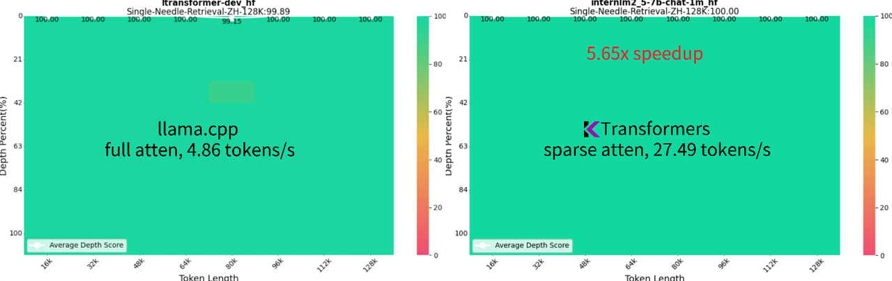
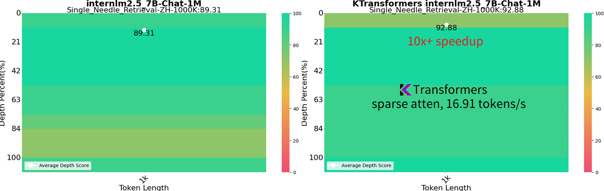

<div align="center">
  <!-- <h1>KTransformers</h1> -->
  <p align="center">

<picture>
    

</picture>

</p>
  <h3>一个用于体验尖端 LLM 推理优化的灵活框架</h3>
  <strong><a href="#show-cases">🌟 案例展示</a> | <a href="#quick-start">🚀 快速入门</a> | <a href="#tutorial">📃 教程</a> | <a href="https://github.com/kvcache-ai/ktransformers/discussions">💬 讨论</a> | <a href="#FAQ">🙋 常见问题</a> </strong>
</div>

<h2 id="intro">🎉 介绍</h2>
KTransformers（发音为 Quick Transformers）旨在通过先进的内核优化和放置/并行策略来增强您对 🤗 [Transformers](https://github.com/huggingface/transformers) 的体验。
<br/><br/>
KTransformers 是一个以 Python 为中心的灵活框架，其核心是可扩展性。通过用一行代码实现并注入优化模块，用户可以获得与 Transformers 兼容的接口、符合 OpenAI 和 Ollama 的 RESTful API，甚至是一个简化的类似 ChatGPT 的 Web 界面。
<br/><br/>
我们对 KTransformers 的愿景是成为一个用于实验创新 LLM 推理优化的灵活平台。如果您需要任何其他功能，请告诉我们。

<h2 id="Updates">🔥 更新</h2>

* **2025 年 2 月 15 日**：为DeepSeek-V3/R1支持[FP8 GPU内核](./doc/en/fp8_kernel.md); 支持更长的上下文([教程](./doc/en/DeepseekR1_V3_tutorial.md#v022-longer-context)).
* **2025 年 2 月 15 日**：长上下文(从4K到8K，24GB VRAM) & 稍快的速度(+15%)(最快 16 Tokens/s)，文档请参见 [这里](./doc/en/DeepseekR1_V3_tutorial.md) 和 [在线指南](https://kvcache-ai.github.io/ktransformers/) 。
* **2025 年 2 月 10 日**：支持 Deepseek-R1 和 V3 在单个（24GB VRAM）/多 GPU 和 382G DRAM 上运行，速度提升高达 3~28 倍。详细教程请参见 [这里](./doc/en/DeepseekR1_V3_tutorial.md)。
* **2024 年 8 月 28 日**：支持 InternLM2.5-7B-Chat-1M 模型下的 1M 上下文，使用 24GB 的 VRAM 和 150GB 的 DRAM。详细教程请参见 [这里](./doc/en/long_context_tutorial.md)。
* **2024 年 8 月 28 日**：将 DeepseekV2 所需的 VRAM 从 21G 降低到 11G。
* **2024 年 8 月 15 日**：更新了详细的 [教程](doc/en/injection_tutorial.md)，介绍注入和多 GPU 的使用。
* **2024 年 8 月 14 日**：支持 llamfile 作为线性后端。
* **2024 年 8 月 12 日**：支持多 GPU；支持新模型：mixtral 8\*7B 和 8\*22B；支持 q2k、q3k、q5k 在 GPU 上的去量化。
* **2024 年 8 月 9 日**：支持 Windows。

<h2 id="show-cases">🌟 案例展示</h2>

<div>
<h3>在仅 24GB VRAM 的桌面上运行 GPT-4/o1 级别的本地 VSCode Copilot</h3>
</div>

https://github.com/user-attachments/assets/ebd70bfa-b2c1-4abb-ae3b-296ed38aa285

</p>

- **[NEW!!!] 本地 671B DeepSeek-Coder-V3/R1**：使用其 Q4_K_M 版本，仅需 14GB VRAM 和 382GB DRAM 即可运行（教程请参见 [这里](./doc/en/DeepseekR1_V3_tutorial.md)）。
	- 预填充速度（tokens/s）：
 		- KTransformers：54.21（32 核）→ 74.362（双插槽，2×32 核）→ 255.26（优化的 AMX 基 MoE 内核，仅 V0.3）→ 286.55（选择性使用 6 个专家，仅 V0.3）
 		- 与 llama.cpp 在 2×32 核下相比，达到 **27.79× 速度提升**。
 	- 解码速度（tokens/s）：
 		- KTransformers：8.73（32 核）→ 11.26（双插槽，2×32 核）→ 13.69（选择性使用 6 个专家，仅 V0.3）
 		- 与 llama.cpp 在 2×32 核下相比，达到 **3.03× 速度提升**。
	- 即将开源发布：
		- AMX 优化和选择性专家激活将在 V0.3 中开源。
		- 目前仅在预览二进制分发中可用，可从 [这里](./doc/en/DeepseekR1_V3_tutorial.md) 下载。

- **本地 236B DeepSeek-Coder-V2**：使用其 Q4_K_M 版本，仅需 21GB VRAM 和 136GB DRAM 即可运行，甚至在 [BigCodeBench](https://huggingface.co/blog/leaderboard-bigcodebench) 中得分超过 GPT4-0613。

<p align="center">
  <picture>
    
  </picture>
</p>

- **更快的速度**：通过 MoE 卸载和注入来自 [Llamafile](https://github.com/Mozilla-Ocho/llamafile/tree/main) 和 [Marlin](https://github.com/IST-DASLab/marlin) 的高级内核，实现了 2K 提示预填充 126 tokens/s 和生成 13.6 tokens/s 的速度。
- **VSCode 集成**：封装成符合 OpenAI 和 Ollama 的 API，可无缝集成到 [Tabby](https://github.com/TabbyML/tabby) 和其他前端的后端。

<p align="center">

https://github.com/user-attachments/assets/4c6a8a38-05aa-497d-8eb1-3a5b3918429c

</p>

<!-- <h3>在仅 24GB VRAM 的桌面上进行 1M 上下文本地推理</h3>
<p align="center"> -->

<!-- https://github.com/user-attachments/assets/a865e5e4-bca3-401e-94b8-af3c080e6c12 -->
<!-- 
* **1M 上下文 InternLM 2.5 7B**：以全 bf16 精度运行，使用 24GB VRAM 和 150GB DRAM，可在本地桌面设置中实现。在 1M "针在干草堆中" 测试中达到 92.88% 的成功率，在 128K NIAH 测试中达到 100%。

<p align="center">
  <picture>
    
  </picture>
</p>

<p align="center">
  <picture>
    
  </picture>
</p>

* **增强的速度**：使用稀疏注意力，通过 llamafile 内核实现 1M 上下文生成 16.91 tokens/s 的速度。这种方法比 llama.cpp 的全注意力方法快 10 倍以上。

* **灵活的稀疏注意力框架**：提供了一个灵活的块稀疏注意力框架，用于 CPU 卸载解码。与 SnapKV、Quest 和 InfLLm 兼容。更多信息请参见 [这里](./doc/en/long_context_introduction.md)。 -->

<strong>更多高级功能即将推出，敬请期待！</strong>

<h2 id="quick-start">🚀 快速入门</h2>


KTransformers 的入门非常简单！请参考我们的[安装指南]((https://kvcache-ai.github.io/ktransformers/))进行安装。

<h2 id="tutorial">📃 简要注入教程</h2>
KTransformers 的核心是一个用户友好的、基于模板的注入框架。这使得研究人员可以轻松地将原始 torch 模块替换为优化的变体。它还简化了多种优化的组合过程，允许探索它们的协同效应。
</br>
<p align="center">
  <picture>
    
  </picture>
</p>

鉴于 vLLM 已经是一个用于大规模部署优化的优秀框架，KTransformers 特别关注受资源限制的本地部署。我们特别关注异构计算时机，例如量化模型的 GPU/CPU 卸载。例如，我们支持高效的 <a herf="https://github.com/Mozilla-Ocho/llamafile/tree/main">Llamafile</a> 和<a herf="https://github.com/IST-DASLab/marlin">Marlin</a> 内核，分别用于 CPU 和 GPU。 更多详细信息可以在 <a herf="doc/en/operators/llamafile.md">这里</a>找到。


<h3>示例用法</h3>
要使用提供的内核，用户只需创建一个基于 YAML 的注入模板，并在使用 Transformers 模型之前添加对 `optimize_and_load_gguf` 的调用。

```python
with torch.device("meta"):
    model = AutoModelForCausalLM.from_config(config, trust_remote_code=True)
optimize_and_load_gguf(model, optimize_config_path, gguf_path, config)
...
generated = prefill_and_generate(model, tokenizer, input_tensor.cuda(), max_new_tokens=1000)
```

在这个示例中，首先在 meta 设备上初始化 AutoModel，以避免占用任何内存资源。然后，`optimize_and_load_gguf` 遍历模型的所有子模块，匹配您的 YAML 规则文件中指定的规则，并将它们替换为指定的高级模块。

注入后，原始的 `generate` 接口仍然可用，但我们还提供了一个兼容的 `prefill_and_generate` 方法，这使得可以进一步优化，例如使用 CUDAGraph 提高生成速度。

<h3>如何自定义您的模型</h3>

一个详细的使用 DeepSeek-V2 作为示例的注入和 multi-GPU 教程在 [这里](doc/en/injection_tutorial.md)。

以下是一个将所有原始 Linear 模块替换为 Marlin 的 YAML 模板示例，Marlin 是一个高级的 4 位量化内核。

```yaml
- match:
    name: "^model\\.layers\\..*$"  # 正则表达式 
    class: torch.nn.Linear  # 仅匹配同时符合名称和类的模块
  replace:
    class: ktransformers.operators.linear.KTransformerLinear  # 量化数据类型的优化内核
    device: "cpu"   # 初始化时加载该模块的 device
    kwargs:
      generate_device: "cuda"
      generate_linear_type: "QuantizedLinearMarlin"
```

YAML 文件中的每个规则都有两部分：`match` 和 `replace`。`match` 部分指定应替换的模块，`replace` 部分指定要注入到模型中的模块以及初始化关键字。

您可以在 [ktransformers/optimize/optimize_rules](ktransformers/optimize/optimize_rules) 目录中找到用于优化 DeepSeek-V2 和 Qwen2-57B-A14 的示例规则模板。这些模板用于为 `local_chat.py` 示例提供支持。

如果您对我们的设计原则和注入框架的实现感兴趣，请参考 [设计文档](doc/en/deepseek-v2-injection.md)。

<h2 id="ack">致谢和贡献者</h2>

KTransformer 的开发基于 Transformers 提供的灵活和多功能框架。我们还受益于 GGUF/GGML、Llamafile 、 Marlin、sglang和flashinfer 等高级内核。我们计划通过向上游贡献我们的修改来回馈社区。

KTransformer 由清华大学 <a href="https://madsys.cs.tsinghua.edu.cn/">MADSys group</a> 小组的成员以及 <a href="http://approaching.ai/">Approaching.AI</a> 的成员积极维护和开发。我们欢迎新的贡献者加入我们，使 KTransformer 更快、更易于使用。


<h2 id="ack">讨论</h2>

如果您有任何问题，欢迎随时提出 issue。或者，您可以加入我们的微信群进行进一步讨论。二维码： [微信群](WeChatGroup.png)

<h2 id="FAQ">🙋 常见问题</h2>

一些常见问题的答案可以在 [FAQ](doc/en/FAQ.md) 中找到。 
