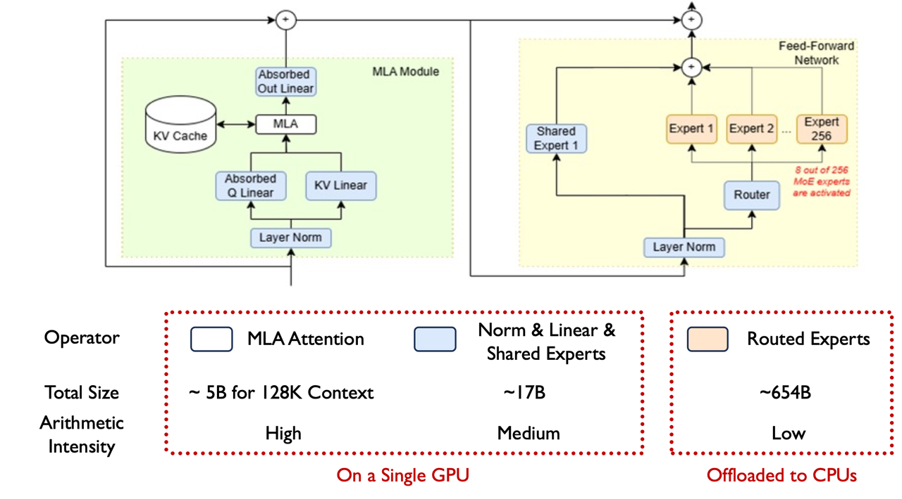

<div align="center">
  <p align="center">

<picture>
    

</picture>

</p>
  <h3>一个用于体验尖端 LLM 推理/微调优化的灵活框架</h3>
  <strong><a href="#-概览">🎯 概览</a> | <a href="#-kt-kernel---高性能推理内核">🚀 kt-kernel</a> | <a href="#-kt-sft---微调框架">🎓 kt-sft</a> | <a href="#-引用">🔥 引用</a> </strong>
</div>

## 🎯 概览

KTransformers 是一个专注于通过 CPU-GPU 异构计算实现大语言模型高效推理和微调的研究项目。该项目已发展为**两个核心模块**：[kt-kernel](./kt-kernel/) 和 [kt-sft](./kt-sft/)。

## 🔥 更新

* **2025 年 12 月 5 日**：支持原生 Kimi-K2-Thinking 推理（[教程](./doc/en/Kimi-K2-Thinking-Native.md)）
* **2025 年 11 月 6 日**：支持 Kimi-K2-Thinking 推理（[教程](./doc/en/Kimi-K2-Thinking.md)）和微调（[教程](./doc/en/SFT_Installation_Guide_KimiK2.md)）
* **2025 年 11 月 4 日**：KTransformers 微调 × LLaMA-Factory 集成（[教程](./doc/en/KTransformers-Fine-Tuning_User-Guide.md)）
* **2025 年 10 月 27 日**：支持昇腾 NPU（[教程](./doc/zh/DeepseekR1_V3_tutorial_zh_for_Ascend_NPU.md)）
* **2025 年 10 月 10 日**：集成到 SGLang（[路线图](https://github.com/sgl-project/sglang/issues/11425)，[博客](https://lmsys.org/blog/2025-10-22-KTransformers/)）
* **2025 年 9 月 11 日**：支持 Qwen3-Next（[教程](./doc/en/Qwen3-Next.md)）
* **2025 年 9 月 5 日**：支持 Kimi-K2-0905（[教程](./doc/en/Kimi-K2.md)）
* **2025 年 7 月 26 日**：支持 SmallThinker 和 GLM4-MoE（[教程](./doc/en/SmallThinker_and_Glm4moe.md)）
* **2025 年 7 月 11 日**：支持 Kimi-K2（[教程](./doc/en/Kimi-K2.md)）
* **2025 年 6 月 30 日**：支持 3 层（GPU-CPU-磁盘）[前缀缓存](./doc/en/prefix_cache.md)复用
* **2025 年 5 月 14 日**：支持 Intel Arc GPU（[教程](./doc/en/xpu.md)）
* **2025 年 4 月 29 日**：支持 AMX-Int8、AMX-BF16 和 Qwen3MoE（[教程](./doc/en/AMX.md)）
* **2025 年 4 月 9 日**：实验性支持 LLaMA 4 模型（[教程](./doc/en/llama4.md)）
* **2025 年 4 月 2 日**：支持多并发（[教程](./doc/en/balance-serve.md)）
* **2025 年 3 月 15 日**：支持 AMD GPU 上的 ROCm（[教程](./doc/en/ROCm.md)）
* **2025 年 3 月 5 日**：支持 unsloth 1.58/2.51 位权重和 [IQ1_S/FP8 混合](./doc/en/fp8_kernel.md)权重。在 24GB VRAM 中支持 DeepSeek-V3 和 R1 的 139K [更长上下文](./doc/en/DeepseekR1_V3_tutorial.md#v022--v023-longer-context--fp8-kernel)
* **2025 年 2 月 25 日**：为 DeepSeek-V3 和 R1 支持 [FP8 GPU 内核](./doc/en/fp8_kernel.md)；[更长上下文](./doc/en/DeepseekR1_V3_tutorial.md#v022-longer-context)
* **2025 年 2 月 15 日**：更长上下文（24GB VRAM 从 4K 到 8K）& 速度稍快（+15%，最高 16 Tokens/s），更新[文档](./doc/en/DeepseekR1_V3_tutorial.md)和[在线手册](https://kvcache-ai.github.io/ktransformers/)
* **2025 年 2 月 10 日**：支持 Deepseek-R1 和 V3 在单 GPU（24GB VRAM）/多 GPU 和 382GB DRAM 上运行，速度提升高达 3~28 倍。详细案例展示和复现教程请参见[这里](./doc/en/DeepseekR1_V3_tutorial.md)
* **2024 年 8 月 28 日**：将 DeepseekV2 所需的 VRAM 从 21GB 降低到 11GB
* **2024 年 8 月 15 日**：更新了关于注入和多 GPU 的详细[教程](doc/en/injection_tutorial.md)
* **2024 年 8 月 14 日**：支持 llamfile 作为线性后端
* **2024 年 8 月 12 日**：支持多 GPU；支持新模型：mixtral 8\*7B 和 8\*22B；支持 GPU 上的 q2k、q3k、q5k 去量化
* **2024 年 8 月 9 日**：支持 Windows 原生环境

---

## 📦 核心模块

### 🚀 [kt-kernel](./kt-kernel/) - 高性能推理内核

用于异构 LLM 推理的 CPU 优化内核操作。



**主要特性：**
- **AMX/AVX 加速**：Intel AMX 和 AVX512/AVX2 优化的内核，用于 INT4/INT8 量化推理
- **MoE 优化**：高效的专家混合推理，具有 NUMA 感知内存管理
- **量化支持**：CPU 端 INT4/INT8 量化权重，GPU 端 GPTQ 支持
- **易于集成**：为 SGLang 和其他框架提供简洁的 Python API

**快速开始：**
```bash
cd kt-kernel
pip install .
```

**使用场景：**

- 大型 MoE 模型的 CPU-GPU 混合推理
- 与 SGLang 集成用于生产服务
- 异构专家放置（热专家在 GPU 上，冷专家在 CPU 上）

**性能示例：**
| 模型 | 硬件配置 | 总吞吐量 | 输出吞吐量 |
|-------|------------------------|------------------|-------------------|
| DeepSeek-R1-0528 (FP8) | 8×L20 GPU + Xeon Gold 6454S | 227.85 tokens/s | 87.58 tokens/s（8 路并发）|

👉 **[完整文档 →](./kt-kernel/README.md)**

---

### 🎓 [kt-sft](./kt-sft/) - 微调框架

KTransformers × LLaMA-Factory 集成，用于超大型 MoE 模型微调。


**主要特性：**

- **资源高效**：仅需 **70GB GPU 显存** + 1.3TB 内存即可微调 671B DeepSeek-V3
- **LoRA 支持**：完整的 LoRA 微调，带有异构加速
- **LLaMA-Factory 集成**：与流行的微调框架无缝集成
- **生产就绪**：聊天、批量推理和指标评估

**性能示例：**

| 模型 | 配置 | 吞吐量 | GPU 显存 |
|-------|--------------|------------|--------------|
| DeepSeek-V3 (671B) | LoRA + AMX | ~40 tokens/s | 70GB（多 GPU）|
| DeepSeek-V2-Lite (14B) | LoRA + AMX | ~530 tokens/s | 6GB |

**快速开始：**
```bash
cd kt-sft
# 按照 kt-sft/README.md 安装环境
USE_KT=1 llamafactory-cli train examples/train_lora/deepseek3_lora_sft_kt.yaml
```

👉 **[完整文档 →](./kt-sft/README.md)**

---

## 🔥 引用

如果您在研究中使用了 KTransformers，请引用我们的论文：

```bibtex
@inproceedings{10.1145/3731569.3764843,
  title = {KTransformers: Unleashing the Full Potential of CPU/GPU Hybrid Inference for MoE Models},
  author = {Chen, Hongtao and Xie, Weiyu and Zhang, Boxin and Tang, Jingqi and Wang, Jiahao and Dong, Jianwei and Chen, Shaoyuan and Yuan, Ziwei and Lin, Chen and Qiu, Chengyu and Zhu, Yuening and Ou, Qingliang and Liao, Jiaqi and Chen, Xianglin and Ai, Zhiyuan and Wu, Yongwei and Zhang, Mingxing},
  booktitle = {Proceedings of the ACM SIGOPS 31st Symposium on Operating Systems Principles},
  year = {2025}
}
```

## 👥 贡献者与团队

由以下团队开发和维护：
- 清华大学 [MADSys 实验室](https://madsys.cs.tsinghua.edu.cn/)
- [Approaching.AI](http://approaching.ai/)
- 社区贡献者

我们欢迎贡献！请随时提交问题和拉取请求。

## 💬 社区与支持

- **GitHub Issues**：[报告问题或请求功能](https://github.com/kvcache-ai/ktransformers/issues)
- **微信群**：请参见 [archive/WeChatGroup.png](./archive/WeChatGroup.png)

## 📦 KT原仓库

原始的集成 KTransformers 框架已归档到 [`archive/`](./archive/) 目录以供参考。该项目现在专注于上述两个核心模块，以获得更好的模块化和可维护性。

有关原始文档以及完整的快速入门指南和示例，请参见：
- [archive/README.md](./archive/README.md)（英文）
- [archive/README_ZH.md](./archive/README_ZH.md)（中文）
