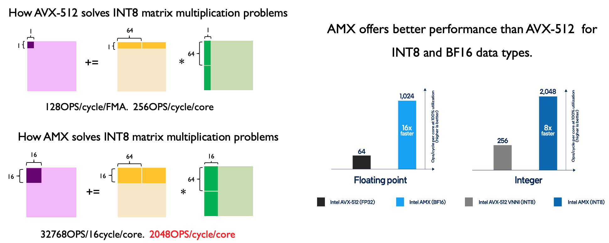
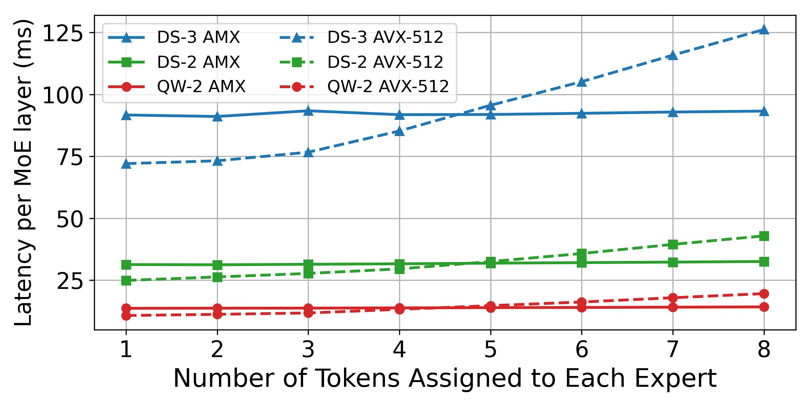

# Qwen 3 + KTransformers 0.3 (+AMX) = AI Workstation/PC
Following DeepSeek-V3/R1, LLaMa-4, and Kimi-VL, Qwen has also released an impressive MoE model—undoubtedly, this year belongs to MoE. As a low-barrier inference system for running MoE models in local heterogeneous environments, KTransformers naturally joins the party. Thanks to the support of the Qwen team, we completed Day 0 support for the entire Qwen 3 series of MoE models. At the same time, we took this opportunity to open-source the long-awaited preliminary version of our AMX high-performance operators (BF16, Int8; an int4 variant is coming soon), officially advancing to version 0.3.

What excites me most about Qwen3MoE is that, unlike the 671 B “giant” model, its two configurations: 235B-A22 and 30B-A3B, **hit the performance sweet spots for both local workstations and consumer-grade PCs**. Accordingly, we ran benchmarks in two typical setups:

Server CPU (Xeon 4) + RTX 4090

Consumer-grade CPU (Core i9-14900KF + dual-channel DDR5-4000 MT/s) + RTX 4090

Note: Because the PC's memory has a low frequency, large capacity, and multiple sticks, it downclocks severely and only operates at 4000MT. Using higher - frequency memory can boost performance.

The results are as follows:

https://github.com/user-attachments/assets/fafe8aec-4e22-49a8-8553-59fb5c6b00a2


You can see that, thanks to the AMX instruction optimizations, we achieve up to 347 tokens/s prefill performance in the workstation scenario. On consumer-grade CPUs, we’re able to run the large model (235B-A22) and deliver smooth performance on the smaller 30B-A3B. Even in terms of resource overhead, it appears that a high-end gaming laptop can handle 30B-A3B smoothly. After talking about the concept of AIPC for so long, we can finally see its feasibility.

Here is the Qwen3MoE startup command:

``` python
# llamafile backend
python ktransformers/server/main.py --architectures Qwen3MoeForCausalLM --model_path <model_dir> --gguf_path <gguf_dir> --optimize_config_path ktransformers/optimize/optimize_rules/Qwen3Moe-serve.yaml --backend_type balance_serve
# AMX backend
python ktransformers/server/main.py --architectures Qwen3MoeForCausalLM --model_path <model_dir> --gguf_path <gguf_dir> --optimize_config_path ktransformers/optimize/optimize_rules/Qwen3Moe-serve-amx.yaml --backend_type balance_serve
```

**Note: At present, Qwen3MoE running with AMX can only read BF16 GGUF; support for loading from safetensor will be added later.**

To make it easier for everyone to understand the AMX optimizations we’ve open-sourced, we’ve prepared a brief document. We also extend our gratitude to Intel for their assistance.

# Introduction to AMX Instruction Set

Intel Advanced Matrix Extensions (AMX) are a set of specialized instruction extensions introduced for the x86 architecture starting with Sapphire Rapids (4th generation Xeon Scalable processors) and onward. AMX accelerates large-scale matrix computations at the hardware level, particularly for the compute-intensive parts of deep learning inference and machine learning workloads. By introducing the concept of Tile registers, it loads 2D sub-matrices into dedicated Tile registers and performs matrix multiply-accumulate operations at the register level, significantly improving throughput and energy efficiency.

Each CPU core contains 8 dedicated registers (tmm0–tmm7), with each register capable of holding up to 16 rows × 64 bytes of data to store 2D sub-matrices. Additionally, there is a 64-byte configuration register (TILECFG) used to describe each tmm register's number of rows, columns, and row stride.

The main AMX instructions are summarized as follows:

| Instruction Category | Instruction Names | Description |
|:---|:---|:---|
| Configuration Instructions | LDTILECFG, STTILECFG, TILERELEASE, TILEZERO | Configure/reset Tile registers and metadata |
| Load/Store Instructions | TILELOADD, TILELOADDT1, TILESTORED | Transfer data between memory and Tile registers |
| INT8 Computation Instructions | TDPBSSD, TDPBUSD, TDPBUUD, TDPBSUD | Perform multiply and accumulate operations on int8 sub-matrices within Tiles |
| BF16 Computation Instructions | TDPBF16PS | Perform multiply and accumulate operations on bfloat16 sub-matrices within Tiles |

To simplify development, Intel provides corresponding intrinsics, allowing C/C++ developers to leverage AMX's performance benefits without writing lengthy assembly code. For example:

```C++
#include <immintrin.h>

_tile_loadconfig(cfg_ptr);
_tile_loadd(tmm0, A_ptr, lda);
_tile_loadd(tmm1, B_ptr, ldb);
_tile_zero(tmm2)
_tile_dpbf16ps(tmm2, tmm0, tmm1);
_tile_stored(tmm2, C_ptr, ldc);
_tile_release();
```

The above code copies sub-matrices from memory (A_ptr, B_ptr) to Tile registers, calls the AMX BF16 compute instruction to multiply two sub-matrices, and then copies the result to memory (C_ptr).

Taking INT8 as an example, AMX can perform the multiplication of two 16×64 sub-matrices (32,768 multiply/add operations) with a single instruction in 16 CPU cycles, enabling each core to complete 2048 multiply/add operations per cycle — 8 times the performance of AVX-512. On an Intel Xeon 4 CPU, a single core can theoretically provide 4 TOPS of compute power, making it highly suitable for compute-intensive tasks on the CPU.

<p align="center">
  <picture>
    
  </picture>
</p>


# AMX Kernel in KTransformers

Before version v0.3, KTransformers performed CPU matrix multiplications based on operators provided by llamafile. Unfortunately, llamafile's implementation had not yet been optimized for the AMX instruction set. This resulted in performance bottlenecks, even in strong hardware environments (such as Xeon 4th Gen + 4090), where inference speeds for large models like DeepSeek-V3 reached only 91 tokens/s during the prefill phase. The CPU thus remained a significant bottleneck. In long prompt scenarios, such performance is clearly unsatisfactory. To fully unleash CPU potential, we introduced a brand-new AMX optimization path along with multiple technical improvements in v0.3.

## 1. AMX Tiling-aware Memory Layout

AMX provides a high-throughput Tile register computation model, reducing instruction count and boosting theoretical throughput through coarse-grained matrix operations. However, to truly exploit AMX's potential, memory access efficiency is critical: because AMX transfers entire Tiles at once, misaligned Tiles and chaotic access patterns can cause severe cache misses, nullifying throughput gains.

Thus, in v0.3, we stopped directly memory-mapping GGUF-format files and introduced AMX Tiling-aware memory preprocessing during model loading. Specifically, expert weight matrices in MoE models are pre-rearranged into Tile-friendly sub-matrices whose shapes precisely match AMX Tile register dimensions, eliminating dynamic transposition overhead during inference. During rearrangement, we strictly align each sub-matrix's start address to 64 bytes to avoid cache line splits, and arrange sub-matrices sequentially according to computation access patterns, maximizing L1/L2 cache hit rates using compiler and hardware sequential prefetch capabilities.

For Int8 quantized formats, we adopted Symmetric Group-wise Quantization, with each column forming a group sharing a scale factor stored separately to maintain memory alignment for Tile data.

This AMX Tiling-aware memory layout design reduces memory latency while providing optimal input conditions for downstream computation kernels.

## 2. Cache-friendly AMX Kernel

During inference, we designed around the CPU’s multi-level cache hierarchy to perform computations in-place in high-speed caches, minimizing DRAM access frequency and overhead.

<p align="center">
  <picture>
    
  </picture>
</p>

As shown in the figure, 
- ① Expert weight matrices are first column-wise partitioned into multiple tasks dynamically scheduled across threads. Input activations are shared among tasks and typically reside in the shared L3 cache due to locality.
- ② Within each task, expert weights are row-wise partitioned into blocks, with block sizes finely tuned to ensure input activations, weights, and intermediate results stay within L2 cache, avoiding DRAM access.
- ③ ④ ⑤ Each block is treated as a set of sub-matrices matching AMX Tile registers, and during Tile-level computation, input Tiles (tmm0–tmm1) and expert Tiles (tmm2–tmm3) are loaded, and four AMX multiplication instructions directly generate and accumulate products into Tile registers (tmm4–tmm7), with output activations accumulated in Tile registers or L1 cache, avoiding additional data movement.

In short, we leveraged the cache hierarchy: every data element of expert weights and output activations accesses DRAM only once, with the other accesses hitting L2 or higher caches; input activations are accessed from DRAM only once and later hit in L3 or higher caches. This significantly reduces main memory traffic and improves overall execution efficiency.

## 3. AVX-512 Kernel Adaptation for Low Arithmetic Intensity Scenarios

Although AMX is highly efficient for large-scale matrix multiplication, it performs poorly under low arithmetic intensity, such as vector-matrix operations in the decode phase. This is because dispatching AMX Tiles involves fixed instruction overhead, which becomes wasteful when the data volume is insufficient to fill a Tile, causing reduced throughput.

<p align="center">
  <picture>
    
  </picture>
</p>

To address this, we introduced a lightweight AVX-512 kernel as a complement. This kernel follows the same memory layout as the AMX kernel but replaces heavy AMX matrix-matrix multiplications with fine-grained AVX-512 vector-matrix multiplications, lowering latency for small matrices.

KTransformers dynamically selects between AMX and AVX-512 kernels at runtime based on arithmetic intensity: AMX kernels are automatically selected during long prompt prefill phases (where each expert handles more than 4 tokens on average), while short prompt prefill and decode phases dynamically switch to AVX-512 kernels. This ensures optimal efficiency under different arithmetic intensity conditions.

## 4. MoE Operator Fusion and Dynamic Scheduling

MoE models have many experts per layer, each requiring three matrix multiplications (Gate, Up, Down projections), leading to many small matrix multiplication tasks. Independently scheduling each small task would cause massive synchronization overhead between threads, dragging down overall inference speed.

Thus, we fused the same type of matrix computations for all experts in a layer into large unified tasks. Furthermore, as there are no data dependencies between Gate and Up projections, their computations can also be fused, ultimately consolidating a layer’s matrix multiplications into two major tasks, greatly reducing scheduling overhead.

To address load imbalance — especially during the prefill phase where expert activations can be highly skewed — we introduced a dynamic task scheduling strategy. Each matrix multiplication task is further split into multiple fine-grained sub-tasks, evenly distributed among CPU threads initially. Once a thread completes its assigned tasks, it atomically "steals" tasks from others, greatly mitigating load imbalance and achieving near-optimal CPU resource utilization.

Thanks to these optimizations, our kernel can achieve 21 TFLOPS of BF16 throughput and 35 TOPS of Int8 throughput on Xeon4 CPUs — about 4× faster than PyTorch’s general AMX kernel. For DeepSeek-V3, pairing a Xeon4 CPU with a single RTX 4090 GPU achieves 418 tokens/s end-to-end throughput, close to the performance of multi-machine, multi-GPU setups. KTransformers’ AMX kernel is the first AMX kernel specifically designed for MoE inference scenarios, significantly lowering the hardware barrier for large model deployment and enabling more developers to enjoy GPU cluster level inference experiences at lower cost.

<p align="center">
  <picture>
    
  </picture>
</p>

# Usage

## Checking AMX Support

Before enabling the AMX-optimized kernels, it is important to verify whether your CPU supports the AMX instruction set. You can check AMX availability with the following command:

```bash
lscpu | grep -i amx
```

If your system supports AMX, you should see output similar to:

```bash
Flags: ... amx-bf16 amx-int8 amx-tile ...
```

If no amx-related flags are found, your CPU may not support AMX, or AMX may be disabled in BIOS settings. In that case, please ensure that:
- You are using a Sapphire Rapids (Xeon 4th Gen) or newer CPU.
- AMX support is enabled in your system BIOS under CPU feature settings.

## Enabling AMX in KTransformers

KTransformers allows users to easily switch between different backends through simple YAML configuration modifications. To enable AMX, modify the injection configuration of your experts by specifying backend as AMXInt8 or AMXBF16:

```YAML
- match:
    name: "^model\\.layers\\..*\\.mlp\\.experts$"
  replace:
    class: ktransformers.operators.experts.KTransformersExperts    # custom MoE Kernel with expert parallelism
    kwargs:
      prefill_device: "cuda"
      prefill_op: "KExpertsTorch"
      generate_device: "cpu"
      generate_op: "KExpertsCPU"
      out_device: "cuda"
      backend: "AMXInt8"  # or "AMXBF16" or "llamafile" (default)
```

**Note:** Currently, using AMXInt8 requires reading weights from a BF16 GGUF file and performing online quantization during model loading. This may cause slightly slower load times. Future versions will provide pre-quantized weights to eliminate this overhead.


