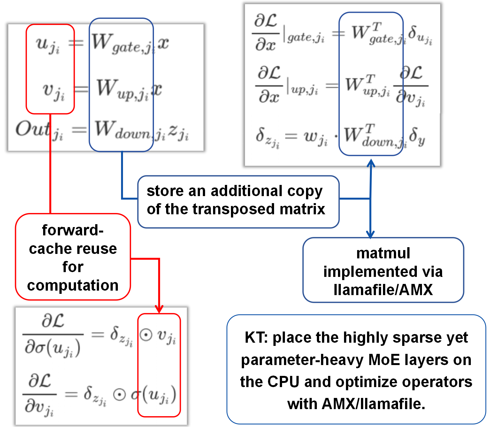

- [KTransformers Fine-Tuning × LLaMA-Factory Integration – Developer Technical Notes](#ktransformers-fine-tuning-x-llama-factory-integration-–-developer-technical-notes)
- [Introduction](#introduction)

- [Overall View of the KT Fine-Tuning Framework](#overall-view-of-the-kt-fine-tuning-framework)
  - [Attention (LoRA + KT coexist)](#attention-lora--kt-coexist)
  - [MoE (operator encapsulation + backward)](#moe-operator-encapsulation--backward)
    - [Encapsulation](#encapsulation)
    - [Backward (CPU)](#backward-cpu)
  - [Multi-GPU Loading/Training: Placement strategy instead of DataParallel](#multi-gpu-loadingtraining-placement-strategy-instead-of-dataparallel)

- [KT-LoRA Fine-Tuning Evaluation](#kt-lora-fine-tuning-evaluation)
  - [Setup](#setup)
  - [Results](#results)
    - [Stylized Dialogue (CatGirl tone)](#stylized-dialogue-catgirl-tone)
    - [Translational-Style benchmark (generative)](#translational-style-benchmark-generative)
    - [Medical Vertical Benchmark (AfriMed-SAQ/MCQ)](#medical-vertical-benchmark-afrimed-saqmcq)
    - [Limitations](#limitations)

- [Speed Tests](#speed-tests)
  - [End-to-End Performance](#end-to-end-performance)
  - [MoE Compute (DeepSeek-V3-671B)](#moe-compute-deepseek-v3-671b)
  - [Memory Footprint](#memory-footprint)

- [Conclusion](#conclusion)

# KTransformers Fine-Tuning × LLaMA-Factory Integration – Developer Technical Notes

**MadSys Lab, KVCache-AI Team, Approaching AI, LLaMA-Factory Team**

## Introduction

Recent open-source LLMs—from DeepSeek-V3/R1 to Qwen-MoE and Kimi-K2—have surged in performance and scale. Yet due to **compute and memory constraints**, it is difficult for typical researchers to fine-tune trillion-parameter-class models. We therefore integrate **KTransformers** with **LLaMA-Factory** so that, with **2–4 RTX 4090 GPUs** and sufficient CPU memory, one can fine-tune ultra-large Mixture-of-Experts (MoE) models such as DeepSeek-671B.

This architecture bridges resource gaps, enabling **local fine-tuning of ultra-large models**, while also supporting **efficient scenario customization** at 14B/30B scales. We validate on stylized dialogue, Westernized translation tone, and medical Q&A, achieving rapid adaptation within hours.

Architecturally, LLaMA-Factory orchestrates data/config/training, LoRA insertion, and inference; KTransformers is a pluggable, high-performance operator backend that takes over Attention and MoE under the same training code, enabling **GPU+CPU heterogeneity** to accelerate training and reduce GPU memory.

We evaluated LoRA fine-tuning with HuggingFace default, Unsloth, and KTransformers backends (same settings and data). **KTransformers** is currently the only solution feasible on **2–4×24GB 4090s** for **671B-scale MoE**, and also shows higher throughput and lower GPU memory for 14B MoEs.

| Under LoRA (BF16) + [NekoQA-10K stylized dialogue](https://github.com/mindsRiverPonder/LLM-practice) | HuggingFace Backend                      | Unsloth Backend                      | KTransformers Backend |
| ------------------------------------------------------------ | ---------------------------------------- | ------------------------------------ | --------------------- |
| [14B-DeepSeekV2-Lite] LoRA fine-tuning throughput            | 303.58 token/s                           | 455.37 token/s                       | 530.38 token/s        |
| [14B-DeepSeekV2-Lite] GPU memory                             | 32.12 GB                                 | 9.64 GB                              | 6.08 GB               |
| [671B-DeepSeekV3] LoRA fine-tuning throughput                | Too Huge to run | NOT SUPPORT | 40.35 token/s         |
| [671B-DeepSeekV3] GPU memory (sum across GPUs)               | theoretical 1400 GB †                    | NOT SUPPORT | 70 GB †               |

† The **1400 GB** is the **theoretical** FP16 full-resident footprint (not runnable). **70 GB** is the **measured peak** with KT (Attention on GPU + layered MoE offload).

From the table above, it can be seen that for the 14B model, the KTransformers backend achieves approximately 75% higher throughput than the default HuggingFace solution, while using only about one-fifth of the GPU memory. For the 671B model, both HuggingFace and Unsloth fail to run on a single 4090 GPU, whereas KTransformers is able to perform LoRA fine-tuning at 40 tokens/s, keeping the GPU memory usage within 70 GB.

## Overall View of the KT Fine-Tuning Framework

We detail how KTransformers takes over core operators in LLaMA-Factory’s fine-tuning framework to optimize Attention and MoE.

DeepSeek-V3/V2 MoE models comprise a small-parameter dense Attention part and a large-parameter sparse MoE part. For illustration, consider layer 2 of DeepSeek-V2-Lite-Chat (from which each layer includes both Attention and MoE). Attention compute and KV cache mainly reside on the GPU; the heavyweight MoE part is primarily executed on the CPU. We first cover **Attention replacement and inheritance**, then **MoE encapsulation and backend interfacing**, and finally **multi-GPU placement**.

### Attention (LoRA + KT coexist)

KTransformers provides operator injection (`BaseInjectedModule`), and PEFT provides LoRA layer insertion. For fine-tuning, we design `KTransformersLinearLora`, inheriting from both `KTransformersLinear` and `LoraLayer`:

- **Inheritance:** `KTransformersLinearLora` retains KT’s high-performance paths (`prefill_linear`/`generate_linear`) while accepting LoRA parameters (`lora_A/lora_B`).
- **Replacement:** During preparation, we replace original `KTransformersLinear` layers (Q/K/V/O) with `KTransformersLinearLora`, preserving KT optimizations while enabling LoRA trainability.

After replacement, LoRA is inserted at Q/K/V/O linear transforms (left), and `KTransformersLinearLora` contains both KT fast paths and LoRA matrices (right).

### MoE (operator encapsulation + backward)

#### Encapsulation

Given large parameters and sparse compute, we encapsulate the expert computation as a **differentiable black-box operator**—transparent upstream, replaceable downstream.

- **Upstream (PyTorch graph):** we register a custom Autograd Function so the MoE layer appears as **a single node**. In the left figure (red box), only `KSFTExpertsCPU` is visible; on the right, the unencapsulated graph expands routing, dispatch, and FFN experts. Encapsulation makes the MoE layer behave like a standard `nn.Module` with gradients.
- **Downstream (backend):** inside the Autograd Function, pybind11 calls C++ extensions for forward/backward. Multiple **pluggable backends** exist (AMX BF16/INT8; **llamafile**). The backend can be switched via YAML (e.g., `"backend": "AMXBF16"` vs. `"llamafile"`).

#### Backward (CPU)

MoE backward frequently needs the transposed weights $W^\top$. To avoid repeated runtime transposes, we **precompute/cache** $W^\top$ at load time (blue box). We also **cache necessary intermediate activations** (e.g., expert projections, red box) to reuse in backward and reduce recomputation. We provide backward implementations for **llamafile** and **AMX (INT8/BF16)**, with NUMA-aware optimizations.

### Multi-GPU Loading/Training: Placement strategy instead of DataParallel

To lower **per-GPU memory peaks** on 2–4 GPUs, we use **model parallelism + explicit placement**, not DataParallel (which duplicates the whole model on each GPU).

Key changes:

1. **KTrainer:** takes over `.to(device)` to prevent “move whole model to a single GPU”. Using KT’s optimize-rule YAML, each layer declares `device: cuda:0/cuda:1/...` and is **constructed directly on the target GPU** (no extra copies).
2. **Disable automatic DataParallel:** when `USE_KT=1`, we disable automatic DP wrappers from LLaMA-Factory/HF Trainer to avoid duplication and keep full control over sharding.
3. **Gradient aggregation:** gradients are reduced to `cuda:0`. Intermediate activations stay local; only necessary tensors are transferred, cutting communication/activation overhead.

Thus, we keep KT placement strategies under multi-GPU fine-tuning. Users choose a `kt_optimize_rule` with `multi-gpu`. For DeepSeek-671B, `DeepSeek-V3-Chat-sft-amx-multi-gpu.yaml` is a typical 2-GPU plan: KV/attention parts on each GPU; MoE experts sharded on CPU; both GPUs share the workload.

## KT-LoRA Fine-Tuning Evaluation

### Setup

LLaMA-Factory orchestration, KTransformers backend, LoRA (rank=8, α=32, dropout=0.1, BF16), `GAS=16`, `qlen=512`, with the same KT optimize rule as training. We evaluate (a) stylized dialogue transfer and (b) two **small-scale representative** benchmarks: Translational-Style (generative) and AfriMed-QA (medical vertical; **SAQ** and **MCQ**). AMX is enabled; GPUs: 2×48GB RTX 4090; CPU: Intel Xeon Platinum 8488C.

### Results

#### Stylized Dialogue (CatGirl tone)

Dataset: [NekoQA-10K](https://zhuanlan.zhihu.com/p/1934983798233231689). The fine-tuned model consistently exhibits the target style (red boxes) versus neutral/rational base (blue). This shows **KT-LoRA injects style features** into the generation distribution with low GPU cost.

#### Translational-Style benchmark (generative)

Dataset: [Translational-Style-ChatLLM](https://github.com/Benson114/Translational-Style-ChatLLM). Metrics: BLEU-1/2/3/4, ROUGE-1/2/L.

| Translational-Style dataset    | BLEU-1    | BLEU-2    | BLEU-3    | BLEU-4    | ROUGE-1   | ROUGE-2   | ROUGE-L   |
| ------------------------------ | --------- | --------- | --------- | --------- | --------- | --------- | --------- |
| V2-Lite (no LoRA)              | 20.66     | 8.33      | 4.54      | 2.89      | 22.71     | 4.52      | 19.19     |
| **KT-LoRA fine-tuned V2-Lite** | **35.41** | **22.44** | **15.42** | **11.18** | **42.03** | **18.38** | **33.10** |
| V3 base (no LoRA)              | 8.49      | 3.34      | 1.62      | 0.96      | 15.91     | 2.55      | 10.07     |
| **KT-LoRA fine-tuned V3**      | **37.02** | **23.70** | **16.21** | **11.49** | **43.43** | **18.96** | **34.54** |

As shown by the test results in the tables above, under a unified workflow and placement strategy, **both model scales exhibit consistent gains after fine-tuning**, supporting the usability and effectiveness of the “KT backend + LoRA fine-tuning” combination for generative style control. At the same time, this indicates that KT’s heterogeneous placement and operator optimizations can stably support small-sample adaptation in the style domain.

#### Medical Vertical Benchmark (AfriMed-SAQ/MCQ)

The dataset adopts [AfriMed-QA](https://aclanthology.org/2025.acl-long.96/) (ACL 2025), a domain-specific dataset for the medical field in Africa with strong scenario customization characteristics, comprising two formats—multiple-choice questions (MCQ) and short-answer questions (SAQ)—which in this case serve as the evaluation for vertical-domain fine-tuning. In terms of evaluation criteria, BLEU/ROUGE are used for SAQ, and Accuracy is used for MCQ.

| AfriMed-QA (SAQ)               | BLEU-1    | BLEU-2    | BLEU-3    | BLEU-4    | ROUGE-1   | ROUGE-2   | ROUGE-L   |
| ------------------------------ | --------- | --------- | --------- | --------- | --------- | --------- | --------- |
| V2-Lite (no LoRA)              | 13.58     | 11.12     | 9.10      | 7.23      | 22.48     | 7.81      | 11.73     |
| **KT-LoRA fine-tuned V2-Lite** | **35.90** | **27.63** | **22.99** | **19.15** | **35.25** | **17.50** | **28.44** |
| V3 base (no LoRA)              | 12.75     | 10.27     | 8.05      | 5.99      | 20.33     | 5.65      | 10.11     |
| **KT-LoRA fine-tuned V3**      | **42.42** | **34.12** | **28.95** | **24.54** | **41.97** | **22.37** | **33.28** |

| AfriMed-QA (MCQ)               | Accuracy   |
| ------------------------------ | ---------- |
| V2-Lite (no LoRA)              | 0.0645     |
| **KT-LoRA fine-tuned V2-Lite** | **0.4812** |
| V3 base (no LoRA)              | 0.5833     |
| **KT-LoRA fine-tuned V3**      | **0.7930** |

As shown in the tables above, (1) DeepSeek-V3 (671B) after KT-LoRA fine-tuning achieves clearly higher performance than the fine-tuned DeepSeek-V2-Lite (14B) on both MCQ and SAQ, and it also surpasses the V3 base model. Within our small-scale setting, this preliminarily indicates that KT-LoRA fine-tuning of ultra-large-parameter models has practical significance in vertical domains.

(2) Across both SAQ/MCQ sub-tasks, KT-LoRA delivers consistent gains, indicating that—with KT’s heterogeneous placement and backend operator support—LoRA fine-tuning can effectively inject the key knowledge points of vertical domains such as medicine into the model.

#### Limitations

At present, most of our testing is conducted on **single datasets** and at **small scale** (≤ 20k examples), with the goal of providing **existence evidence of system effectiveness for KT-LoRA fine-tuning**, rather than drawing generalized conclusions about algorithmic generalization or scaling laws. Our report primarily presents representative figures; to support stronger algorithmic claims, larger sample sizes, multi-lingual/multi-domain datasets, and multi-seed repeated experiments would be required—these are beyond the scope of this work.

**We also warmly welcome everyone to join the open-source LLaMA-Factory KT fine-tuning project. If you have additional test results, we especially welcome you to record them in the shared spreadsheet below, and to include the corresponding `kt_optimize_rule` files, dataset examples, training/evaluation YAMLs, and detailed GPU-memory and CPU configurations for community reference and reproducibility~!** 

### Speed Tests

#### End-to-End Performance

**Definitions**

`step_time`：time per optimization step (tensor movement + Attention + MoE + others).

`tokens_per_step = GAS × qlen`；`token/s = tokens_per_step / step_time`。 We use `GAS=16`, `qlen=512` → `tokens_per_step=8192`.

**Measured**

| Model                | step_time (s) | tokens/step | token/s   |
| -------------------- | ------------- | ----------- | --------- |
| DeepSeek-V3-671B     | 203           | 8192        | **40.35** |
| DeepSeek-V2-Lite-14B | 36            | 8192        | **227.6** |

#### MoE Compute (DeepSeek-V3-671B)

**Theory**

- MoE per-layer, per-token FLOPs (forward+backward) approx.:
  $$
  \text{FLOPs}_{\text{per-layer, per-token}} \approx c \cdot k \cdot H \cdot I
  $$

​		with $k = 8$（Top-k），$H = 7168$（hidden size），$I = 2048$（intermediate size），$c\approx16$（≈6 forward + ≈10 backward matmuls）。

- Per-step across all MoE layers:
  $$
  \text{FLOPs}_{\text{per-step}} \approx c \cdot qlen \cdot k \cdot H \cdot I \cdot L_{\text{MoE}}
  $$

​		Plugging $c=16, qlen=512, k=8, H=7168, I=2048, L_{MoE}=58$，$\text{FLOPs}_{\text{per-step}} \approx 55.8\ \text{TFLOPs}$.

**Measured (MoE TFLOPS on CPU)**

If the **MoE-only** time per step is `t_moe` (seconds), $\text{TFLOPS} = \text{FLOPs}_{\text{per-step}} / \text{step\_per\_second}.$

Use MoE-phase time, not full `step_time`, to get MoE throughput.

| TFLOPS  | Forward | Backward |
| ------- | ------- | -------- |
| Average | 17.55   | 18.41    |

### Memory Footprint

- DeepSeek-V3 (671B; 58 MoE layers out of 61): ~**70 GB** total GPU, ~**1.2–1.3 TB** host memory.
- DeepSeek-V2-Lite (14B; 26 MoE layers out of 27): ~**5 GB** GPU, ~**30 GB** host memory.

## Conclusion

Integrating **KTransformers LoRA** with **LLaMA-Factory** provides a practical path to efficiently train and deploy MoE LLMs. KT contributes placement strategies and operator optimizations (DeepSeek/Qwen/Kimi support with AMX-accelerated kernels), and LoRA enables customization with very low GPU memory; LLaMA-Factory supplies a coherent user-level interface.

This means even tens-to-hundreds-of-billion-parameter MoE models can be fine-tuned and served with low latency on ordinary hardware. The approach balances **memory savings**, **speed**, and **usability**, turning ultra-large models into tools that developers can actually wield.