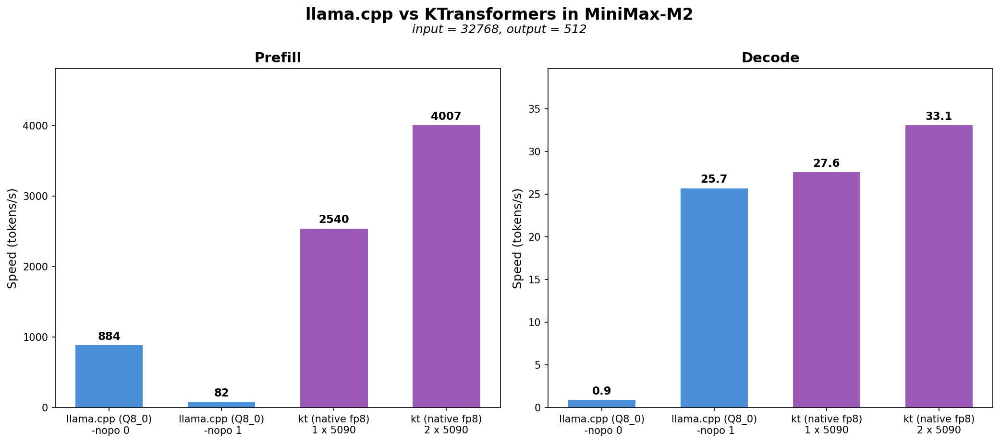

# Running MiniMax-M2.1 with Native Precision using SGLang and KT-Kernel

This tutorial demonstrates how to run MiniMax-M2.1 model inference using SGLang integrated with KT-Kernel. MiniMax-M2.1 provides native FP8 weights, enabling efficient GPU inference with reduced memory footprint while maintaining high accuracy.

## Table of Contents

- [Overview](#overview)
- [Hardware Requirements](#hardware-requirements)
- [Prerequisites](#prerequisites)
- [Step 1: Download Model Weights](#step-1-download-model-weights)
- [Step 2: Launch Server with KT CLI](#step-2-launch-server-with-kt-cli)
- [Step 3: Send Inference Requests](#step-3-send-inference-requests)
- [Performance](#performance)
- [Troubleshooting](#troubleshooting)

## Overview

MiniMax-M2.1 is a large MoE (Mixture of Experts) model that provides native FP8 weights. This tutorial uses KT-Kernel's FP8 support to enable CPU-GPU heterogeneous inference:

- **FP8 GPU Inference**: Native FP8 precision for GPU-side computation, providing both memory efficiency and computational accuracy
- **CPU-GPU Heterogeneous Architecture**:
  - Hot experts and attention modules run on GPU with FP8 precision
  - Cold experts offloaded to CPU for memory efficiency

## Hardware Requirements

**Minimum Configuration:**
- **GPU**: NVIDIA RTX 5090 32 GB (or equivalent with at least 32GB VRAM available)
- **CPU**: x86 CPU with AVX512 support (e.g., Intel Sapphire Rapids, AMD EPYC)
- **RAM**: At least 256GB system memory
- **Storage**: >220 GB for model weights (same weight dir for GPU and CPU)

**Tested Configuration:**

- **GPU**: 1/2 x NVIDIA GeForce RTX 5090 (32 GB)
- **CPU**: 2 x AMD EPYC 9355 32-Core Processor (128 threads)
- **RAM**: 1TB DDR5 5600MT/s ECC
- **OS**: Linux (Ubuntu 20.04+ recommended)

## Prerequisites

Before starting, ensure you have:

1. **SGLang installed** 

    Note: Currently, please clone our custom SGLang repository:

    ```bash
    git clone https://github.com/kvcache-ai/sglang.git
    cd sglang
    pip install -e "python[all]"
    ```

    You can follow [SGLang integration steps](https://docs.sglang.io/get_started/install.html)

2. **KT-Kernel installed**

    Please follow [kt-kernel](https://github.com/kvcache-ai/ktransformers/blob/main/kt-kernel/README.md)

    After installation, verify the CLI is working:

    ```bash
    kt version
    ```

3. **CUDA toolkit** - CUDA 12.0+ recommended for FP8 support
4. **Hugging Face CLI** - For downloading models:
   ```bash
   pip install -U huggingface-hub
   ```

## Step 1: Download Model Weights

Download the official MiniMax-M2.1 weights.

* huggingface: https://huggingface.co/MiniMaxAI/MiniMax-M2.1

    ```bash
    hf download MiniMaxAI/MiniMax-M2.1 --local-dir /path/to/minimax-m2.1
    ```

## Step 2: Launch Server with KT CLI

The simplest way to start the MiniMax-M2.1 server is using the `kt` CLI:

```bash
kt run m2.1
```

The CLI will automatically detect your hardware configuration and apply optimal parameters for your system.

### Advanced Options

For custom configurations, you can specify additional parameters:

```bash
# Use specific number of GPUs (tensor parallel)
kt run m2.1 --tensor-parallel-size 2

# Custom CPU threads and NUMA configuration
kt run m2.1 --cpu-threads 64 --numa-nodes 2
```

### Dry Run

To preview the command without executing:

```bash
kt run m2.1 --dry-run
```

See [KT-Kernel Parameters](https://github.com/kvcache-ai/ktransformers/tree/main/kt-kernel#kt-kernel-parameters) for detailed parameter tuning guidelines.

### Key Parameters

| Parameter | Description |
|-----------|-------------|
| `--kt-method FP8` | Enable FP8 inference mode for MiniMax-M2.1 native FP8 weights. |
| `--kt-cpuinfer` | Number of CPU inference threads. Set to physical CPU cores (not hyperthreads). |
| `--kt-threadpool-count` | Number of thread pools. Set to NUMA node count. |
| `--kt-num-gpu-experts` | Number of experts kept on GPU for decoding. |
| `--chunked-prefill-size` | Maximum tokens per prefill batch. |
| `--max-total-tokens` | Maximum total tokens in KV cache. |
| `--kt-gpu-prefill-token-threshold` | Token threshold for layerwise prefill strategy. |

## Step 3: Send Inference Requests

Once the server is running (default: `http://localhost:30000`), you can interact with the model in several ways:

### Option A: Interactive Chat with KT CLI

The easiest way to chat with the model:

```bash
kt chat
```

This opens an interactive terminal chat session. Type your messages and press Enter to send. Use `Ctrl+C` to exit.

### Option B: OpenAI-Compatible API

The server exposes an OpenAI-compatible API at `http://localhost:30000/v1`.

**curl example (streaming):**

```bash
curl http://localhost:30000/v1/chat/completions \
  -H "Content-Type: application/json" \
  -d '{
    "model": "MiniMax-M2.1",
    "messages": [{"role": "user", "content": "Hello!"}],
    "stream": true
  }'
```

**Python example (streaming):**

```python
from openai import OpenAI

client = OpenAI(base_url="http://localhost:30000/v1", api_key="not-needed")

for chunk in client.chat.completions.create(
    model="MiniMax-M2.1",
    messages=[{"role": "user", "content": "Hello!"}],
    stream=True
):
    print(chunk.choices[0].delta.content or "", end="", flush=True)
```


## Performance

### Throughput (tokens/s)

The following benchmarks were measured with single concurrency (Prefill tps / Decode tps):

| GPU  | CPU  | PCIe |  2048 tokens | 8192 tokens | 32768 tokens |
|------------|-------------|-------------|-------------|-------------|--------------|
| 1 x RTX 4090 (48 GB) | 2 x Intel Xeon Platinum 8488C| PCIe 4.0 | 129 / 21.8 | 669 / 20.9 | 1385 / 18.5 |
| 2 x RTX 4090 (48 GB) | 2 x Intel Xeon Platinum 8488C| PCIe 4.0 | 139 / 23.6 | 1013 / 23.3 | 2269 / 21.6 |
| 1 x RTX 5090 (32 GB) | 2 x AMD EPYC 9355 | PCIe 5.0 | 408 / 32.1 | 1196 / 31.4 | 2540 / 27.6 |
| 2 x RTX 5090 (32 GB) | 2 x AMD EPYC 9355 | PCIe 5.0 | 414 / 35.9 | 1847 / 35.5 | 4007 / 33.1 |

### Comparison with llama.cpp

We benchmarked KT-Kernel + Sglang against llama.cpp to demonstrate the performance advantages of our CPU-GPU heterogeneous inference approach.

- **Weight formats**: KT-Kernel uses native unquantized FP8 weights from MiniMax-M2, while llama.cpp only supports quantized weights, so we used Q8_0 quantization for the llama.cpp benchmarks.

- **Test environment**: 2 x RTX 5090 (32 GB) with AMD EPYC 9355 CPUs, input tokens=32768, output tokens=512. We made our best effort to optimize llama.cpp performance, but we could not achieve optimal prefill and decode with a single command, so we used separate configurations for prefill and decode measurements.



As shown in the chart, KT-Kernel achieves up to **>4.5x prefill** and **30% faster decode** compared to llama.cpp on the same hardware.

## Troubleshooting

### OOM (Out of Memory) Issues

Layerwise prefill requires extra VRAM (~3.6GB + incremental cost with prefill length). If you encounter OOM, adjust these parameters when launching the server:

| Parameter | VRAM Impact |
|-----------|-------------|
| `--kt-num-gpu-experts` | Reduces expert weight VRAM usage |
| `--chunked-prefill-size` | Reduces prefill extra VRAM allocation |
| `--max-total-tokens` | Reduces KV cache VRAM usage |

**Tip:** Test with an input of length `chunked-prefill-size` to verify your configuration won't OOM during prefill.

## Advanced Use Case: Running Claude Code with MiniMax-M2.1 Local Backend

```bash
kt run m2.1 --tool-call-parser minimax-m2 --reasoning-parser minimax-append-think
```

With the above command, you can use [claude-code-router](https://github.com/musistudio/claude-code-router) to connect MiniMax-M2.1 as a local backend for [Claude Code](https://github.com/anthropics/claude-code).

## Additional Resources

- [KT-Kernel Documentation](../../kt-kernel/README.md)
- [SGLang GitHub](https://github.com/sgl-project/sglang)
- [KT-Kernel Parameters Reference](../../kt-kernel/README.md#kt-kernel-parameters)