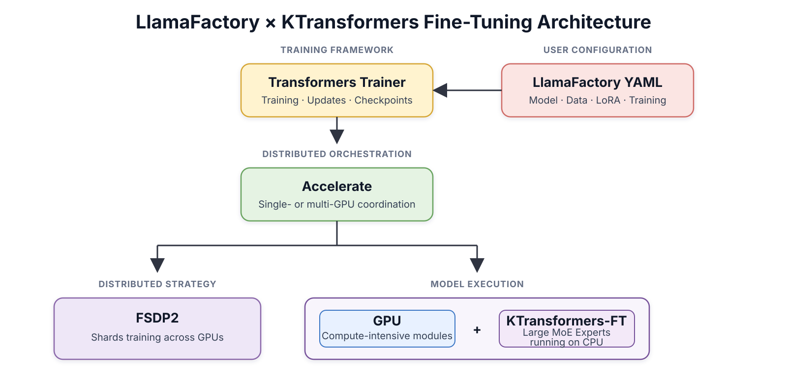

# KTransformers × LlamaFactory MoE Fine-Tuning Cookbook

From Qwen3.5 to DeepSeek-V4, Kimi-K3, and GLM-5.2, each new ultra-large open model brings a major leap in capability and scale. However, the cost of high-end GPUs still prevents many researchers and developers from fine-tuning these models under constrained resources. KTransformers and LlamaFactory provide a practical alternative: with 1–4 RTX 4090 GPUs and a CPU platform with sufficient memory, users can fine-tune trillion-parameter MoE (Mixture of Experts) models such as the DeepSeek-V3/V4 family, Kimi-K2.5, and GLM-5.2.

KTransformers integrates with LlamaFactory while preserving its familiar training workflow. LlamaFactory remains the unified configuration and orchestration layer for data processing, training, LoRA injection, and inference integration. The GPU runs Attention and Shared Expert modules, while KTransformers manages Routed Experts in CPU memory for heterogeneous GPU–CPU execution.


**Technical overview:** KTransformers places compute-intensive Attention and shared modules on the GPU, while storing the large, sparsely activated Routed Experts in CPU memory. This avoids repeatedly transferring large Expert weights over PCIe and lets the CPU runtime select an optimized backend according to the weight format and available instruction set.


**Guide at a glance:** For a first run, start with **native BF16 + LoRA or full fine-tuning + `kt_backend: auto`**. This path requires no weight conversion and starts with two YAML files. If the model provides a native FP8 checkpoint and the training method is LoRA, KTransformers can load the native FP8 Expert weights directly to reduce host-memory usage. Use converted INT8 or AMXINT4 weights only when host memory remains the limiting resource and the matching converted artifacts are available.

## Contents

- [Check hardware and install](#1-check-hardware-and-install)
- [Choose a fine-tuning setup](#2-choose-a-fine-tuning-setup)
- [Custom YAML: advanced settings](#3-custom-yaml-advanced-settings)
- [Performance and resource estimates](#4-performance-and-resource-estimates)
- [Appendix: complete configurations and Q&A](#appendix)

## 1. Check hardware and install

### 1.1 Check hardware resources

Check the CPU instruction set first to identify the available acceleration backend:

```bash
lscpu | grep -i -E 'Model name|Socket|NUMA|avx512|amx'
```

Then check GPU memory, host memory, and disk capacity:

```bash
nvidia-smi
free -h
df -h /data
```

Confirm two requirements:

- **Instruction-set compatibility:** Native FP8 requires a compatible AMD/x86 CPU with AVX512F, AVX512_BF16, AVX512_VNNI, and AVX512_VBMI. For INT8, `auto` can select an AMX-INT8 or AVX512-VNNI implementation. AMXINT4 requires AMX and matching converted weights. Native BF16 performs best when AMX is available.
- **Sufficient capacity:** Host memory must hold the Expert weights and leave room for activations, gradients, and optimizer states. Disk capacity must also cover checkpoints and temporary files.

### 1.2 Install the environment

Use a clean Python 3.11 environment. Pin PyTorch 2.9.1 before installing LlamaFactory, and install the KT dependencies last so standard `transformers` or `accelerate` packages do not overwrite the KT variants:

```bash
conda create -n kt-sft python=3.11 -y
conda activate kt-sft

git clone --depth 1 https://github.com/hiyouga/LlamaFactory.git
cd LlamaFactory

python -m pip install torch==2.9.1 torchaudio==2.9.1 torchvision==0.24.1
python -m pip install -e .
python -m pip install "ktransformers[sft]==0.7.0"
python -m pip install "sglang-kt==0.7.0"
```

After installation, check dependency consistency and the versions that Python actually imports:

```bash
python -m pip check

python - <<'PY'
from importlib.metadata import version

import accelerate
import ktransformers
import kt_kernel
import torch
import transformers

for name, module in {
    "torch": torch,
    "transformers": transformers,
    "accelerate": accelerate,
    "kt_kernel": kt_kernel,
    "ktransformers": ktransformers,
}.items():
    print(f"{name:14s} {getattr(module, '__version__', 'unknown')}")

print(f"{'sglang-kt':14s} {version('sglang-kt')}")
print(f"{'transformers-kt':14s} {version('transformers-kt')}")
print(f"{'accelerate-kt':14s} {version('accelerate-kt')}")

from accelerate.utils.dataclasses import KTransformersPlugin  # noqa: F401
PY
```

The compatible environment should include these versions:

```text
No broken requirements found.
torch          2.9.1
transformers   5.6.0
accelerate     1.14.0
kt_kernel      0.7.0
ktransformers  0.7.0
sglang-kt      0.7.0
transformers-kt 5.6.0.post2
accelerate-kt  1.14.0.post2
```

## 2. Choose a fine-tuning setup

Choose the Expert weight format first, then select LoRA or full fine-tuning. After making both choices, use the corresponding training YAML and Accelerate YAML below.

### 2.1 Choose the Expert weight format

Native versus converted precision describes the Expert weight format. AMX (Advanced Matrix Extensions) and AVX512 (Advanced Vector Extensions 512-bit) describe CPU instruction sets and backends; they are a separate dimension.

| Weight option | When to use it | Requirements and tradeoffs |
| --- | --- | --- |
| Native BF16 checkpoint | Host memory is sufficient and a stable, direct training path is the priority | No weight conversion is required. When AMX is available, `auto` selects the currently fastest AMXBF16 path |
| Native FP8 (8-bit floating point) | The model provides a native FP8 checkpoint and should remain in its original weight format | Currently used for LoRA with frozen base Experts. Requires the complete AVX512 FP8 extension set; AMX does not support this native FP8 path |
| KT-converted INT8 | Native Expert weights do not fit in host memory | Requires a mutually matched pair of INT8 Routed Expert weights and a BF16 non-expert cache. `auto` can select AMX-INT8 or AVX512-VNNI |
| KT-converted AMXINT4 | Memory pressure is more severe and the additional accuracy risk is acceptable | Requires AMX and matching AMXINT4 weights. Validate quality on a representative evaluation set |

Prefer native BF16 or native FP8 when host memory allows. Use INT8 or AMXINT4 only when matching converted weights are available and reducing Expert memory is necessary.

### 2.2 Choose LoRA or full fine-tuning

Expert weight format and parameter-update scope are separate configuration dimensions, but the supported combinations have clear boundaries. Native BF16 supports both LoRA and full fine-tuning. Native FP8, INT8, and AMXINT4 recipes use LoRA with frozen base Experts. Full fine-tuning uses BF16.

| Method | When to use it | Resources and output |
| --- | --- | --- |
| LoRA (Low-Rank Adaptation) | Recommended by default for rapid task adaptation, repeated experiments, or constrained resources | Lower GPU-memory, host-memory, and disk cost. Produces a LoRA adapter and KT Expert LoRA artifacts |
| Full fine-tuning | The task requires updating all target parameters and can afford the higher training and checkpoint cost | Requires more GPU memory, host memory, and disk capacity. Produces a complete model checkpoint |

### 2.3 Responsibilities of the two YAML files



Each run uses two YAML files. The training YAML defines the task and owns every KTransformers setting. The Accelerate YAML defines only distributed execution and FSDP2. Current LlamaFactory rejects `kt_config` in the Accelerate YAML.

| File | Responsibility | Common fields |
| --- | --- | --- |
| Training YAML | Model, data, LoRA or full fine-tuning, batch, sequence length, output directory, and all KT settings | `model_name_or_path`, `dataset`, `finetuning_type`, `lora_*`, `cutoff_len`, `output_dir`, `use_kt`, `kt_cpu_activation`, `kt_weight_path`, `kt_non_expert_weight_path`, `kt_config` |
| Accelerate YAML | GPU processes, FSDP2 (Fully Sharded Data Parallel 2), and global mixed precision | `num_processes`, `mixed_precision`, `fsdp_config` |

Check three relationships before launch:

1. The number of GPUs in `CUDA_VISIBLE_DEVICES` must equal `num_processes`.
2. If `kt_config.kt_model_max_length` is set manually in the training YAML, it must cover `cutoff_len` plus the runtime token margin.
3. Write the LoRA rank only at the top level of the training YAML. LlamaFactory derives the internal KT fields. Remove LoRA-only fields for full fine-tuning.

### 2.4 Base YAML for four common setups

Copy the complete configurations from Appendix A.1 and A.2, then replace the fields shown for the selected setup. Each block labels the training YAML and Accelerate YAML sections. `kt_config` always belongs in the training YAML.

#### 2.4.1 Native BF16 + LoRA

```yaml
# File 1: training YAML
model_name_or_path: /data/models/Your-BF16-Model
finetuning_type: lora
lora_rank: 8
use_kt: true
# Do not set kt_weight_path for native BF16
kt_config:
  kt_backend: auto
  kt_expert_weight_format: bf16

# File 2: Accelerate YAML
mixed_precision: bf16
num_processes: 2
```

#### 2.4.2 Native FP8 + LoRA

```yaml
# File 1: training YAML
model_name_or_path: /data/models/Your-Native-FP8-Model
finetuning_type: lora
lora_rank: 8
use_kt: true
# Do not set kt_weight_path for native FP8
kt_config:
  kt_backend: auto
  kt_expert_weight_format: fp8

# File 2: Accelerate YAML
mixed_precision: bf16
num_processes: 2
```

#### 2.4.3 INT8 / AMXINT4 + LoRA

```yaml
# File 1: training YAML
finetuning_type: lora
lora_rank: 8
use_kt: true
# INT8 setup
kt_weight_path: /data/models/Your-Routed-Experts-INT8
kt_non_expert_weight_path: /data/models/Your-Non-Expert-Cache-BF16
kt_config:
  kt_backend: auto
  kt_expert_weight_format: int8
  kt_weight_lifecycle: persistent

# For AMXINT4, use matching paths and replace kt_config above with:
# kt_weight_path: /data/models/Your-Model-AMXINT4
# kt_non_expert_weight_path: /data/models/Your-Non-Expert-Cache-BF16
# kt_config:
#   kt_backend: AMXINT4

# File 2: Accelerate YAML
mixed_precision: bf16
num_processes: 2
```

#### 2.4.4 Native BF16 + full fine-tuning

```yaml
# File 1: training YAML
finetuning_type: full
learning_rate: 1.0e-5
use_kt: true
# Remove lora_rank, lora_alpha, lora_dropout, lora_target, and other LoRA fields
kt_config:
  kt_backend: auto
  kt_expert_weight_format: bf16

# File 2: Accelerate YAML
mixed_precision: bf16
num_processes: 2
```

### 2.5 Launch

```bash
CUDA_VISIBLE_DEVICES=0,1 accelerate launch --main_process_port 0 --config_file qwen35_fsdp2_2gpu.yaml src/train.py qwen35_397b_bf16_lora.yaml
```

## 3. Custom YAML: advanced settings

After a base setup launches successfully, tune the following parameters according to the training objective and resource bottleneck. Keep the recommended values unless there is a clear reason to change them, and avoid changing several parameter groups at once.

**(1) LoRA capacity: `lora_rank`, `lora_alpha`, `lora_target`, `lora_dropout`**

Change these four fields only at the top level of the training YAML. LlamaFactory automatically derives the rank, alpha, and dropout used internally by KTransformers. Do not repeat them in `kt_config` or the Accelerate YAML. Start with `lora_rank: 8`, `lora_alpha: 16`, `lora_target: all`, and `lora_dropout: 0.0`.

If task adaptation is insufficient, increase the rank to 16 and then 32 while keeping alpha at about twice the rank. If a small dataset shows clear overfitting, increase dropout to `0.05`.

**(2) Sequence length: `cutoff_len`**

Set this field in the training YAML according to the effective token length of most samples. Do not use the maximum dataset length solely for a small number of long samples. Longer sequences increase activation and KT buffer usage, which raises both host-memory and GPU-memory requirements.

The system derives the KT model-length capacity from `cutoff_len`. To increase it manually, set `kt_model_max_length` in the training YAML's `kt_config`. It must be greater than `cutoff_len` and include room for additional runtime tokens.

**(3) Batch: `per_device_train_batch_size`, `gradient_accumulation_steps`**

Set both fields in the training YAML. For ultra-large MoE models, start with `per_device_train_batch_size: 1`. Increase the micro batch only after confirming sufficient GPU and host memory. If GPU memory is insufficient, keep the micro batch at 1 and use gradient accumulation to increase the effective batch.

```text
effective batch size = per_device_train_batch_size × number of GPUs × gradient_accumulation_steps
```

**(4) Activation recomputation and CPU Activation Reuse: `disable_gradient_checkpointing`, `kt_cpu_activation`**

In the training YAML, `disable_gradient_checkpointing: false` enables gradient checkpointing to trade additional computation for lower activation memory. Setting it to `true` retains more intermediate results and may improve speed, but uses more memory.

When host memory is sufficient, add this top-level field to the same training YAML:

```yaml
kt_cpu_activation: retain
```

This option retains CPU Expert activations during checkpoint recomputation, using more host memory to reduce repeated CPU work. When gradient checkpointing is enabled and the field is omitted, CPU and GPU activations are recomputed. `kt_cpu_activation` controls CPU Expert activation retention, while `disable_gradient_checkpointing` controls the overall checkpoint-recomputation policy; do not treat them as one switch.

**(5) CPU Expert reuse and threads: `kt_share_backward_bb`, `kt_num_threads`**

Both fields belong in the training YAML's `kt_config`. Keep `kt_share_backward_bb: true` to reuse the buffer required by CPU Expert backward computation. It is separate from `kt_cpu_activation`; do not disable it unless the configuration for the current model explicitly requires that change.

Set `kt_num_threads` to the number of physical CPU cores available to the job, not the total number of logical cores including SMT threads. If data preprocessing shares the same CPUs, reserve cores for the DataLoader and system processes.

The system derives `kt_threadpool_count` from the NUMA topology. Change it manually only after confirming the CPU socket and NUMA layout.

**(6) Resume from a checkpoint: `resume_from_checkpoint`**

Set this field in the training YAML to the target `checkpoint-*` directory. Omit it for a new run. Keep `output_dir` pointed at the output directory for the current job, never at the base-model directory, and keep `overwrite_output_dir: false` to avoid overwriting existing results.

## 4. Performance and resource estimates

The table below uses a 2K context (`sequence length = 2048`), per-GPU batch size 1, and gradient accumulation 1. It includes only accepted KTransformers BF16 runs that completed real LoRA training. Throughput includes forward, loss, backward, and optimizer steps.

| Model and weights | GPUs | Global batch size | Minimum per-GPU memory reference | Minimum host-memory reference | Fine-tuning throughput (tokens/s) |
| --- | ---: | ---: | ---: | ---: | ---: |
| Qwen3-235B-2507 BF16 LoRA | 2 | 2 | ≥ 27.14 GiB | ≥ 545.36 GiB | 147.91 |
| Qwen3.5-397B BF16 LoRA | 8 | 8 | ≥ 20.37 GiB | ≥ 1075.68 GiB | 215.25 |

The GPU-memory column reports the highest single-GPU peak from the measured run. The host-memory column reports peak CPU RSS for the training process tree, normalized to GiB. These values are minimum references for the measured configurations, not safety margins. Reserve additional capacity for data loading, caches, checkpoint saving, and system processes.

Results with different GPU counts should not be used to infer linear scaling directly. Increasing `cutoff_len`, batch size, or KT cache depth increases resource usage. Full fine-tuning also requires additional capacity for gradients, master weights, optimizer states, and complete checkpoints.

## Appendix

### A.1 Qwen3.5-397B BF16 LoRA training YAML

Save as `qwen35_397b_bf16_lora.yaml`:

```yaml
### model
model_name_or_path: /data/models/Qwen3.5-397B-A17B
trust_remote_code: true
disable_gradient_checkpointing: false

### method
stage: sft
do_train: true
finetuning_type: lora
lora_rank: 8
lora_alpha: 16
lora_dropout: 0.0
lora_target: all

### dataset
dataset: your_dataset
template: qwen3_5
cutoff_len: 2048
packing: false
preprocessing_num_workers: 16
dataloader_num_workers: 4

### output
output_dir: /data/output/qwen35-bf16-lora
logging_steps: 10
save_strategy: steps
save_steps: 500
plot_loss: true
overwrite_output_dir: false
save_only_model: false
report_to: none

### train
per_device_train_batch_size: 1
gradient_accumulation_steps: 1
learning_rate: 1.0e-4
num_train_epochs: 3
lr_scheduler_type: cosine
warmup_ratio: 0.1
bf16: true
ddp_timeout: 180000000

### ktransformers
use_kt: true
# kt_cpu_activation: retain  # Optional: use more host memory to reduce CPU Expert recomputation
# kt_weight_path: /data/models/Your-Routed-Experts-INT8  # Converted INT8 Routed Experts
# kt_non_expert_weight_path: /data/models/Your-Non-Expert-Cache-BF16  # Must match the path above
kt_config:
  kt_expert_weight_format: bf16
  kt_backend: auto
  kt_num_threads: 64
  kt_tp_enabled: true
  kt_threadpool_count: 2
  kt_max_cache_depth: 2
  kt_share_backward_bb: true
```

### A.2 FSDP2 Accelerate YAML

Save as `qwen35_fsdp2_2gpu.yaml`:

```yaml
compute_environment: LOCAL_MACHINE
distributed_type: FSDP
fsdp_config:
  fsdp_auto_wrap_policy: TRANSFORMER_BASED_WRAP
  fsdp_cpu_ram_efficient_loading: true
  fsdp_offload_params: false
  fsdp_reshard_after_forward: true
  fsdp_state_dict_type: FULL_STATE_DICT
  fsdp_version: 2
mixed_precision: bf16
num_machines: 1
num_processes: 2
rdzv_backend: static
same_network: true
use_cpu: false
```

### A.3 Q&A

#### A.3.1 Why can't a native FP8 checkpoint use the converted INT8 configuration?

The weight formats and loading paths are different. Native FP8 preserves the FP8 weights and scales from the checkpoint and uses the AVX512 native-precision backend. The INT8 recipe reads a mutually matched pair of INT8 Routed Expert weights and a BF16 non-expert cache, then lets `auto` select an AMX-INT8 or AVX512-VNNI implementation. Do not pass a native FP8 checkpoint through `kt_weight_path`.

#### A.3.2 `auto` did not select the expected backend

Save the `lscpu` output and startup log, then confirm that the container or virtualization environment did not hide the required instruction set. Native BF16 can select AMXBF16 when AMX is available. Native FP8 should select AVX512. Do not force a backend that the CPU or weight format does not support.

#### A.3.3 Insufficient host memory

First reduce concurrent data loading, sequence length, and cache depth, and confirm that two copies of the Expert weights are not loaded. If memory is still insufficient, prepare converted INT8 or AMXINT4 weights. For full fine-tuning, estimate the additional memory for gradients, master weights, and optimizer states separately.

#### A.3.4 GPU OOM

OOM (Out of Memory) means GPU or host memory is insufficient. Reduce `cutoff_len`, per-GPU batch size, and activation usage first, then increase `gradient_accumulation_steps` to preserve the global batch size. `num_processes`, the visible GPU count, and the actual model placement must agree.

#### A.3.5 `kt_model_max_length` does not match `cutoff_len`

When increasing `cutoff_len`, increase `kt_model_max_length` as well and leave room for the effective runtime sequence length. A value that is too small causes buffer or shape errors; an unnecessarily large value increases host-memory usage.
