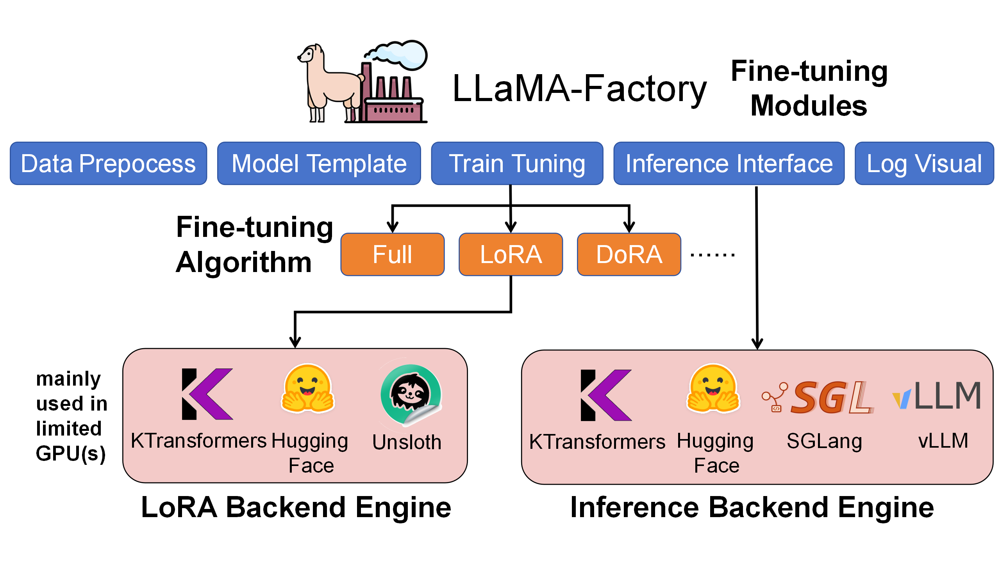
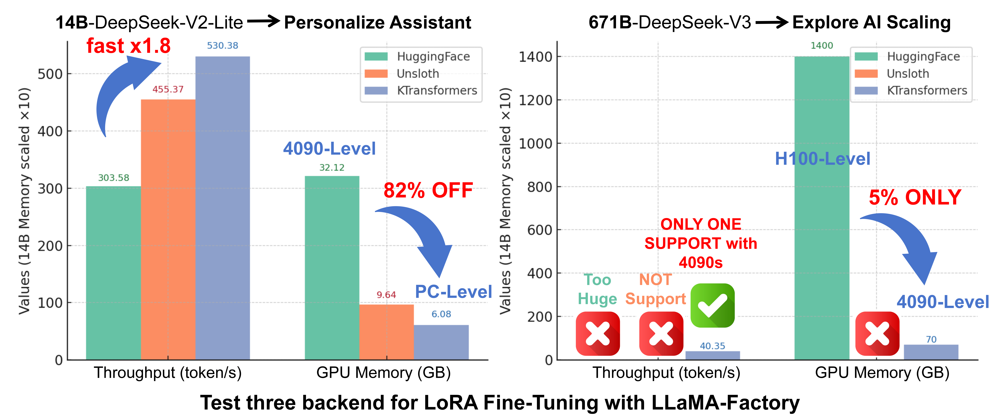
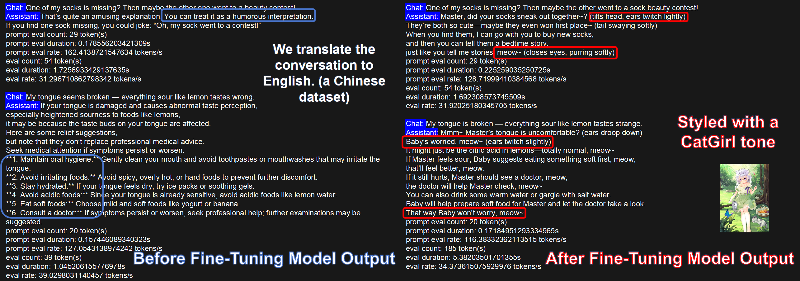
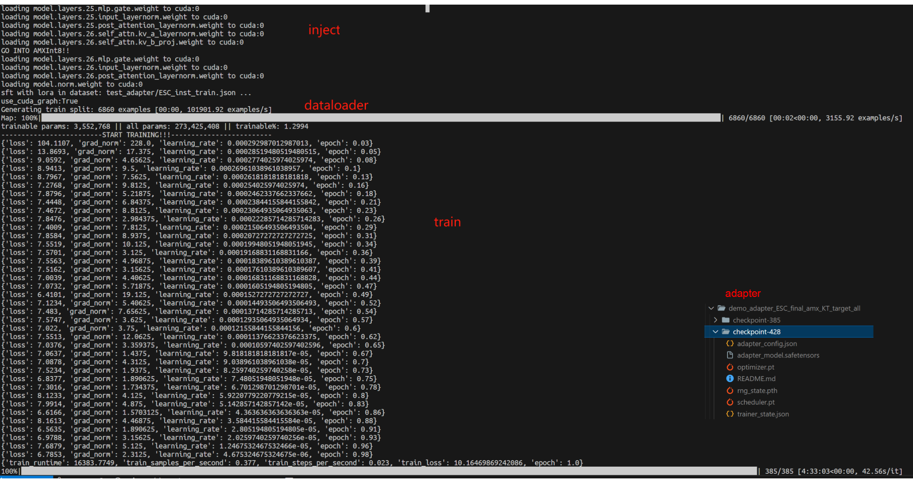
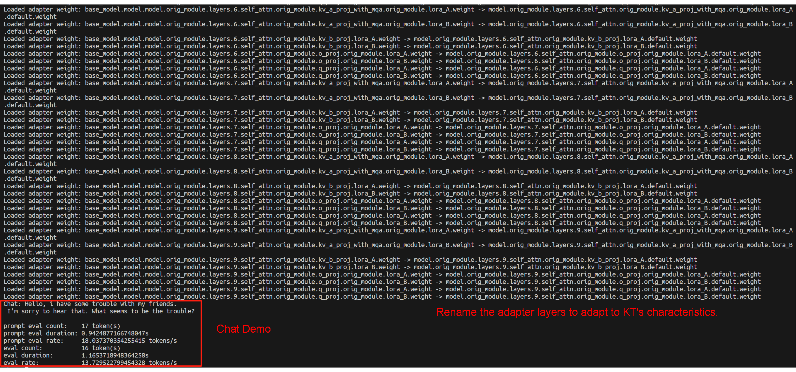

- [Introduction](#introduction)
  - [Fine-Tuning Results (Examples)](#fine-tuning-results-examples)
- [Quick to Start](#quick-to-start)
  - [Environment Setup](#environment-setup)
  - [Core Feature 1: Use KTransformers backend to fine-tune ultra-large MoE models](#core-feature-1-use-ktransformers-backend-to-fine-tune-ultra-large-moe-models)
  - [Core Feature 2: Chat with the fine-tuned model (base + LoRA adapter)](#core-feature-2-chat-with-the-fine-tuned-model-base--lora-adapter)
  - [Core Feature 3: Batch inference + metrics (base + LoRA adapter)](#core-feature-3-batch-inference--metrics-base--lora-adapter)
- [KT Fine-Tuning Speed (User-Side View)](#kt-fine-tuning-speed-user-side-view)
  - [End-to-End Performance](#end-to-end-performance)
  - [GPU/CPU Memory Footprint](#gpucpu-memory-footprint)
- [Conclusion](#conclusion)


# KTransformers Fine-Tuning × LLaMA-Factory Integration – User Guide

**MadSys Lab, KVCache-AI Team, Approaching AI, LLaMA-Factory Team**

## Introduction

From **DeepSeek-V3/R1** to **Qwen3-MoE** and **Kimi-K2**, each wave of open-sourced large models brings leaps in performance and scale. However, many researchers and developers are constrained by expensive GPUs and models with tens or even hundreds of billions of parameters, making it **hard to fine-tune very large models under limited resources**. To bridge this gap, we propose a practical approach: combining **KTransformers** with **LLaMA-Factory**. With just **2–4 RTX 4090s** and a high-memory CPU, you can fine-tune ultra-large MoE models like DeepSeek-671B.

Our goal is to give resource-constrained researchers a **local path to explore fine-tuning ultra-large models**, and also a fast way to customize smaller models (e.g., 14B/30B) for specific scenarios. We validate the setup using **stylized dialogue**, **Westernized translation tone**, and **medical Q&A** as representative tasks, showing that **personalized adaptation can be achieved within hours**.

As shown below, LLaMA-Factory is the unified orchestration/configuration layer for the whole fine-tuning workflow—handling data, training scheduling, LoRA injection, and inference interfaces. **KTransformers** acts as a pluggable high-performance backend that takes over core operators like Attention/MoE under the same training configs, enabling efficient **GPU+CPU heterogeneous cooperation**.



Within LLaMA-Factory, we compared LoRA fine-tuning with **HuggingFace**, **Unsloth**, and **KTransformers** backends. KTransformers is the **only workable 4090-class solution** for ultra-large MoE models (e.g., 671B) and also delivers higher throughput and lower GPU memory on smaller MoE models (e.g., DeepSeek-14B).

| Under LoRA (BF16) + [NekoQA-10K stylized dialogue](https://github.com/mindsRiverPonder/LLM-practice) | HuggingFace Backend                      | Unsloth Backend                      | KTransformers Backend |
| ------------------------------------------------------------ | ---------------------------------------- | ------------------------------------ | --------------------- |
| [14B-DeepSeekV2-Lite] LoRA fine-tuning throughput            | 303.58 token/s                           | 455.37 token/s                       | 530.38 token/s        |
| [14B-DeepSeekV2-Lite] GPU memory                             | 32.12 GB                                 | 9.64 GB                              | 6.08 GB               |
| [671B-DeepSeekV3] LoRA fine-tuning throughput                | <font color='red'>Too Huge to run</font> | <font color='red'>NOT SUPPORT</font> | 40.35 token/s         |
| [671B-DeepSeekV3] GPU memory (sum across GPUs)               | theoretical 1400 GB †                    | <font color='red'>NOT SUPPORT</font> | 70 GB †               |

† **1400 GB** is a **theoretical** FP16 full-parameter resident footprint (not runnable). **70 GB** is the **measured peak** with KT strategy (Attention on GPU + layered MoE offload).



### Fine-Tuning Results (Examples)

#### Stylized Dialogue (CatGirl tone)

Dataset: [NekoQA-10K](https://zhuanlan.zhihu.com/p/1934983798233231689). Goal: improve style consistency and recognizability.

The figure compares responses from the base vs. fine-tuned models. The fine-tuned model maintains the target tone and address terms more consistently (red boxes), validating the effectiveness of **style-transfer fine-tuning**.



#### Benchmarks

We use:

(1) [Translational-Style-ChatLLM](https://github.com/Benson114/Translational-Style-ChatLLM), which asks for an exaggerated, Westernized translation tone—clear, stylized customization.

(2) [AfriMed-QA](https://aclanthology.org/2025.acl-long.96/) (ACL 2025), a medical dataset for African contexts with strong domain specificity, including multiple-choice and short-answer sub-tasks—well-suited for vertical fine-tuning evaluation.

The tables show metrics before vs. after LoRA fine-tuning. We observe **large improvements** across metrics, verifying fine-tuning effectiveness:

| Translational-Style dataset    | BLEU-1    | BLEU-2    | BLEU-3    | BLEU-4    | ROUGE-1   | ROUGE-2   | ROUGE-L   |
| ------------------------------ | --------- | --------- | --------- | --------- | --------- | --------- | --------- |
| V2-Lite (no LoRA)              | 20.66     | 8.33      | 4.54      | 2.89      | 22.71     | 4.52      | 19.19     |
| **KT-LoRA fine-tuned V2-Lite** | **35.41** | **22.44** | **15.42** | **11.18** | **42.03** | **18.38** | **33.10** |
| V3 base (no LoRA)              | 8.49      | 3.34      | 1.62      | 0.96      | 15.91     | 2.55      | 10.07     |
| **KT-LoRA fine-tuned V3**      | **37.02** | **23.70** | **16.21** | **11.49** | **43.43** | **18.96** | **34.54** |

| AfriMed-QA (short answer)      | BLEU-1    | BLEU-2    | BLEU-3    | BLEU-4    | ROUGE-1   | ROUGE-2   | ROUGE-L   |
| ------------------------------ | --------- | --------- | --------- | --------- | --------- | --------- | --------- |
| V2-Lite (no LoRA)              | 13.58     | 11.12     | 9.10      | 7.23      | 22.48     | 7.81      | 11.73     |
| **KT-LoRA fine-tuned V2-Lite** | **35.90** | **27.63** | **22.99** | **19.15** | **35.25** | **17.50** | **28.44** |
| V3 base (no LoRA)              | 12.75     | 10.27     | 8.05      | 5.99      | 20.33     | 5.65      | 10.11     |
| **KT-LoRA fine-tuned V3**      | **42.42** | **34.12** | **28.95** | **24.54** | **41.97** | **22.37** | **33.28** |

| AfriMed-QA (multiple choice)   | Accuracy   |
| ------------------------------ | ---------- |
| V2-Lite (no LoRA)              | 0.0645     |
| **KT-LoRA fine-tuned V2-Lite** | **0.4812** |
| V3 base (no LoRA)              | 0.5833     |
| **KT-LoRA fine-tuned V3**      | **0.7930** |

Even for ultra-large MoE models, **KTransformers-backed fine-tuning** achieves strong task performance quickly.


## Quick to Start

This section shows how to install and use **LLaMA-Factory + KTransformers** for fine-tuning and inference:

- Environment setup
- Fine-tune ultra-large MoE models with KTransformers backend
- Load the fine-tuned model (base + LoRA adapter) for chat/inference
- Batch inference and metric evaluation

### Environment Setup

According to the following example, install both the **KTransformers** and **LLaMA-Factory** environments simultaneously.
 This time, to simplify the installation process of KTransformers, use the PyPI packages to avoid local compilation.
 The detailed installation steps are as follows:
 (Note: Make sure your local **Python version**, **Torch version**, and **CUDA version** are compatible with the installed packages.)

```shell
# 1. Create a conda environment
conda create -n Kllama python=3.12 # choose from : [3.11, 3.12, 3.13]
conda install -y -c conda-forge libstdcxx-ng gcc_impl_linux-64
conda install -y -c nvidia/label/cuda-11.8.0 cuda-runtime

# 2. Install the LLaMA-Factory environment
git clone --depth 1 https://github.com/hiyouga/LLaMA-Factory.git
cd LLaMA-Factory
pip install -e .

# 3. Install the KTransformers SFT packages
pip install "ktransformers[sft]"

# 4. Install flash-attention, download the corresponding file based on your Python and Torch versions from: https://github.com/Dao-AILab/flash-attention/releases
pip install flash-attn --no-build-isolation
# abi=True/False can find from below
# import torch
# print(torch._C._GLIBCXX_USE_CXX11_ABI)

# 5. (Optional) If you want to use flash_infer (otherwise it defaults to triton)
git clone https://github.com/kvcache-ai/custom_flashinfer.git
pip install custom_flashinfer/
```

**Usage tip:** In LLaMA-Factory YAML, set `use_kt: true` and pick a `kt_optimize_rule` file to have KTransformers handle the core compute. The features below show typical configs.

### Core Feature 1: Use KTransformers backend to fine-tune ultra-large MoE models

Run the command: `USE_KT=1 ACCELERATE_USE_KT=true accelerate launch --config_file examples/ktransformers/accelerate/fsdp2_kt_bf16.yaml -m llamafactory.cli train examples/ktransformers/train_lora/deepseek_v3_lora_sft_kt.yaml`.

Note: You **must** provide a **BF16** model. DeepSeek-V3-671B is released in FP8 by default; convert with [DeepSeek-V3/inference/fp8_cast_bf16.py](https://github.com/deepseek-ai/DeepSeek-V3/blob/main/inference/fp8_cast_bf16.py).

```yaml
### model
model_name_or_path: opensourcerelease/DeepSeek-V3-bf16
trust_remote_code: true

### method
stage: sft
do_train: true
finetuning_type: lora
lora_rank: 8
lora_target: all

### dataset
dataset: identity
template: deepseek
cutoff_len: 2048
max_samples: 100000
overwrite_cache: true
preprocessing_num_workers: 16
dataloader_num_workers: 4

### output
output_dir: saves/Kllama_deepseekV3
logging_steps: 10
save_steps: 500
plot_loss: true
overwrite_output_dir: true
save_only_model: false
report_to: none  # choices: [none, wandb, tensorboard, swanlab, mlflow]

### train
per_device_train_batch_size: 1
gradient_accumulation_steps: 8
learning_rate: 1.0e-4
num_train_epochs: 3.0
lr_scheduler_type: cosine
warmup_ratio: 0.1
bf16: true
ddp_timeout: 180000000
resume_from_checkpoint: null

### ktransformers
use_kt: true # use KTransformers as LoRA sft backend
kt_optimize_rule: examples/kt_optimize_rules/DeepSeek-V3-Chat-sft-amx-multi-gpu.yaml
cpu_infer: 32
chunk_size: 8192
```

`kt_optimize_rule` controls **placement strategy**. See also [ktransformers/optimize_rules](https://github.com/kvcache-ai/ktransformers/tree/main/ktransformers/optimize/optimize_rules). Naming hints (`*` = wildcard):

| Pattern                                      | Meaning                                               |
| -------------------------------------------- | ----------------------------------------------------- |
| DeepSeek-V2-Lite-Chat-* / DeepSeek-V3-Chat-* | Target model variants                                 |
| *-sft-*                                      | Strategy for fine-tuning; others are for inference    |
| *-amx-*                                      | Use AMX on CPU; otherwise use **llamafile**           |
| *-multi-gpu-X*                               | Model parallel on X GPUs (X omitted → default 2 GPUs) |

Example: `DeepSeek-V3-Chat-sft-amx-multi-gpu.yaml` = V3-Chat fine-tuning with AMX and 2-GPU model parallel.

We recommend **AMX acceleration** where available (`lscpu | grep amx`). AMX supports BF16/INT8. Example:

```yaml
- match:
    name: "^model\\.layers\\..*\\.mlp\\.experts$"
  replace:
    class: ktransformers.operators.experts.KTransformersExperts     # custom MoE Kernel with expert parallelism
    kwargs:
      prefill_device: "cpu"
      prefill_op: "KExpertsTorch"
      generate_device: "cpu"
      generate_op: "KSFTExpertsCPU"
      out_device: "cuda"
      backend: "AMXInt8" # or "AMXBF16" or "llamafile" (default)
```

Outputs go to `output_dir` in safetensors format plus adapter metadata for later loading.



### Core Feature 2: Chat with the fine-tuned model (base + LoRA adapter)

Run the command: `llamafactory-cli chat examples/inference/qwen3_lora_sft.yaml`.

Use the safetensors adapter trained with KT for inference.

```yaml
model_name_or_path: opensourcerelease/DeepSeek-V3-bf16
adapter_name_or_path: saves/Kllama_deepseekV3
template: deepseek
infer_backend: ktransformers  # choices: [huggingface, vllm, sglang, ktransformers]
trust_remote_code: true

use_kt: true # use KTransformers as LoRA sft backend to inference
kt_optimize_rule: examples/kt_optimize_rules/DeepSeek-V3-Chat-sft-amx-multi-gpu.yaml
cpu_infer: 32
chunk_size: 8192
```

We also support **GGUF** adapters: for safetensors, set the **directory**; for GGUF, set the **file path** in `adapter_name_or_path`.

During loading, LLaMA-Factory maps layer names to KT’s naming. You’ll see logs like `Loaded adapter weight: XXX -> XXX`:



### Core Feature 3: Batch inference + metrics (base + LoRA adapter)

Run the command: `API_PORT=8000 llamafactory-cli api examples/inference/qwen3_lora_sft.yaml`.
 Invoke the KT fine-tuned adapter to provide the API; the usage logic of other APIs is consistent with the native LLaMA-Factory approach.

```yaml
model_name_or_path: opensourcerelease/DeepSeek-V3-bf16
adapter_name_or_path: saves/Kllama_deepseekV3
template: deepseek
infer_backend: ktransformers  # choices: [huggingface, vllm, sglang, ktransformers]
trust_remote_code: true

use_kt: true # use KTransformers as LoRA sft backend to inference
kt_optimize_rule: examples/kt_optimize_rules/DeepSeek-V3-Chat-sft-amx-multi-gpu.yaml
cpu_infer: 32
chunk_size: 8192
```

<a id="qwen35-vlm-lora-full-guide"></a>

## Qwen3.5 VLM LoRA Full Guide

This module documents end-to-end Qwen3.5 VLM LoRA SFT with the KTransformers backend and the matching LlamaFactory integration. It covers the verified Qwen3.5-122B-A10B example and applies to compatible Qwen3.5 VLM checkpoints after their model path and resource settings are adjusted.

### 1. Choose the VLM LoRA scope

`vlm_lora_scope` controls which modality receives LoRA adapters; it does not make the base model weights trainable.

| Value | Trainable LoRA modules | KT offloaded language experts |
| --- | --- | --- |
| `text` | Language-side Linear/Conv modules | LoRA enabled |
| `vision` | Vision tower and multimodal projector Linear/Conv modules, including Conv3D patch embedding | Frozen; KT computes only required input gradients |
| `all` | The union of text and vision targets | LoRA enabled |

Use `lora_target: all` with every non-default VLM scope. Existing non-VLM configurations remain unchanged because the default scope is `default`.

### 2. Clone the matching `main` branches

Keep both repositories under the same parent directory:

```bash
mkdir qwen35-vlm-lora
cd qwen35-vlm-lora
git clone https://github.com/Illumination111/LlamaFactory.git
git clone https://github.com/Illumination111/ktransformers.git
```

The VLM examples live in LlamaFactory, while the patched kernel, compatibility layer, and dedicated requirements file live in KTransformers.

### 3. Create the environment and install dependencies

Use Python 3.11 or later. Install LlamaFactory first so that the second installation step leaves the KT-patched Transformer and Accelerate implementations active:

```bash
conda create -n kt-vlm-lora python=3.11 -y
conda activate kt-vlm-lora

cd LlamaFactory
pip install -e .

cd ../ktransformers
pip install -r requirements-vlm-lora.txt
```

[`requirements-vlm-lora.txt`](../../../requirements-vlm-lora.txt) provides the verified VLM stack:

- `torch==2.9.1`, `torchvision==0.24.1`, and `torchaudio==2.9.1`
- the local editable `kt-kernel[vlm-sft]` and `ktransformers[vlm-sft]`
- `transformers-kt==5.6.0.post1` and `accelerate-kt==1.14.0.post1`
- `ms-swift>=4.4.2,<4.5` for the PyTorch 2.9 Conv3D compatibility path

Confirm that the KT distributions and import packages resolve together:

```bash
python - <<'PY'
import importlib.metadata as md
import accelerate
import torch
import transformers

print("torch:", torch.__version__)
print("transformers:", transformers.__version__)
print("transformers-kt:", md.version("transformers-kt"))
print("accelerate:", accelerate.__version__)
print("accelerate-kt:", md.version("accelerate-kt"))
print("kt-kernel:", md.version("kt-kernel"))
PY
```

### 4. Prepare the model weights

Download the Qwen3.5 VLM checkpoint or use its Hugging Face identifier. The training YAML accepts either form:

```yaml
model_name_or_path: Qwen/Qwen3.5-122B-A10B
```

For a local checkpoint, replace it with an absolute directory containing the model configuration, tokenizer/processor files, and all weight shards. Keep `trust_remote_code: true`.

### 5. Prepare and register the multimodal dataset

Place the dataset JSON and referenced media under `LlamaFactory/data/`. Each `<image>` placeholder must have a corresponding entry in `images`. A minimal ShareGPT example is:

```json
[
  {
    "messages": [
      {"role": "user", "content": "<image>Describe this image."},
      {"role": "assistant", "content": "A concise description of the image."}
    ],
    "images": ["my_vlm_data/example.jpg"]
  }
]
```

Register the file in `LlamaFactory/data/dataset_info.json`:

```json
"my_vlm_sft": {
  "file_name": "my_vlm_sft.json",
  "formatting": "sharegpt",
  "columns": {
    "messages": "messages",
    "images": "images"
  },
  "tags": {
    "role_tag": "role",
    "content_tag": "content",
    "user_tag": "user",
    "assistant_tag": "assistant"
  }
}
```

Set `dataset: my_vlm_sft` in the training YAML. For an initial smoke test, use the built-in `mllm_demo` dataset without adding a new registration.

### 6. Configure the training YAML

LlamaFactory provides matching `text`, `vision`, and `all` examples under `examples/ktransformers/train_lora/`. The complete `all`-scope example is:

```yaml
### model
model_name_or_path: Qwen/Qwen3.5-122B-A10B
image_max_pixels: 262144
video_max_pixels: 16384
trust_remote_code: true

### method
stage: sft
do_train: true
finetuning_type: lora
lora_rank: 8
lora_alpha: 16
lora_target: all
vlm_lora_scope: all

### dataset
dataset: mllm_demo
template: qwen3_5
cutoff_len: 512
overwrite_cache: true
preprocessing_num_workers: 4
dataloader_num_workers: 1

### output
output_dir: saves/KT_FT_qwen35Moe_VLM_all
logging_steps: 1
save_steps: 100
plot_loss: true
overwrite_output_dir: true
report_to: none

### train
per_device_train_batch_size: 1
gradient_accumulation_steps: 1
learning_rate: 1.0e-4
num_train_epochs: 3.0
lr_scheduler_type: cosine
warmup_ratio: 0.1
bf16: true
gradient_checkpointing: true
gradient_checkpointing_kwargs: {use_reentrant: false}
ddp_timeout: 360000000

### ktransformers
use_kt: true
```

Reduce `image_max_pixels`, `video_max_pixels`, `cutoff_len`, or the per-device batch size if GPU memory is insufficient. Increase gradient accumulation to preserve the desired effective batch size.

### 7. Launch training

Run from the LlamaFactory root. Direct CLI launches must explicitly allow the verified Transformers-KT fork:

```bash
cd ../LlamaFactory
LLAMAFACTORY_ALLOW_TRANSFORMERS_KT=1 \
  llamafactory-cli train \
  examples/ktransformers/train_lora/qwen3_5moe_vlm_all_lora_sft_kt.yaml
```

Replace the YAML filename with the `text` or `vision` example to use those scopes. Do not omit `use_kt: true`.

### 8. Check the run and outputs

At startup, verify that the selected VLM LoRA scope is reported, the expected trainable modules are listed, and the KT VLM Conv3D compatibility path is enabled for trainable Qwen VLM runs on PyTorch 2.9.x. Training artifacts are written to `output_dir`; depending on the selected scope, they include the PEFT adapter metadata and non-expert LoRA weights, plus KT fused expert LoRA weights when language experts are trainable.

Common failures:

- If LlamaFactory rejects stock `transformers==5.6.0`, reinstall with `requirements-vlm-lora.txt` and keep `LLAMAFACTORY_ALLOW_TRANSFORMERS_KT=1` in a direct CLI launch.
- If the Conv3D compatibility API is unavailable, confirm that `kt-kernel[vlm-sft]` and `ms-swift>=4.4.2,<4.5` are installed from the dedicated requirements file.
- If a non-default scope is rejected, use a current LlamaFactory `main` checkout and keep `lora_target: all`.
- If image placeholder counts do not match the `images` array, fix the dataset record before retrying.

For serving a converted KT LoRA adapter, continue with [Qwen3.5 MoE KT LoRA Serving with SGLang-KT](./Qwen3.5-SGLang-LoRA-Serving.md).


## KT Fine-Tuning Speed (User-Side View)

### End-to-End Performance

**Definitions**

- `step_time`: wall-clock time for a full optimization step (tensor movement + Attention + MoE + other compute).
- `tokens_per_step = GAS × qlen`; `token/s = tokens_per_step / step_time`.

**Settings:** `GAS=16`, `qlen=512` (→ `tokens_per_step = 8192`); LoRA (`r=8, alpha=32, dropout=0.1`); **AMX** enabled; GPU: RTX 4090, CPU: Intel Xeon Platinum 8488C.

**Measured**

- **DeepSeek-V3-671B:** `step_time = 203 s` → `token/s ≈ 8192 / 203 ≈ 40.35`
- **DeepSeek-V2-Lite-14B:** `step_time = 36 s` → `token/s ≈ 8192 / 36 ≈ 227.6`

### GPU/CPU Memory Footprint

- DeepSeek-V3 (671B; 61 layers with 58 MoE): ~**70 GB** total GPU VRAM (multi-GPU), ~**1.2–1.3 TB** CPU RAM.
- DeepSeek-V2-Lite (14B; 27 layers with 26 MoE): ~**5.5 GB** GPU VRAM, ~**30 GB** CPU RAM.

## Conclusion

By integrating **KTransformers LoRA fine-tuning** into **LLaMA-Factory**, we provide a practical guide for efficient training and deployment of MoE LLMs. KT brings cutting-edge optimizations (DeepSeek/Qwen/Kimi support with AMX-accelerated kernels), and LoRA enables customization under very low GPU memory. LLaMA-Factory offers a friendly, unified interface.

This integration (akin to Unsloth-style speedups) means even models with tens to hundreds of billions of parameters can be fine-tuned and deployed with low latency on commodity hardware. You get **memory savings, speed-ups, and usability** together. We encourage you to try LLaMA-Factory + KT for your next MoE project and follow this guide. Feedback is welcome!
