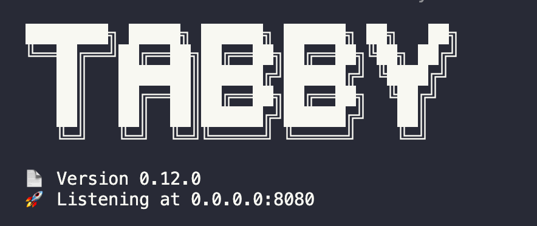
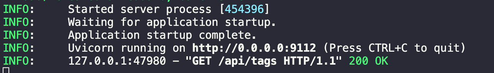

# How to Use Tabby and ktransformers Locally with 236B Large Models for Code Completion?

[Tabby](https://tabby.tabbyml.com/docs/welcome/) is an open-source code assistant that allows users to manually configure the backend framework and model, and use it across multiple IDEs/editors, such as VSCode and IntelliJ. Since Tabby can interface with Ollama on the framework side, and the ktransformers server provides a consistent API with Ollama, we can connect Tabby to the ktransformers server. This setup allows us to experience fast, heterogeneous inference in code completion scenarios.

1. Start ktransformers.
```bash
./ktransformers --port 9112
```
2. Install Tabby: Follow the official tutorial to install Tabby on a Linux server or Windows PC with an NVIDIA GPU [here](https://tabby.tabbyml.com/docs/quick-start/installation/linux/).
3. Configure Tabby: Create `~/.tabby/config.toml` and add the following configuration.
```toml
[model.completion.http]
kind = "ollama/completion"
api_endpoint = "http://127.0.0.1:9112/"
model_name = "DeepSeek-Coder-V2-Instruct"
prompt_template = "<｜fim▁begin｜>{prefix}<｜fim▁hole｜>{suffix}<｜fim▁end｜>" # Prompt Template
```

In this configuration, `kind` specifies that ktransformers uses the standard Ollama API to serve Tabby; `api_endpoint` matches the interface bound when launching ktransformers; `model_name` is set to the model used by ktransformers, here `DeepSeek-Coder-V2-Instruct` is the backend inference model; `prompt_template` is the model's prompt template, which requires a corresponding template for different models to use the Fill In the Middle feature properly.
Here we demonstrate the relevant configuration for Tabby using the Ollama API to provide the Completion feature. For configuration information about other functions available in Tabby, refer to [here](https://tabby.tabbyml.com/docs/administration/model/).


4. Start the Tabby service: `./tabby serve`.


   After launching, you should see access to the `/api/tags` interface in the ktransformers command line (in version v0.13.0 of Tabby, this changes to access to the `/api/show/` interface).


6. Register a Tabby account, obtain a Token: After starting the Tabby service, open the corresponding link in a browser (as shown above at 0.0.0.0:8080), and follow the [tutorial](https://tabby.tabbyml.com/docs/quick-start/register-account/) to create a user and get a Token.

7. Start VSCode, install the Tabby extension plugin, and use the Token obtained in the previous step to connect to the Tabby Server, following [here](https://tabby.tabbyml.com/docs/extensions/installation/vscode/).

8. Open any code file and experience the fast heterogeneous inference of ktransformers.