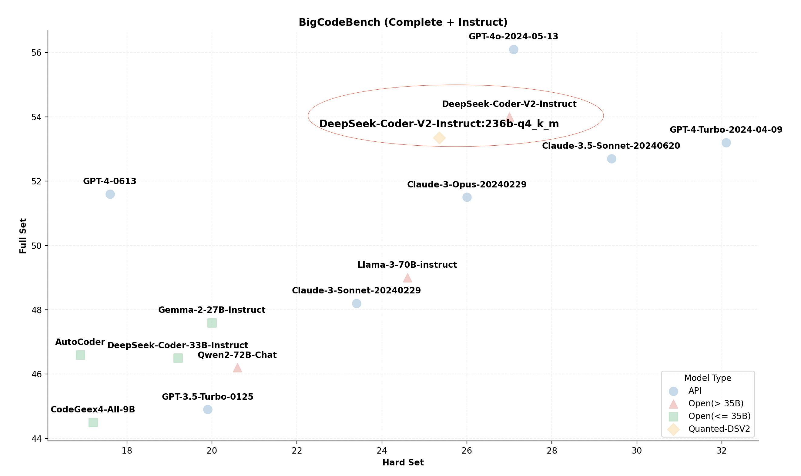
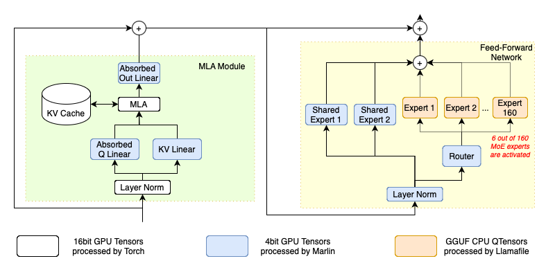
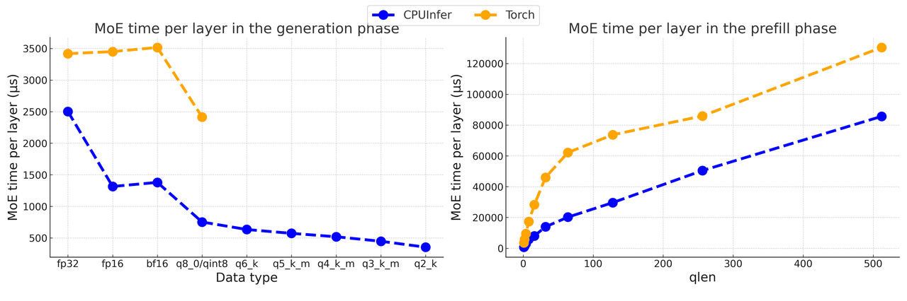

# Tutorial: Heterogeneous and Local MoE Inference

DeepSeek-(Code)-V2 is a series of strong mixture-of-experts (MoE) models, featuring a total of 236 billion parameters, with 21 billion parameters activated per token. This model has demonstrated remarkable reasoning capabilities across various benchmarks, positioning it as one of the SOTA open models and nearly comparable in performance to GPT-4. DeepSeek-R1 uses a similar architecture to DeepSeek-V2, but with a bigger number of parameters.

<p align="center">
  <picture>
    
  </picture>
</p>

Moreover, unlike previous models that employed traditional attention mechanisms like Grouped-Query Attention (GQA), DeepSeek-V2 incorporates a novel Multi-head Latent Attention (MLA). This innovation significantly reduces the size of the KV cache required during inference, enhancing efficiency.


However, despite its efficiency, the practicality of running such a large model on personal computing setups seems impractical. Official documentation for DeepSeek-V2 indicates that eight 80GB GPUs are necessary for standard inference operations, and even the scaled-down Q4_k_m version requires at least two 80GB GPUs. These requirements are beyond the reach of most individual researchers and small teams.


Nonetheless, by employing several cutting-edge optimization techniques, we have successfully operated this colossal model on a desktop computer with only 21GB of VRAM and 136GB of DRAM. In this document, we outline the specific optimizations utilized and provide a detailed tutorial on how to implement these strategies using KTransformers.

## Applied Optimizations

### Optimized MLA Operator

The following figure provides a brief overview of DeepSeek-V2 architecture. At the heart of its attention layer, DeepSeek-V2 introduces a novel MLA operator that represents the heads of key-value pairs using a common, joint compressed representation, which holds significant potential for efficiency improvements. However, the official open-source implementation of the MLA operator explicitly decompresses this compressed representation and caches the decompressed key-value pairs. This process not only enlarges the KV cache size but also diminishes inference performance.

<p align="center">
  <picture>
    
  </picture>
</p>

To truly capitalize on the benefits of MLA, we have implemented an optimized version for inference. According to its original paper, we absorb the decompression matrices directly into the q_proj and out_proj weights. Consequently, the compressed representation does not need to be decompressed to compute the attention. This adjustment significantly reduces the KV cache size and increases the arithmetic intensity of this operator, which greatly optimizes the utilization of GPU computational power.

### Advanced Quantization Kernels

The original DeepSeek-V2 model stores its parameters in BF16 format, consuming approximately 470GB of raw storage. This exceeds the RAM capacity available on mainstream desktop computers. To address this, we leverage the well-established GGUF community's quantized weights to simplify the process for users.
However, quantized data types are not typically supported by highly-optimized BLAS packages. As a result, the original HuggingFace Transformers' Torch implementation must dequantize these tensors to supported data types before processing, which introduces unnecessary computational overhead and increases memory traffic. To overcome this, we have incorporated advanced kernels that operate directly on quantized data types, thereby optimizing inference performance.


In the current version of KTransformers, we utilize Marlin for GPU kernels and llamafile for CPU kernels. These kerenls are specially designed to benefit from modern GPU architecture and modern CPU instruction extensions such as AVX512-BF16 (AMD Zen4 or newer) and AVX-VNNI (Intel Alder Lake or newer), that are tailored for quantized data types and machine learning workloads. We also use expert parallelism and other optimization for MOE inferencem on CPU based on llamafile, and call them as CPUInfer.  As demonstrated in Figure 2(cite from Marlin), Marlin can achieve near ideal 3.87x speedup compare to corresponding Torch counterparts. As demonstrated in the following figure, our micro benchmarks show that inference using CPUInfer performs several times faster than Torch in low bits representation. Note that in practical inference such as using transformers, the Torch baseline use BF16 or FP16 as linear weights, and will occupy more memory resources, or it will be more slower due to dequantization when using quanted weights.

<p align="center">
  <picture>
    
  </picture>
</p>
<p align="center">
  <picture>
    
  </picture>
</p>

### Arithmetic Intensity Guided Offloading

Storing all 236 billion parameters of a model in GPU VRAM is clearly impractical for local users. Therefore, we strategically store only the most computationally intensive parameters on the GPU. For instance, after our optimizations, the MLA operator, which contains 128 heads with a shared compressed key-value representation, shows an arithmetic intensity of 512. This makes it the most intensive operator, particularly during smaller inference batch sizes. Hence, it is allocated to the GPU to leverage the power of tensor cores.


On the other hand, as shown in Figure 1, each transformer block in DeepSeek-V2 includes 160 mixture-of-experts (MoE) experts, comprising 96% of the total parameters. However, the MoE router activates only 6 out of these 160 experts for each token, which means that only 3.75% of the MoE parameters are utilized during the decoding phase. With a batch size of one, the arithmetic intensity of the MoE operation is roughly 0.075. This operation, primarily involving a batched General Matrix-Vector Multiplication (GEMV), can thus be efficiently handled by the CPU.


Following this principle of arranging all operators by their arithmetic intensity and placing the most intensive ones in the GPU as much as possible, we prioritize positioning the MoE parameters and word embeddings computations on the CPU side to utilize its larger memory capacity. Meanwhile, the remaining parameters, including shared experts, projections in the attention module, and MLA, are stored in the GPU VRAM. As these parameters are accessed by every token, their placement on the GPU maximizes the benefits of high memory bandwidth. This configuration leads to approximately 20.7 GB of VRAM usage and 136GB DRAM memory requests if the Q4_K_M version is used, which is feasible even on a local desktop. Additionally, the placement can be adjusted according to the actual configuration, adhering to the same principle.


Moreover, as an extensible framework, KTransformers is set to support more advanced operators in future releases, continually enhancing its capability to handle diverse workloads efficiently.

## YAML Template

To implement the above optimizations in KTransformers, users need to write a YAML file containing the optimized rules. 
KTransformers will iterate through all sub-modules of the model, match rules specified in the YAML rule file, and replace them with advanced modules as specified.

<p align="center">
  <picture>
    
  </picture>
</p>

Specifically, the following rules are used:

- Replace the Attention module with our [optimized MLA Operator](#mla).
- Replace routed experts with [CPUInfer kernels](#experts) that use Llamafile.
- Replace all Linear modules not belonging to attention with [Marlin](#linear) kernels.


<h3 id="mla">MLA</h3>

For attention module injection, we only need to match the module name used in Transformers using a regular expression and replace it with our pre-implemented module. 
The YAML rule is listed below.

```yaml
- match:
    name: "^model\\.layers\\..*\\.self_attn$" # regular expression
  replace:
    class: ktransformers.operators.attention.KDeepseekV2Attention # optimized MLA implementation
```

As we can see, each rule in the YAML file has two parts: `match` and `replace`. 
The match part specifies which module should be replaced, and the replace part specifies the module to be injected into the model along with the initialization keywords. 

<h3 id="experts">Routed Experts </h3>

For routed experts, the module we inject is a wrapper of CPUInfer, KTransformersExperts. There are several implementations within a wrapper, and we need to specify keywords to tell the wrapper which implementation we want to use and how we intend to use it.

In KTransformers, some models exhibit different behaviors during prefilling and generation for better performance. KTransformersExperts is one of them. All these special modules have a `device` keyword describing which device the module should be initialized on. Other keywords specify the behaviors during prefilling and generation and may be differ when using different injection modules. Here, we specify which implementation on which device we want to use during prefilling and generation, and which device the output should be on.
Note that we only use these parameters when layer-wise prefilling is enabled; otherwise, prefilling is conducted with the same configuration as generation.

In the original implementation of Transformers, MoE is implemented using `nn.ModuleList`. We don't want KTransformers to iterate through all the sub-modules in the list, so we set `recursive: False` in this rule to prevent recursive injection into submodules of the current module. Here is the YAML rule:

```yaml
- match:
    name: "^model\\.layers\\..*\\.mlp\\.experts$"
  replace:
    class: ktransformers.operators.experts.KTransformersExperts     # custom MoE Kernel with expert parallelism
    device: "cpu"   # device to load this module on initialization
    kwargs:
      prefill_device: "cuda"
      prefill_op: "KExpertsTorch"
      generate_device: "cpu"
      generate_op:  "KExpertsCPU"
      out_device: "cuda"
  recursive: False # don't recursively inject submodules of this module
```

If we inject the expert list as a custom module, we can't use the interface in `nn.ModuleList` as default. We need to change the forward function in the FFN module. The simplest way is implementing a new module using custom forward function and inject it. We have implemented the new module, and the injection can be done by simply adding an injection rule. We can use the `class` instead of `name` to match a module that will be replaced. Here is the YAML rule:

```yaml
- match:
    class: ktransformers.models.modeling_deepseek.DeepseekV2MoE
  replace:
    class: ktransformers.operators.experts.KDeepseekV2MoE     # MLP module with custom forward function
```

<h3 id="linear">Other Linear Modules</h3>

For the remained linear modules, we want to use our quantization kernels. However, we don't want to inject linear in the MLA operator because we currently don't know the effect of using quantization in MLA. 
So, we can change our regular expression and add a class check in the match part of the rule. Only modules matching both name and class simultaneously will be injected. 
We also need to transfer some keywords similar to the injection of experts. Here is the YAML rule:

```yaml
- match:
    name: "^model\\.layers\\.(?!.*self_attn).*$"  # regular expression 
    class: torch.nn.Linear  # only match modules matching name and class simultaneously
  replace:
    class: ktransformers.operators.linear.KTransformersLinear  # optimized Kernel on quantized data types
    kwargs:
      generate_device: "cuda"
      prefill_device: "cuda"
      generate_op: "KLinearMarlin"
      prefill_op: "KLinearTorch"
```

<h3 id="Pre-compute Buffers">Pre-compute Buffers </h3>

The original model is initialized on the meta device. The rotary embedding module pre-computes some buffers when initializing, which has no effect and doesn't compute anything when using the meta device. Therefore, we need to compute the buffers when loading the model. For convenience, we inject the rotary embedding module with our custom module, which performs pre-computations when loading. Here is the YAML rule:

```yaml
- match:
    class: ktransformers.models.modeling_deepseek.DeepseekV2YarnRotaryEmbedding
  replace:
    class: ktransformers.operators.RoPE.YarnRotaryEmbedding
```

## Wrap Your Custom Module

We have implemented some modules, but you may need to inject your custom module using KTransformers. 
The only thing you need to do is wrap your custom module and write YAML files. We provide a base operator specifying interfaces an injection module should have. You only need to inherit from that module and change the `__init__`, `forward`, or `load` function as needed.

- The `__init__` function of the base operator maintains the necessary information for injection and execution of the KTransformers framework. To override this function, subclass modules need to call the base operator's `__init__` function in their own initializer.
- The `forward` function is a function in torch that will be called during inference, where the module author has the freedom to achieve higher performance.
- The `load` function is used to load all parameters of this module. The default implementation is to call the `load` function of all submodules. You can modify this function to customize its loading method and explicitly control the loading of its submodules.

