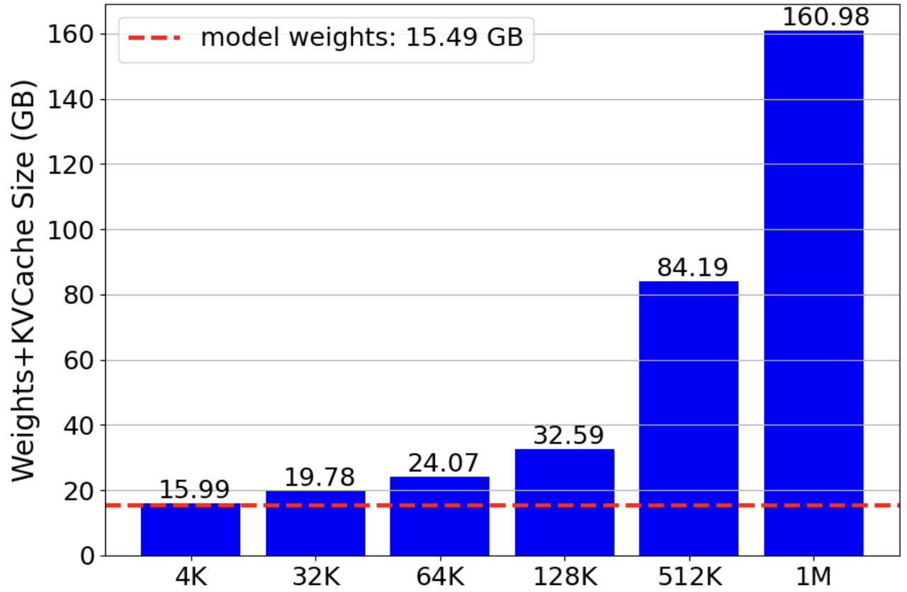
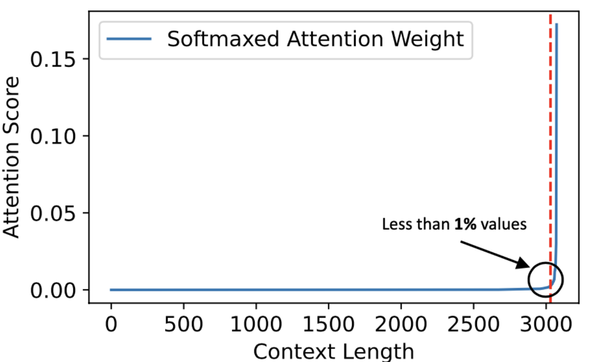
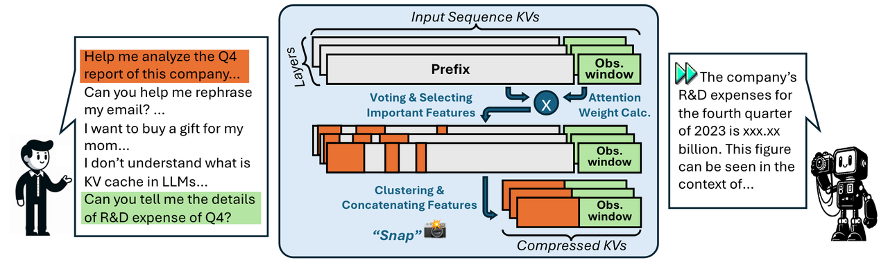
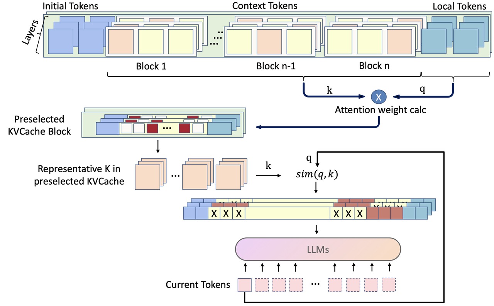
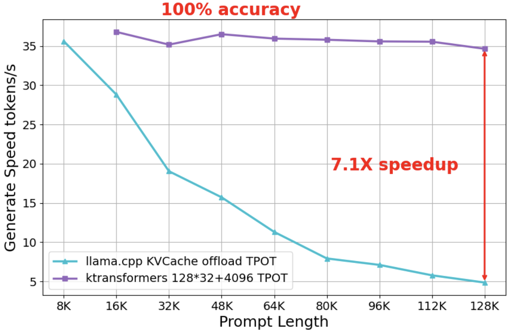

# KVCache Long Context

## TL;DR

Training larger models and supporting longer text sequences are currently the two most widely agreed-upon directions toward achieving AGI. After lowering the barrier for local inference with trillion-parameter MoE models, the second showcase scenario for KTransformers is reducing the inference barrier for ultra-long context sequences. Recently, both ChatGLM and InternLM have released open-source models supporting 1M tokens of context. This article will use InternLM2.5-7B-Chat-1M as an example to introduce a method that leverages the sparsity of attention to accelerate long-text inference on heterogeneous CPU/GPU systems.

After optimization, KTransformers has achieved native-precision inference for 128K and even 1M tokens of context on a single 24GB GPU with CPU/DRAM support. In the 128K context scenario, the generation speed is 7.1 times faster than llama.cpp, while also achieving 100% accuracy on relatively simple test sets like "needle in haystack" and "passkey". On the more challenging dataset kvretrieval, through flexible framework configurations, we can achieve a **6.22x speedup** during inference while obtaining even higher scores than running the original model directly (**21.2 -> 24.4**). In the 1M context scenario on a single 24GB GPU, KTransformers can similarly achieve a 16 tokens/s inference speed, nearly 10 times faster than llama.cpp under the same conditions, with the "needle in haystack" evaluation score even surpassing the original model (**89.31 -> 92.88**).

Project url: https://github.com/kvcache-ai/ktransformers

## Mathematical Principle: The computational overhead of long-text inference and the sparsity in Attention caused by Softmax.

As the demand for longer context windows increases, not only have commercial large models like Kimi and Claude/Gemini started supporting increasingly longer context windows, but open-source models have also begun to catch up. Notably, both ChatGLM 4 and InternLM 2.5 have released versions that are under 10 billion parameters but support up to 1 million tokens of context. However, despite the relatively small size of these models, the enormous KVCache required for such ultra-long contexts still prevents local users from practically running these models. As shown in the figure below, while the InternLM2.5-7B-Chat-1M model weights only require 15.49GB of GPU memory, an additional 145.49GB is needed to store the entire 1M-token KVCache, which is clearly beyond the memory capacity of local users. Even when using the KVCache Offload feature of llama.cpp to offload the KVCache to CPU/DRAM, barely making the model runnable, performance remains unacceptable due to the need to fully scan the entire KVCache each time a single token is generated.

|  |  |
| ------------------------------------------------------------------------------------ | -------------------------------------------------------------------------- |

Fortunately, many studies have noticed that attention distribution during the inference phase tends to be **sparse**. For example, the right figure shows SparQ's experimental statistics based on LLaMa 7B, where less than 1% of tokens in a 3k context have relatively high attention scores. Similar conclusions are not only reflected in many other papers, such as H2O, Quest, InfLLM, and SnapKV, but we have also further validated this through long-text experiments with InternLM 2.5-7B-1M. Although the proportion isn't as extreme as 1%, due to the inherent head-focused effect of the softmax operation in attention mechanisms, it is theoretically possible that if we can identify in advance which tokens have high attention scores, scanning less than 5% of the tokens would suffice to essentially replicate the original result.

Thus, the problem narrows down to how to quickly identify these tokens with high attention scores without scanning them all. In the following sections, we will first briefly survey several key related papers, then summarize and propose a general framework we designed and implemented within KTransformers—a highly efficient sparse attention operator for CPUs.

## Related Papers and Conclusions

### Prune or Retrieval？

Based on the aforementioned points, we studied papers from recent years related to sparse selection in KVCache. The earliest of these is the paper H2O, which suggested that the attention distribution during inference is sparse and that only 5% of the KVCache is needed during inference. Following this, a series of works built on H2O's approach by designing more complex methods for selecting tokens that perform better in different scenarios. These methods are quite reasonable for single-word inference. However, as we previously explored in the Mooncake project, **we believe that the future trend is to precompute reusable KVCache as much as possible, and then use it to answer different questions.** This "compute once, use many" approach aims to reduce computational costs. Therefore, with this goal in mind, we prefer not to delete any tokens from the KVCache, or at least not remove a significant portion of them, to ensure that different questions can focus on different parts of the context in the future.


We further investigated related research, among which InfLLM proposed a very promising framework. Not only does it recognize that attention is sparse, but it also suggests that overly long contexts can cause attention to be dispersed into irrelevant noise, thereby reducing the model's ability to focus on key information. To address this issue, InfLLM introduces an external memory module (Memory Units) to store the context's KVCache. In each computation step, the most relevant semantic information is retrieved from this external memory module to participate in the calculation, thus enhancing the model's ability to handle long-context inference.

Specifically, InfLLM organizes the external memory module using semantic blocks composed of neighboring tokens and employs a sliding window mechanism during computation. In each step, it selects only the semantic blocks at the head of the context (Initial Tokens), the blocks near the current token (Local Tokens), and a few blocks with the highest semantic similarity to the current token to participate in the attention calculation. As shown in equation 1, to efficiently retrieve the blocks with the highest similarity, InfLLM selects a few representative tokens whose scores $$r_m$$ are the highest within each block. Use Equation 2 to calculate the semantic similarity between the current token and each semantic block.


Compared to the previously mentioned H2O, the differences in InfLLM are as follows:

1. The KVCache is not discarded but stored in memory and dynamically loaded onto the GPU during inference.

2. KVCache is managed at the granularity of blocks rather than tokens, with each block selecting a few tokens as its representative index tokens.

InfLLM's proposed method aligns with our "compute once, use many" approach of reusing KVCache. The external memory units in this method can be offloaded to CPU/DRAM or even SSD storage, allowing different parts to be selected for computation based on the specific question. This significantly improves the efficiency of attention computation.

### Other Improvements

Similarly, after InfLLM, Quest also manages tokens at the granularity of blocks. Quest analyzed the recall rate of key tokens in H2O and full attention, finding that the Top-10 attention score token recall rate for the H2O algorithm is around 50%, which indicates that too much key information was lost. To improve the recall rate of key tokens, Quest chooses two "representative tokens" from each block for retrieval. In the prefill stage, each KVCache block records the maximum and minimum values for each channel, as shown in the figure below under "Reduced Keys," which contains the element-wise min key and element-wise max key.

During the attention computation stage, the dot product is computed between the current query vector and the max key and min key of each KVCache block, respectively. Then, for each channel, the maximum value between the two resulting product vectors is selected and summed to serve as the upper bound of the relevance score for that KVCache block, as shown in stage 1 of the diagram. Based on the relevance scores, the top-k KVCache blocks are selected to participate in the attention computation, as illustrated in stage 2 of the diagram.


Compared to InfLLM, Quest does not take heterogeneous architectures into account. Instead, it assumes that all KVCache can still fit into memory, simply leveraging sparse attention to accelerate the inference process. Ultimately, Quest achieves a 7.03x speedup in attention computation and a 2.23x improvement in end-to-end inference latency.

Going further, SnapKV proposes retaining two parts of the tokens during the prefill stage, as shown in the diagram below with the orange and green segments. The difference from InfLLM lies only in the method of selecting the middle tokens. SnapKV selects tokens at the token level rather than the block level, with the score calculation being similar to H2O, i.e., $$softmax(\frac{qk^T}{\sqrt{d_k}})$$. However, when summing across columns, only the rows within the final green window are selected for computation, corresponding to the Local Tokens section in InfLLM. Additionally, SnapKV introduces a pooling operation on top of attention, which the paper explains as ensuring that the recalled tokens retain more complete semantic information.

This approach in SnapKV involves a one-time selection during the inference phase, after which only the selected tokens are used for attention computation, while the rest of the KVCache is discarded.




Other related papers include PyramidKV, which observed that attention scores exhibit a pyramid-shaped distribution across attention layers. In lower attention layers, attention is widely distributed, while in higher layers, the attention scores for a few key tokens become increasingly prominent. Therefore, PyramidKV allocates more KVCache storage space to lower layers and less space to higher layers.

MagicPiG, based on Locality-Sensitive Hashing (LSH), proposes a dynamic KVCache management strategy. First, it uses SnapKV to select a portion of important tokens to be stored in the GPU, while the KVCache of other tokens is placed in memory. By leveraging the high efficiency of LSH in high-dimensional space searches and the multithreading capabilities of CPUs, MagicPiG retrieves KVCache from memory that is similar to the current query and loads it into memory for inference. Compared to the earlier methods like InfLLM, Quest, and SnapKV, MagicPiG does not need to scan all representative tokens and select the top-k KVCache. Instead, it utilizes the mathematical properties of LSH, which not only simulates attention scores but also allows for identifying important KVCache with low overhead and high speed.

The above are just descriptions of some key points. For more detailed explanations, you can refer to the existing articles on Zhihu in Chinese:

- https://zhuanlan.zhihu.com/p/701580870

- https://zhuanlan.zhihu.com/p/714288577

## KTransformers CPU Sparse Attn Framework

### Framework Prototype

Based on the introduction of the above papers, we have distilled the following key points:

- The distribution of attention weights is sparse, and useless KVCache may introduce noise, which could actually reduce performance during the inference stage.

- For the KVCache eviction strategy during the inference stage, the common approach is to retain the tokens from the beginning and the end of the prompt, while designing algorithms to select the tokens from the middle portion. One of the main factors affecting the model's performance is the ability to accurately identify the key tokens.

- Managing the middle portion of tokens in blocks can improve memory swapping and attention computation efficiency, and smaller blocks do not seem to perform worse than token-level granularity.

- The tokens that each attention layer focuses on during inference differ, and even the allocated KVCache capacity for different layers should vary.

Based on these insights and inspirations, we developed a general framework for implementing sparse CPU attention operators during the inference phase. In the prefill stage, we use chunked prefill, loading only one layer of KVCache into GPU memory at a time for computation. Once completed, the KVCache is stored on CPU/DRAM. In the subsequent decode stage, instead of swapping KVCache in and out, the sparse attention operator runs directly on the CPU. **This significantly reduces the minimum** **GPU** **memory requirements, making local 128K or even 1M token contexts possible.**

Specifically during the generation phase, we implemented the entire framework as shown in the diagram below.


We organized the KVCache in units of blocks. Specifically:

- **KVCache Partitioning:** A complete input prompt is divided into three configurable parts: Initial, Context, and Local. During the computation process, the Initial/Local parts will be fully attended to, while the Context part will be sparsely retrieved. This approach is based on findings from many papers (such as streamingLLM and Minference) which mention the existence of "attention sinks," where higher attention weights are often found at the beginning and the end of the sequence.

- **Context Block Partitioning:** For the middle Context, we follow the InfLLM approach by dividing it into blocks based on a configurable fixed number of tokens. Each block can select 1 to k tokens as its representative tokens. During the actual inference phase, the Context blocks that require attention are selected based on these representative tokens.
  
  - Specifically, we have implemented the following methods for selecting representative tokens, based on the approaches outlined in various papers.
    
    - Max: The maximum values of multiple tokens within a block, across each channel, are concatenated to form the representative token for the current block.
    
    - Mean: The average values of multiple tokens within a block, across each channel, are concatenated to form the representative token for the current block.
    
    - Quest: A combination of the previous two methods: the maximum and minimum values of multiple tokens within a block, across each channel, are taken as the representative tokens for the block. Under this method, the number of representative tokens is fixed at 2
    
    - Dynamic: By calculating the cumulative attention score for each token using a specific method, each block selects the top-k tokens with the highest scores as the representative tokens for the block. This is similar to InfLLM but with some simplifications.
    
    - Fix: Select tokens at fixed intervals within the block.
  
  - Once the representative tokens for each block are determined, use Equation 2 from InfLLM to calculate the similarity between the input X and the k representative tokens of each block B, and only select the top $$r_k$$ blocks for attention computation, where $$l_P $$ represents the length of the historical tokens:

Since InfLLM requires calculating a representative score for each token during the prefill stage and then selecting a representative token for each block based on these scores, this operation involves invasive modifications to the prefill implementation, making it difficult to integrate with other methods. Furthermore, in actual testing, we found that in most scenarios, similar or even better results can be achieved through a combination of other methods. Therefore, we ultimately decided not to integrate this method into the framework.

## Further Optimizations

After implementing the above framework, we conducted a series of evaluations based on LongBench and InfiniteBench.

At the beginning of the experiment, we designed the architecture so that for each inference token, the most relevant KVCache blocks would be reselected. On the one hand, this strategy incurred significant overhead during the retrieval process. On the other hand, we found that in some scenarios, f**requently changing the selection of retrieved blocks did not lead to better results**. For example, in the kvretrieval dataset, we observed that the model's responses were often correct in the first half but incorrect in the second half. Since the answers to kvretrieval questions consist of long and meaningless strings, this indicates that the correct KVCache blocks were selected during the inference of the earlier tokens but incorrect blocks were chosen during the later stages of inference.

To address this issue, we further integrated the method proposed in SnapKV. Before starting the inference, we preselect relevant KVCache blocks by analyzing the attention scores of the context tokens, based on the question. During the subsequent inference stages, the selection of KVCache blocks is restricted to this preselected range. This approach allowed us to select the block containing the correct answer 100% of the time in the kvretrieval dataset.

However, it should be noted that this method strictly relies on the structure of the Benchmark Prompt and **does not necessarily guarantee optimal performance in other scenarios, such as complex document understanding and generation tasks.** Therefore, we have integrated it into our framework as an optional module. The final framework and configurable parameters are as follows:




Configuration：

- **threads_num:** Number of CPU Threads

- **block_size:** KVCache Block Size

- **local_windows_len:** Prompt End Window Size

- **preselect_block_count:** Number of Preselected Blocks

- **second_block_count:** Number of Blocks Selected After Preselection

- **preselect_block:** Whether to Enable Preselection

- **token_step:** Interval Between Token Selections for KVCache

- **layer_step:** Interval Between Layer Selections for KVCache

- **dense_layer_num:** Number of Initial Layers Without KVCache Selection, Importing All KVCache

- **head_select_mode:SEPARATE**(In the GQA scenario, each kv_head is selected separately) / **SHARED:** (All kv_heads are selected together)

- **representative_type:** Method of Selecting Representative Tokens

- **representative_num:** Number of Representative Tokens

By modifying configuration options, various KVCache eviction or compression methods can be easily reproduced within our framework. For example:

- Setting `block_size` to 1 and `preselect_block` to True results in a version of SnapKV without the pooling operation.

- Setting `representative_type` to Quest, `preselect_block` to False, and `head_select_mode` to SEPARATE replicates the Quest method.

Below is the pseudocode for the framework:

```python
def preselect_block(local_q, kvcache):
    key_states = kvcache.keycache
    attn_scores = torch.matmul(
                local_q, key_states.transpose(2, 3)
            ) / math.sqrt(head_dim)
    attn_scores += attn_mask
    attn_scores = nn.functional.softmax(
                attn_scores, dim=-1, dtype=torch.float32
            ).to(query_states.dtype)
    vote = attn_scores[..., initial_size:-local_size:, :].sum(dim=-2)
    pool_vote = pool1d(vote, kernel_size=kernel_size, padding=kernel_size//2, stride=1)
    indices = pool_vote.topk(max_capacity_prompt - local_size, dim=-1).indices
    kv_cache_block_indices = find_representative_tokens_block(indices)
    kvcache_after_preselected = kvcache[kv_cache_block_indices]
    ...
    return kvcache_after_preselected
def get_representative_tokens():
    Calculate the representative token for each block based on the representative_type.
    return ...
def decode_attention(query, key, value):
  # Select once every token_steps tokens.
  token_steps = 4
  # Select once every layer_steps layers.
  layer_steps = 4
  for token_idx in range(max_new_tokens):
      for layer_idx in range(config.num_hidden_layers):
          if token_idx % token_steps != 0 or layer_idx % layer_steps != 0:
            # If the attention of the current layer in this round does not require reselection, the historical selection results from the kvcache will be retained.
            kvcache_after_retrieval = history_kvcache_after_retrieval[layer_idx//layer_steps]
          else:
            # Otherwise, use the query from the current round's current layer to reselect the kvcache.
            kvcache_after_retrieval = retrieval_kvcache(query, kvcache)
            # Save it to the kvcache historical selection results.
            history_kvcache_after_retrieval[layer_idx//layer_steps] = kvcache_after_retrieval
          # calculate attention
          output = attn(query, kvcache_after_retrieval)
          yield output

# Model prefill, if preselection is required, local_q still needs to be saved.
local_q, KVCache = model.prefill(input_ids)
if preselect_block:
    # Preselection round
    KVCache = preselect_block(local_q, kvcache)
# Find the representative token for each block.
block_representative_tokens = get_representative_tokens(
   kvcache,                      
   config.representative_type
)

# model generate
'''
'''
decode_attention(query, key, value)
'''
'''
```

## Experiment

At the beginning of testing, we will use the following basic configuration, which will be further optimized through the extended framework.

```python
max_seq_len: 256000 # KVCache length
block_size: 128 # KVCache block size
local_windows_len: 4096 # The KVCache of length local_windows_len is stored on the GPU.
second_block_count: 96 # After preselection, each time select the number of KVCache blocks. If >= preselect_block_count, use the preselected blocks.
threads_num: 64 # CPU thread num
representative_type: DYNAMIC # KVCache block representative token selection method.
kv_type: FP16 
dense_layer_num: 0 # The first few layers do not need to fill or select KVCache
representative_num: 1 # The number of representative tokens within a KVCache block.
preselect_block: False # Whether to preselect.
head_select_mode: SHARED # All kv_heads jointly select.
preselect_block_count: 0 # Number of preselected blocks.
layer_step: 1 # Select every few layers.
token_step: 1 # Select every few tokens.
```

Under our framework, the comparison between the original model and KTransformers after acceleration on datasets such as 128K Big Needle-in-a-Haystack, passkey, kvretrieval, etc., is as follows. The passkey dataset involves inserting a small segment of numbers at varying depths within a redundant text. kvretrieval is about finding a matching item in randomly generated key-value pairs. All tests were conducted under the opencompass framework:


|                                                             |                                 |         |             |
| ----------------------------------------------------------- | ------------------------------- | ------- | ----------- |
|                                                             | Single needle retrieval zh 128k | passkey | kvretrieval |
| Original model                                              | 99.89                           | 100     | 21.0        |
| KTransformers (reselect KVCache blocks for each generation) | 100                             | 100     | 15.40       |

We can see that both the original model and the accelerated KTransformers achieve perfect scores on the relatively simpler datasets, such as Single Needle Retrieval and passkey. At the same time, the generation speed has significantly improved, increasing from 4.86 tokens/s with llama.cpp to 27.49 tokens/s with KTransformers, achieving up to a 5.65x speedup. Although the current configuration shows a noticeable drop in performance on the more challenging kvretrieval dataset, in the next section, we will address this by implementing a more optimized selection strategy to compensate for or even surpass the original model's accuracy.

Additionally, we tested the performance of the KTransformers-based configuration framework in reproducing the results of Quest. However, since InternLM2.5-7B-Chat-1M uses GQA (Grouped Query Attention) while the Quest paper primarily focuses on optimizing MHA (Multi-Head Attention) models, the actual testing results were not particularly favorable. The official team also mentioned that further support for GQA models is needed, so we will not discuss this in detail for now.

### Further improve performance

By modifying certain configurations within our flexible framework on the basis of reproduction, **we can actually achieve better results than those reported in the previous paper,** as shown in the figure below:


As mentioned earlier, the goal of the kvretrieval dataset is to find a matching key-value pair within a long sequence of semantically meaningless pairs. If tokens are generated by reselecting based on the current query each time, the likelihood of deviation increases as the text grows, leading to the selection of different KVCache blocks compared to previous selections. To address this, we introduced a preselection mechanism using SnapKV to calculate the method for selecting representative tokens, which preselects a portion of the KVCache blocks. During the subsequent inference process, the selection is limited to these blocks. After one round of preselection, the score increased from 15.4 to 24.2, **surpassing the original model + full attention's performance of 21 points.** Further research indicates that the sparsity effect of the KVCache in the first few layers of LLMs is not as significant. Therefore, we set the first two layers to fully reuse the KVCache, ultimately achieving a score of **24.4**.

Similarly, when testing the needle-in-a-haystack task on the 1M dataset, we not only reproduced the original model's reported score but also further improved accuracy (**from 89.31 to 92.88**) by using the KTransformers CPU Sparse Attn Framework to selectively compute only certain KVCache blocks. Additionally, the inference speed **reached nearly 10 times that of llama.cpp**.


### More comparisons

As shown in the two figures below, using the Single Needle Retrieval dataset as an example, we set llama.cpp to store the KVCache on CPU/DRAM while performing all computations on the GPU. On a 4090D server, we compared the KTransformers CPU Sparse Attn Framework with llama.cpp. While maintaining **100% answer accuracy**, we achieved a 20.6 to 94.1 times prefill speed increase and a **1.2 to 7.1 times inference speed boost**.

|  |  |
| --------------------------------------------------------------- | ----------------------------------------------------------------- |

The main reason for the significant gap in prefill speed is that after enabling KVCache offload, llama.cpp performs the attention (attn) computation on the CPU. In long-text scenarios, attention not only requires heavy computation but also takes up the majority of the computation time. In contrast, KTransformers leverages a flexible template injection framework to implement GPU Chunk Prefill layer by layer. Moving forward, we plan to further integrate high-performance sparse prefill methods such as MInference to boost speed even further.

Additionally, as a key focus of this article, the right-hand graph shows that as the prompt length increases, the inference speed of KTransformers remains stable, hovering near a horizontal line. In contrast, llama.cpp slows down as the prompt length increases. By selecting only the most important 16K KVCache blocks to participate in the inference computation, KTransformers maintains a consistent inference speed comparable to llama.cpp when processing a 16K prompt, without any performance degradation (at least on these test datasets).

## How to Use

Currently, long context is only supported by our **local_chat.py** interface, and the integration with the server interface is under development.

To facilitate user management, we have uploaded the model config, gguf, and tokenizer to a repo. URL: https://huggingface.co/nilv234/internlm2_5_to_llama_1m/tree/main

By setting the model_path and gguf_path in the local_chat function to **/path/to/repo** and setting the mode to **"long_context"**, you can use the InternLM2.5-7B-Chat-1M model with 1m functionality on a 24G VRAM.

After running local_chat.py for the first time, a config.yaml file will be automatically created under ** ~/.ktransformers**. The relevant configurations for long context are as follows:

```python
chunk_size: 4096 # prefill chunk size
max_seq_len: 100000 # KVCache length
block_size: 128 # KVCache block size
local_windows_len: 4096 # The KVCache of length local_windows_len is stored on the GPU.
second_select_num: 96 # After preselection, each time select the number of KVCache blocks. If >= preselect_block_count, use the preselected blocks.
threads_num: 64 # CPU thread num
anchor_type: DYNAMIC # KVCache block representative token selection method.
kv_type: FP16
dense_layer_num: 0 # The first few layers do not need to fill or select KVCache
anchor_num: 1 # The number of representative tokens within a KVCache block.
preselect_block: False # Whether to preselect.
head_select_mode: SHARED # All kv_heads jointly select.
preselect_block_count: 96 # Number of preselected blocks.
layer_step: 1 # Select every few layers.
token_step: 1 # Select every few tokens.
```

The memory required for different context lengths is shown in the table below:

|                | 4K  | 32K  | 64K  | 128K | 512K | 1M     |
| -------------- | --- | ---- | ---- | ---- | ---- | ------ |
| DRAM Size (GB) | 0.5 | 4.29 | 8.58 | 17.1 | 68.7 | 145.49 |

Please choose an appropriate max_seq_len based on your DRAM size.
For example:
```python
python local_chat.py --model_path="/data/model/internlm2_5_to_llama_1m"  --gguf_path="/data/model/internlm2_5_to_llama_1m" --max_new_tokens=500 --cpu_infer=10  --use_cuda_graph=True  --mode="long_context" --prompt_file="/path/to/file"
```

If you've already specified the input text via the prompt_file, just press Enter when the terminal displays chat: to begin.
