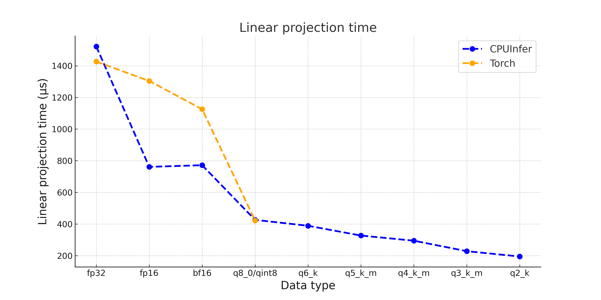
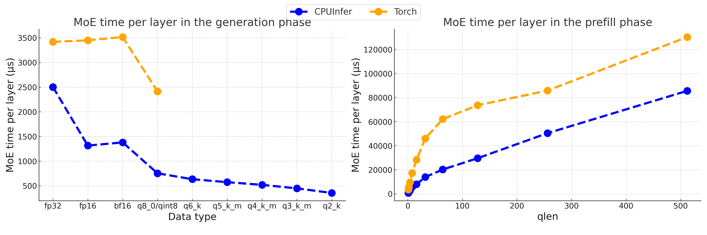

# Llamafile Operators Documentation

## Llamafile Sgemm

The Llamafile Sgemm module is an efficient implementation of general matrix multiplication (GEMM) extracted from the great [Llamafile project](https://github.com/Mozilla-Ocho/llamafile/blob/main/llamafile/sgemm.cpp). 
This module optimizes performance by utilizing various processor-specific instruction sets. For instance, it checks for different x86 instruction sets such as AVX, FMA, and AVX512, leveraging these advanced instructions to accelerate computation. 
Additionally, the Llamafile Sgemm module supports multiple quantization types, including q8_0, q6_k, and q5_k, among others. This adaptability to different hardware capabilities ensures the most advanced instructions are used in any given computing environment, achieving high computational efficiency. For more information, you can view the [Llamafile Sgemm module](https://github.com/Mozilla-Ocho/llamafile/blob/main/llamafile/sgemm.cpp) on GitHub.

## CPUInfer
To power Llamafile and many future CPU kernels without the original GGML framework, we developed a simple CPUInfer multi-threaded execution framework. It currently leverages the Llamafile Sgemm module to implement key operators such as linear layers, MLP, and MoE, and will be extended to support many other operators. These operators are fundamental components for building large models. CPUInfer features a backend work-stealing thread pool and asynchronous task queue execution logic to efficiently offload parts of model parameters to the CPU, thereby maintaining high inference performance. It supports adjustments based on hardware capabilities or user configurations, providing enhanced inference performance and making it an ideal tool for running deep learning models on CPUs.

## Expert-Parallel MoE

The MoE module's performance can be enhanced by using custom kernels that utilize **expert parallelism**. Since the routed experts are independently computable, we can utilize this inherent parallelism to speed up MoE computations. Specifically, we can allocate each expert MLP to a separate thread group, allowing for the simultaneous computation of all routed experts. This approach of expert parallelism significantly boosts MoE performance by minimizing the frequency of global synchronizations and reducing kernel launch overhead compared to sequential expert computation.

## Microbenchmark

Our evaluations were conducted on an Intel(R) Xeon(R) Gold 6454S processor, utilizing real parameters from the DeepSeek-Coder-V2-Instruct model.

### Linear Projection

The performance of the linear layer was assessed using an Attention Output Projection with dimensions of [5120, 16384]. Here, the input was a vector of 16384 dimensions, and the output was a vector of 5120 dimensions.

As we can see, in half-precision floating-point formats (fp16 and bf16), CPUInfer's performance exceeded that of Torch by 1.7 and 1.5 times, respectively. For 8-bit quantization, CPUInfer (supporting q8_0) and Torch (supporting qint8) demonstrated nearly equivalent performance. However, CPUInfer employs a more refined scaling approach, using different factors for each group (in q8_0 quantization, every 32 numbers form one group), whereas Torch uses a basic per-tensor quantization, potentially leading to significant precision loss. Furthermore, CPUInfer’s capability to use lower-bit quantization enhances inference speed in specific scenarios.

### MoE

In the MoE module, each token selected 6 experts out of 160 for computation, with input and output dimensions of 5120, and an intermediate dimension of 1536.

For half-precision floating points and 8-bit quantization formats, CPUInfer's generation performance was 2.5 and 3.2 times better than Torch, respectively. Moreover, using the 8-bit quantization format, CPUInfer achieved faster prefill speeds compared to Torch, with shorter prompts highlighting a more pronounced performance difference.
