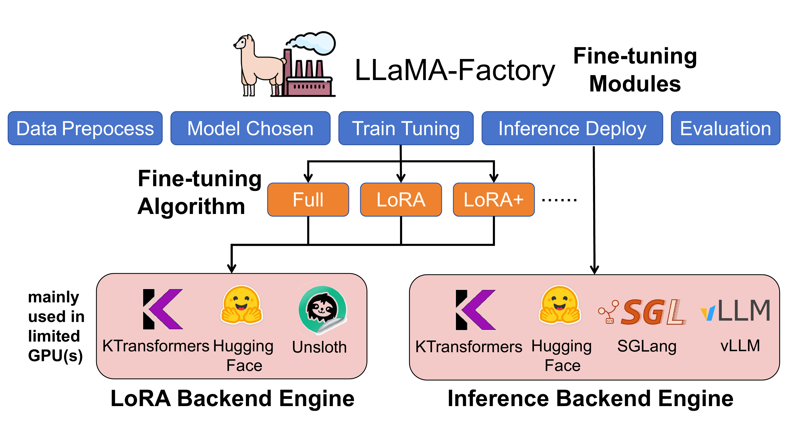
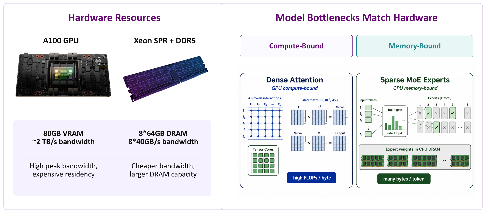
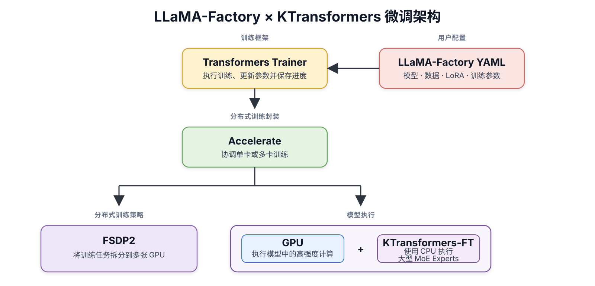

# KTransformers × LlamaFactory MoE 微调 Cookbook

从  Qwen3.5 到 DeepSeek-V4、Kimi-K3、GLM-5.2，每一次超大模型的开源都带来性能与规模上的巨大跃升。然而，多数研究者与开发者受限于昂贵的显卡，难以在资源受限条件下微调超大模型。面对这种差距，我们提出了一种更具可行性的方案：通过 KTransformers 与 LlamaFactory 的结合，仅需1~4张RTX 4090与较高内存CPU，便可微调 DeepSeek-V3&V4系列/Kimi-K2.5/GLM-5.2等1T规模的 MoE（Mixture of Experts，混合专家）模型。

为给大家提供便捷高效的使用方式，KTransformers 与 LlamaFactory 合作，保持您的工作流不受影响，最大化支持矩阵。如下图所示，LlamaFactory 是整个微调流程的统一调度与配置框架，负责数据处理、训练调度、LoRA 插入与推理接口管理；GPU 运行 Attention、Shared Expert 等模块，KTransformers 接管位于 CPU 与大内存中的 Routed Experts，实现 GPU+CPU 异构协同。



**技术简介：**如下图，KTransformers 通过将 Attention、共享模块等计算密集部分放在 GPU，将体积大但每次只激活少量的 Routed Experts 放入 CPU 内存。避免了大量专家权重在 PCIe 上面反复传输，通过 GPU+CPU 协同计算的方式，最大化性能。CPU 则根据权重格式和硬件能力自动适配了各种后端。



**指南简介：**首次上手建议直接选择 **原精度 BF16（16 位浮点）+ LoRA/全量 + `kt_backend: auto`**：无需转换权重，修改两份 YAML 配置文件即可启动。模型提供原生 FP8 checkpoint 且选择 LoRA 时，可直接使用原生 FP8 Expert 权重降低主机内存占用。仅在系统内存仍然紧张且已准备好 KT 转换权重时，再考虑 INT8 或 AMXINT4 量化方案。

## 阅读导航

- [硬件检查与安装](#1-硬件检查与安装)
- [选择微调方案](#2-选择微调方案)
- [Custom YAML：高级参数](#3-custom-yaml高级参数)
- [性能与资源估算](#4-性能与资源估算)
- [附录：完整配置与 Q&A](#附录)

## 1. 硬件检查与安装

### 1.1 检查硬件资源

先检查 CPU 指令集，确认可用的加速后端：

```bash
lscpu | grep -i -E 'Model name|Socket|NUMA|avx512|amx'
```

再检查 GPU 显存、系统内存与磁盘空间：

```bash
nvidia-smi
free -h
df -h /data
```

根据检查结果确认两件事：

- **指令集匹配：** 原生 FP8 需要具备 AVX512F、AVX512_BF16、AVX512_VNNI、AVX512_VBMI 的兼容 AMD/x86 CPU；INT8 可由 `auto` 在 AMX-INT8 与 AVX512-VNNI 实现之间选择；AMXINT4 需要 AMX 与匹配的转换权重；原生 BF16 在支持 AMX 时性能最佳。
- **容量充足：** 系统内存要容纳 Expert 权重，同时为 activation（激活值）、梯度和 optimizer state（优化器状态）留出空间；磁盘还要容纳 checkpoint 与临时文件。

### 1.2 安装环境

推荐使用干净的 Python 3.11 环境。先固定 PyTorch 2.9.1，再安装 LlamaFactory；KT 依赖必须最后安装，避免标准版 `transformers` 或 `accelerate` 覆盖 KT 定制版本：

```bash
conda create -n kt-sft python=3.11 -y
conda activate kt-sft

git clone --depth 1 https://github.com/hiyouga/LlamaFactory.git
cd LlamaFactory

python -m pip install torch==2.9.1 torchaudio==2.9.1 torchvision==0.24.1
python -m pip install -e .
python -m pip install "ktransformers[sft]==0.7.0"
python -m pip install "sglang-kt==0.7.0"
```

安装完成后检查依赖关系，并核对实际导入版本：

```bash
python -m pip check

python - <<'PY'
from importlib.metadata import version

import accelerate
import ktransformers
import kt_kernel
import torch
import transformers

for name, module in {
    "torch": torch,
    "transformers": transformers,
    "accelerate": accelerate,
    "kt_kernel": kt_kernel,
    "ktransformers": ktransformers,
}.items():
    print(f"{name:14s} {getattr(module, '__version__', 'unknown')}")

print(f"{'sglang-kt':14s} {version('sglang-kt')}")
print(f"{'transformers-kt':14s} {version('transformers-kt')}")
print(f"{'accelerate-kt':14s} {version('accelerate-kt')}")

from accelerate.utils.dataclasses import KTransformersPlugin  # noqa: F401
PY
```

当前兼容版本的输出应包括：

```text
No broken requirements found.
torch          2.9.1
transformers   5.6.0
accelerate     1.14.0
kt_kernel      0.7.0
ktransformers  0.7.0
sglang-kt      0.7.0
transformers-kt 5.6.0.post2
accelerate-kt  1.14.0.post2
```

## 2. 选择微调方案

先确定 Expert 权重格式，再决定使用 LoRA 还是全量微调。选定后，直接使用本节对应的训练 YAML 和 Accelerate YAML 基础配置。

### 2.1 选择 Expert 权重格式

“原精度”与“量化”描述 Expert 权重格式；AMX（Advanced Matrix Extensions）与 AVX512（Advanced Vector Extensions 512-bit）描述 CPU 后端指令集，两者不是同一个维度。

| 权重方案 | 适合情况 | 前提与取舍 |
| --- | --- | --- |
| 原生 BF16 checkpoint | 系统内存充足，希望优先获得稳定、直接的训练体验 | 无需转换权重；CPU 支持 AMX 时，`auto` 会优先选择当前最快的 AMXBF16 |
| 原生 FP8（8-bit Floating Point，8 位浮点） | 模型本身提供原生 FP8 checkpoint，并希望保留其原生权重格式 | 当前用于冻结基座 Expert 的 LoRA；需要完整的 AVX512 FP8 扩展组合，AMX 不支持该原生 FP8 路径 |
| KT 转换后的 INT8 | 系统内存不足以容纳原精度 Expert 权重，希望降低内存占用 | 必须准备相互匹配的 INT8 Routed Expert 权重与 BF16 non-expert cache；`auto` 可选择 AMX-INT8 或 AVX512-VNNI 实现 |
| KT 转换后的 AMXINT4 | 内存约束比 INT8 更严格，并且可以接受更高的精度风险 | CPU 需要支持 AMX；必须准备匹配的 AMXINT4 权重，并在代表性验证集上检查效果 |

系统内存允许时优先选择原生 BF16 或原生 FP8。只有已经准备好匹配的转换权重，并且确实需要降低 Expert 内存占用时，再选择 INT8 或 AMXINT4。

### 2.2 选择 LoRA 或全量微调

Expert 权重格式与参数更新范围是两个配置维度，但当前可用组合有明确边界。原生 BF16 支持 LoRA 与全量微调；原生 FP8、INT8 和 AMXINT4 配方用于冻结基座 Expert 的 LoRA。全量微调使用 BF16。

| 微调方式 | 适合情况 | 资源与输出 |
| --- | --- | --- |
| LoRA（Low-Rank Adaptation，低秩适配） | 默认推荐；适合快速适配新任务、反复实验或资源受限的训练 | 显存、系统内存和磁盘开销较低；输出 LoRA adapter 与 KT Expert LoRA 文件 |
| 全量微调 | 确实需要更新全部目标参数，并且能够承担更高训练与保存成本 | 需要更多显存、系统内存和磁盘；输出完整模型 checkpoint |

### 2.3 两份 YAML 的分工



一次训练使用两份 YAML。训练 YAML 描述训练任务并持有全部 KTransformers 设置；Accelerate YAML 只描述分布式与 FSDP2 运行方式。当前 LlamaFactory 会拒绝 Accelerate YAML 中的 `kt_config`。

| 文件 | 负责什么 | 常改字段 |
| --- | --- | --- |
| 训练 YAML | 模型、数据、LoRA 或全量微调、batch、序列长度、输出目录及全部 KT 设置 | `model_name_or_path`、`dataset`、`finetuning_type`、`lora_*`、`cutoff_len`、`output_dir`、`use_kt`、`kt_cpu_activation`、`kt_weight_path`、`kt_non_expert_weight_path`、`kt_config` |
| Accelerate YAML | GPU 进程、FSDP2（Fully Sharded Data Parallel 2，全分片数据并行）和全局混合精度 | `num_processes`、`mixed_precision`、`fsdp_config` |

启动前核对三个关系：

1. `CUDA_VISIBLE_DEVICES` 中的 GPU 数必须等于 `num_processes`；
2. 手动设置训练 YAML 中的 `kt_config.kt_model_max_length` 时，它必须覆盖 `cutoff_len`，并为运行时额外 token 留出余量；
3. LoRA rank 只写训练 YAML 顶层，LlamaFactory 会派生 KT 内部字段；全量微调删除 LoRA 专用字段。

### 2.4 四种方案的基础 YAML

先从附录 A.1 和 A.2 复制完整配置，再按所选方案替换下面的字段。每个代码块用注释区分训练 YAML 与 Accelerate YAML；`kt_config` 始终放在训练 YAML。

#### 2.4.1 原生 BF16 + LoRA

```yaml
# 文件 1：训练 YAML
model_name_or_path: /data/models/Your-BF16-Model
finetuning_type: lora
lora_rank: 8
use_kt: true
# 原生 BF16 不设置 kt_weight_path
kt_config:
  kt_backend: auto
  kt_expert_weight_format: bf16

# 文件 2：Accelerate YAML
mixed_precision: bf16
num_processes: 2
```

#### 2.4.2 原生 FP8 + LoRA

```yaml
# 文件 1：训练 YAML
model_name_or_path: /data/models/Your-Native-FP8-Model
finetuning_type: lora
lora_rank: 8
use_kt: true
# 原生 FP8 不设置 kt_weight_path
kt_config:
  kt_backend: auto
  kt_expert_weight_format: fp8

# 文件 2：Accelerate YAML
mixed_precision: bf16
num_processes: 2
```

#### 2.4.3 INT8 / AMXINT4 + LoRA

```yaml
# 文件 1：训练 YAML
finetuning_type: lora
lora_rank: 8
use_kt: true
# INT8 方案
kt_weight_path: /data/models/Your-Routed-Experts-INT8
kt_non_expert_weight_path: /data/models/Your-Non-Expert-Cache-BF16
kt_config:
  kt_backend: auto
  kt_expert_weight_format: int8
  kt_weight_lifecycle: persistent

# AMXINT4 方案改为匹配的权重目录，并将上面的 kt_config 替换为：
# kt_weight_path: /data/models/Your-Model-AMXINT4
# kt_non_expert_weight_path: /data/models/Your-Non-Expert-Cache-BF16
# kt_config:
#   kt_backend: AMXINT4

# 文件 2：Accelerate YAML
mixed_precision: bf16
num_processes: 2
```

#### 2.4.4 原生 BF16 + 全量微调

```yaml
# 文件 1：训练 YAML
finetuning_type: full
learning_rate: 1.0e-5
use_kt: true
# 删除 lora_rank、lora_alpha、lora_dropout、lora_target 等 LoRA 字段
kt_config:
  kt_backend: auto
  kt_expert_weight_format: bf16

# 文件 2：Accelerate YAML
mixed_precision: bf16
num_processes: 2
```

### 2.5 启动

```bash
CUDA_VISIBLE_DEVICES=0,1 accelerate launch --main_process_port 0 --config_file qwen35_fsdp2_2gpu.yaml src/train.py qwen35_397b_bf16_lora.yaml
```

## 3. Custom YAML：高级参数

基础方案能够启动后，再按训练目标和资源瓶颈调整下面的参数。没有明确需求时保留推荐值，不要同时修改多组参数。

**（1）LoRA 容量：`lora_rank`、`lora_alpha`、`lora_target`、`lora_dropout`**

这四项只在训练 YAML 顶层修改，LlamaFactory 会自动派生 KTransformers 内部使用的 rank、alpha 和 dropout；不要在 `kt_config` 或 Accelerate YAML 中重复填写。建议从 `lora_rank: 8`、`lora_alpha: 16`、`lora_target: all`、`lora_dropout: 0.0` 开始。

任务适配不足时依次把 rank 提高到 16、32，并让 alpha 保持约为 rank 的两倍。小数据集出现明显过拟合时，再把 dropout 提高到 `0.05`。

**（2）序列长度：`cutoff_len`**

在训练 YAML 中设置，建议按大多数样本的有效 token 长度选择，不要为了少量超长样本直接采用数据集最大长度。序列越长，中间激活值和 KT 缓冲区占用越高，也就是需要的内存和显存越高。

系统会根据 `cutoff_len` 生成 KT 的模型长度容量。需要手动扩大时，在训练 YAML 的 `kt_config` 中设置 `kt_model_max_length`，并让它大于 `cutoff_len`、保留额外 token 的运行余量。

**（3）Batch：`per_device_train_batch_size`、`gradient_accumulation_steps`**

这两项在训练 YAML 中修改。超大 MoE 模型优先使用 `per_device_train_batch_size: 1`；确认显存和内存均仍有余量后再增加 micro batch，显存不足时则保持为 1，通过梯度累积扩大有效 batch。

```text
有效 batch size = per_device_train_batch_size × GPU 数量 × gradient_accumulation_steps
```

**（4）Activation 重计算与 CPU Activation Reuse：`disable_gradient_checkpointing`、`kt_cpu_activation`**

训练 YAML 中设置 `disable_gradient_checkpointing: false` 会启用 gradient checkpointing，以额外计算换取更低的 activation 内存；设为 `true` 会保留更多中间结果，速度可能更高，但内存占用也更大。

主机内存充足时，还可以在同一份训练 YAML 顶层设置：

```yaml
kt_cpu_activation: retain
```

该选项在 checkpoint 重计算期间保留 CPU Expert activation，以增加主机内存占用换取更少的 CPU 重复计算。启用 gradient checkpointing 且未填写该字段时，CPU 与 GPU activation 默认重计算。`kt_cpu_activation` 与 `disable_gradient_checkpointing` 分别控制 CPU Expert activation 保留和整体 checkpoint 重计算，不要将两者合并成一个开关。

**（5）CPU Expert 复用与线程：`kt_share_backward_bb`、`kt_num_threads`**

这两项位于训练 YAML 的 `kt_config`。保持 `kt_share_backward_bb: true`，复用 CPU Expert 反向计算所需的缓冲；它不等同于 `kt_cpu_activation`。除非当前模型的配置说明明确要求，否则不要关闭。

`kt_num_threads` 填写本次作业实际可用的物理 CPU 核数，不要直接填写包含超线程的逻辑核总数。若数据预处理也使用同一批 CPU，需为 DataLoader 和系统进程预留部分核心。

`kt_threadpool_count` 与 NUMA 拓扑由系统生成；只有确认 CPU socket 和 NUMA 划分后才手动修改。

**（6）断点续训：`resume_from_checkpoint`**

在训练 YAML 中设置，值指向需要恢复的 `checkpoint-*` 目录；新训练不填写。`output_dir` 应继续指向本次任务的输出目录，不得与 base model 目录重叠，并保留 `overwrite_output_dir: false`，避免覆盖已有结果。

## 4. 性能与资源估算

下表统一采用 2K context（sequence length = 2048）、每卡 batch size 1、梯度累积 1，并只统计完成真实 LoRA 训练的 KTransformers BF16 结果。吞吐量包含 forward、loss、backward 和 optimizer。

| 模型与权重 | GPU 数 | 全局 batch size | 单卡显存最低参考 | 系统内存最低参考 | 微调吞吐量（tokens/s） |
| --- | ---: | ---: | ---: | ---: | ---: |
| Qwen3-235B-2507 BF16 LoRA | 2 | 2 | ≥ 27.14 GiB | ≥ 545.36 GiB | 147.91 |
| Qwen3.5-397B BF16 LoRA | 8 | 8 | ≥ 20.37 GiB | ≥ 1075.68 GiB | 215.25 |

显存列取该次运行中占用最高的单卡峰值；系统内存列取训练进程树 CPU RSS 峰值，并统一换算为 GiB。它们是已测配置的最低容量参考，不是安全余量：正式训练还要为数据加载、缓存、保存 checkpoint 和系统进程预留空间。

不同 GPU 数的结果不能直接用来判断线性扩展效率。增大 `cutoff_len`、batch size 或 KT cache 深度都会增加资源占用；全量微调还需要额外容纳梯度、master weight、optimizer state 与完整 checkpoint。

## 附录

### A.1 Qwen3.5-397B BF16 LoRA 训练 YAML

保存为 `qwen35_397b_bf16_lora.yaml`：

```yaml
### model
model_name_or_path: /data/models/Qwen3.5-397B-A17B
trust_remote_code: true
disable_gradient_checkpointing: false

### method
stage: sft
do_train: true
finetuning_type: lora
lora_rank: 8
lora_alpha: 16
lora_dropout: 0.0
lora_target: all

### dataset
dataset: your_dataset
template: qwen3_5
cutoff_len: 2048
packing: false
preprocessing_num_workers: 16
dataloader_num_workers: 4

### output
output_dir: /data/output/qwen35-bf16-lora
logging_steps: 10
save_strategy: steps
save_steps: 500
plot_loss: true
overwrite_output_dir: false
save_only_model: false
report_to: none

### train
per_device_train_batch_size: 1
gradient_accumulation_steps: 1
learning_rate: 1.0e-4
num_train_epochs: 3
lr_scheduler_type: cosine
warmup_ratio: 0.1
bf16: true
ddp_timeout: 180000000

### ktransformers
use_kt: true
# kt_cpu_activation: retain  # 可选：以更多主机内存减少 CPU Expert 重计算
# kt_weight_path: /data/models/Your-Routed-Experts-INT8  # 转换 INT8 Routed Experts
# kt_non_expert_weight_path: /data/models/Your-Non-Expert-Cache-BF16  # 与上面权重匹配
kt_config:
  kt_expert_weight_format: bf16
  kt_backend: auto
  kt_num_threads: 64
  kt_tp_enabled: true
  kt_threadpool_count: 2
  kt_max_cache_depth: 2
  kt_share_backward_bb: true
```

### A.2 FSDP2 Accelerate YAML

保存为 `qwen35_fsdp2_2gpu.yaml`：

```yaml
compute_environment: LOCAL_MACHINE
distributed_type: FSDP
fsdp_config:
  fsdp_auto_wrap_policy: TRANSFORMER_BASED_WRAP
  fsdp_cpu_ram_efficient_loading: true
  fsdp_offload_params: false
  fsdp_reshard_after_forward: true
  fsdp_state_dict_type: FULL_STATE_DICT
  fsdp_version: 2
mixed_precision: bf16
num_machines: 1
num_processes: 2
rdzv_backend: static
same_network: true
use_cpu: false
```

### A.3 Q&A

#### A.3.1 原生 FP8 为什么不能选择 INT8 转换权重配置

两者的权重格式和加载方式不同。原生 FP8 保留 checkpoint 中的 FP8 权重与 scale，使用 AVX512 原精度后端；INT8 配方读取相互匹配的 Routed Expert INT8 权重与 BF16 non-expert cache，并由 `auto` 选择 AMX-INT8 或 AVX512-VNNI 实现。不要把原生 FP8 checkpoint 填入 `kt_weight_path`。

#### A.3.2 `auto` 没有选择预期后端

保存 `lscpu` 输出和启动日志，确认容器或虚拟化环境没有屏蔽指令集。原生 BF16 可在支持 AMX 时选择 AMXBF16；原生 FP8 应选择 AVX512。不要强制指定本机或权重格式不支持的后端。

#### A.3.3 CPU 系统内存不足

优先降低并发数据加载、序列长度和 cache 深度，并确认没有重复加载两份 Expert 权重。若仍不足，再考虑准备 INT8 / AMXINT4 转换权重。全量微调还要单独估算梯度、master weight 与 optimizer state。

#### A.3.4 GPU OOM

OOM（Out of Memory）表示显存或系统内存不足。先降低 `cutoff_len`、每卡 batch size 和 activation 占用，再增加 `gradient_accumulation_steps` 维持全局 batch size。`num_processes`、可见 GPU 数与模型实际放置必须一致。

#### A.3.5 `kt_model_max_length` 与 `cutoff_len` 不一致

增大 `cutoff_len` 时同步提高 `kt_model_max_length`，并按分布式运行时的有效序列长度留出余量。值过小会导致 buffer 或 shape 错误，过大会增加系统内存占用。
