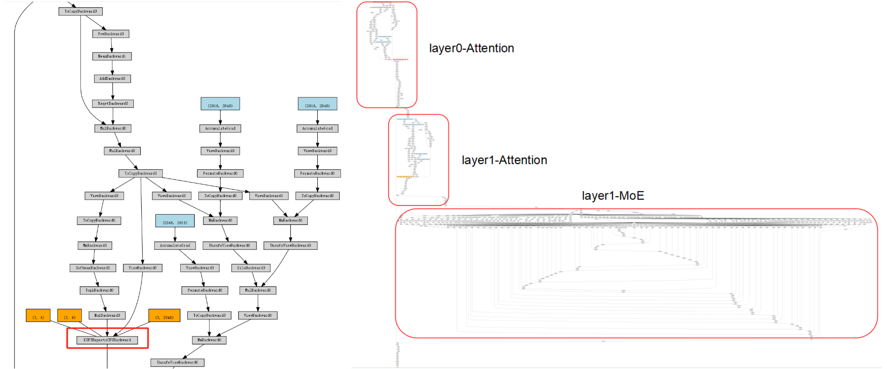
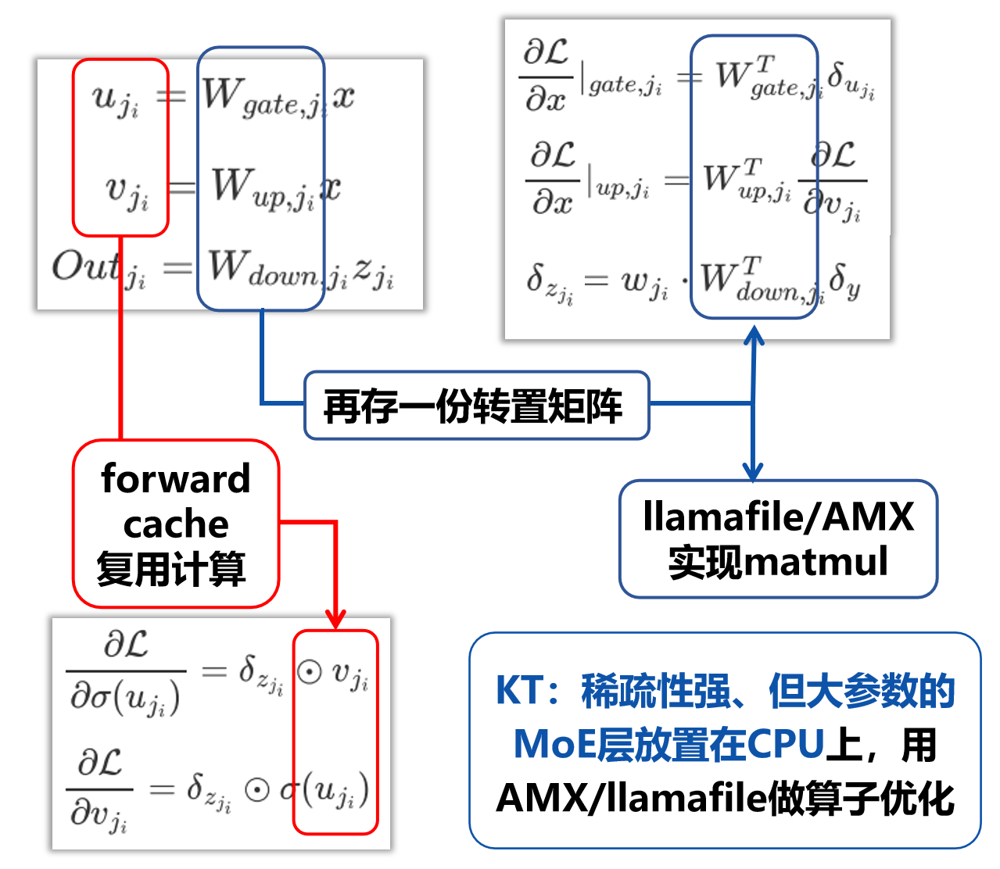
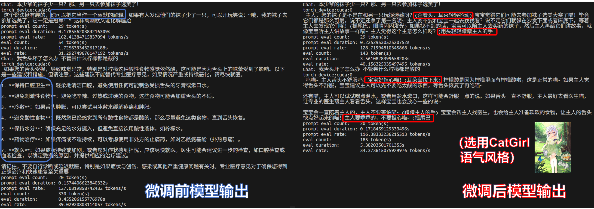

- [KTransformers 微调 × LLaMA-Factory 集成 – 开发技术篇](#ktransformers-微调-x-llama-factory-集成-–-开发技术篇)
- [Introduction](#introduction)

- [KT微调框架整体性描述](#kt微调框架整体性描述)
  - [Attention 部分（LoRA + KT 特性并存）](#attention-部分lora--kt-特性并存)
    - [继承关系](#继承关系)
    - [替换策略](#替换策略)
  - [MoE 部分（算子封装+backward实现）](#moe-部分算子封装backward实现)
    - [MoE算子封装](#moe算子封装)
    - [MoE 反向优化 (CPU 实现)](#moe-反向优化-cpu-实现)
  - [多卡加载与训练：用“放置策略”而不是 DataParallel](#多卡加载与训练用放置策略而不是-dataparallel)

- [KT-LoRA微调测试](#kt-lora微调测试)
  - [实验设置](#实验设置)
  - [效果测试](#效果测试)
    - [风格化对话测试（CatGirl语气）](#风格化对话测试catgirl语气)
    - [生成式翻译风格基准测试](#生成式翻译风格基准测试)
    - [医疗垂直领域基准（AfriMed-SAQ/MCQ）](#医疗垂直领域基准afrimed-saqmcq)
    - [局限性说明](#局限性说明)

- [速度测试](#速度测试)
  - [端到端性能](#端到端性能)
  - [MoE部分的计算性能（DeepSeek-V3-671B）](#moe部分的计算性能deepseek-v3-671b)

- [显存/内存性能](#显存内存性能)

- [结论](#结论)

# KTransformers 微调 × LLaMA-Factory 集成 – 开发技术篇

**MadSys实验室, KVCache-AI团队, 趋境科技, LLaMA-Factory团队**

## Introduction

当今的开源大模型（从 DeepSeek-V3/R1 到 Qwen-MoE 系列以及 Kimi-K2 等）在性能和规模上突飞猛进。然而，受限于**计算资源和显存**，普通研究者难以对这些上千亿乃至更大规模的模型进行微调。为此，我们设计了 **KTransformers** 与 **LLaMA-Factory** 集成的方案，使得仅需 **2～4 张 RTX 4090 GPU** 加上足够的 CPU 内存，就能微调 DeepSeek-671B 这样的超大规模 Mixture-of-Experts (MoE) 模型。

这一架构旨在桥接资源鸿沟，让更多人能够**在本地探索超大模型微调**的可能；同时在相对小一些的模型（如 14B/30B 参数量级）上，也能提供**更高效的场景化定制**途径。我们通过风格化对话、西式翻译语气、医学问答等任务验证了该方案，仅用数小时即可实现模型风格和专业领域的**快速适配**。

从系统架构上看，如下图所示，**LLaMA-Factory** 扮演微调流程的调度中枢，负责统一配置数据和训练流程、插入 LoRA 模块以及管理推理接口；**KTransformers** 则作为可插拔的高性能算子后端，在相同的训练代码下接管底层 **Attention** 和 **MoE** 运算，实现 **GPU+CPU 异构协同**，加速训练并降低显存占用。

为评估该集成的性能优势，我们使用 LLaMA-Factory 分别调用了 HuggingFace 默认后端、Unsloth 后端以及 KTransformers 后端进行 LoRA 微调的对比测试（在相同设置和数据集下）。结果表明，**KTransformers** 是目前唯一能在 2～4 张 24GB 4090卡上微调 **671B 规模 MoE 模型** 的方案；同时在 14B 规模的 MoE 模型上，相比另两种方案也具有**更高的吞吐速率**和**更低的 GPU 显存占用**。

| Under LoRA (BF16)+[NekoQA-10K-风格化对话数据集](https://github.com/mindsRiverPonder/LLM-practice) | HuggingFace Backend                      | Unsloth Backend                      | KTransformers Backend |
| ------------------------------------------------------------ | ---------------------------------------- | ------------------------------------ | --------------------- |
| [14B-DeepSeekV2-Lite] LoRA Fine-tuning throughput            | 303.58 token/s                           | 455.37 token/s                       | 530.38 token/s        |
| [14B-DeepSeekV2-Lite] GPU Memory                             | 32.12 GB                                 | 9.64 GB                              | 6.08 GB               |
| [671B-DeepSeekV3] LoRA Fine-tuning throughput                | Too Huge to run | NOT SUPPORT | 40.35 token/s         |
| [671B-DeepSeekV3] GPU Memory（多卡总和）                     | 理论值1400 GB †                          | NOT SUPPORT | 70 GB †               |

† **1400 GB** 为**理论显存**（FP16 全参数常驻，非可运行配置）；**70 GB** 为 KT 策略（Attention 驻 GPU + MoE分层 offload）下的**实测峰值**。

上表中可以看出，对于 14B 模型，KTransformers 后端的吞吐量相比 HuggingFace 默认方案提升了约 75%，而显存占用仅为其约 1/5。对于 671B 模型，HuggingFace 和 Unsloth 在单台4090环境下无法运行，而 KTransformers 能以 **40 tokens/s** 的速度LoRA微调，并将 GPU 显存需求控制在 70 GB。

## KT微调框架整体性描述

下面详细展示的是在 LLaMA-Factory 的微调框架中，KTransformers 后端如何接管底层算子并实现 Attention / MoE 的优化结构。

DeepSeek-V3/V2等MoE模型主要包括小参数、密集矩阵的Attention部分和大参数、稀疏矩阵的MoE部分。为了直观说明，我们以 DeepSeek-V2-Lite-Chat 的第 2 层为例（从该层起，每层包含 Attention 与 MoE 两个子模块），其中Attention由GPU承担主要计算与缓存（KV），剩下的大参数量MoE主要由CPU承担 。下文将先介绍 **Attention 部分的替换与继承关系**，再介绍 **MoE 部分的封装与后端对接**，最后说明**多卡放置等特性支持**。

### Attention 部分（LoRA + KT 特性并存）

KTransformers 提供了算子模块的注入机制（`BaseInjectedModule`），而 PEFT 库提供了 LoRA 微调的层插入机制。为了在**微调阶段**同时兼容两者，我们设计了 `KTransformersLinearLora` 类，使其同时继承自 KTransformers 的线性层 (`KTransformersLinear`) 和 LoRA 的层基类 (`LoraLayer`)。如下图所示：

- **继承关系**：如下图所示，`KTransformersLinearLora` 同时继承 `KTransformersLinear` 与 `LoraLayer`，既保留 **KT 的高性能算子**（如 `prefill_linear` / `generate_linear`），又能**加载 LoRA参数**（如 `lora_A`、`lora_B` 等矩阵）；

- **替换策略**：在微调准备阶段，用 `KTransformersLinearLora` **逐一替换** 原 `KTransformersLinear`层（如下图右侧所示，主要包含Q/K/V/O 等线性层），从而在不破坏 KT 优化的前提下，将 LoRA 注入到了模型中，使其参数可训练。

替换完成后，如下图（左）所示，在计算图中相当于在原模型的 Q/K/V/O 四个矩阵乘法位置都插入了 LoRA。下图（右）展示了 `KTransformersLinearLora` 的内部，它同时包含了 KT 模块的高性能计算接口（prefill 和 generate 阶段的方法）以及 LoRA 的 A、B 矩阵等参数。

### MoE 部分（算子封装+backward实现）

#### MoE算子封装

考虑到 MoE 参数量大且计算稀疏，我们采用“封装成黑盒算子”的策略处理：将 MoE 专家计算封装为一个**对上游而言透明（单节点）、对下游可替换（多实现）**的可微算子。

- **上游（PyTorch 计算图）**：我们注册自定义 Autograd Function，整个 MoE 专家层在计算图中呈现为**一个节点**。如下左图红框所示，封装后计算图中只有 `KSFTExpertsCPU` 这样一个算子节点；而右图红框为未封装时的细粒度计算图——路由、专家选择以及 FFN 计算都完整展开在计算图中。封装后，对微调过程来说，MoE层就等同于一个普通 `nn.Module`，前向计算可求梯度，反向梯度也由我们来自定义算子返回。
- **下游（后端实现）**：在这个 Autograd Function 内部，我们通过 pybind11 调用了 C++ 扩展实现具体的前向和反向计算。这里我们提供了多个**可插拔后端实现**，如 AMX 指令集版本（支持 BF16/INT8 算子优化）和 llamafile 版本。只要遵循同样的接口，即可灵活切换后端。例如在 YAML 优化规则里指定使用 `"backend": "AMXBF16"`，就会调用 AMX 后端；改成 `"llamafile"` 则使用默认后端。

#### MoE 反向优化 (CPU 实现)

在实现 MoE 自定义算子的反向传播时，我们特别优化了大矩阵的梯度计算开销。MoE反向计算需要频繁访问权重转置`Wᵀ`，为避免运行时反复转置带来的开销，我们在加载参数时**预备一份权重转置`Wᵀ` 便于复用**（如下图蓝框）。同时，**缓存必要的中间激活**（例如专家层中间投影结果，见下图红框），以便在反向阶段复用，减少重复计算。基于这些缓存，当前已提供 llamafile 与 AMX（INT8/BF16） 的MoE反向计算实现，并针对 NUMA 架构优化内存访问。

### 多卡加载与训练：用“放置策略”而不是 DataParallel

为了在使用 2～4 张 GPU 时进一步降低**单卡显存压力**，KTransformers 结合模型并行技术实现了**多卡协同微调**。与常规的 DataParallel 不同，我们没有简单地将整层模型复制到每张卡（那样显存需求会翻倍），而是采用**模型并行 + 显式算子放置**的策略，让不同 GPU 各自承载模型的一部分层。

具体而言，我们对 Transformers Trainer 做了以下改动：

1. **自定义训练器 (KTrainer)**：接管模型加载到设备的逻辑，采用显示层放置。默认情况下 `transformers` 会在初始化时将模型 `.to(device)` 全部搬移到单块 GPU，我们通过自定义 KTrainer 阻止这一行为，利用 KTransformers 的优化规则 YAML，我们可以在每一层声明 `device: cuda:0/cuda:1/...` 来指定该层所在的设备。这样初始化模型时，各层就直接构建在目标 GPU 上，不需要额外拷贝。。

2. **禁用自动 DataParallel**：当启动全局变量`USE_KT=1`时，我们暂时禁用了 LLaMA-Factory 和 HuggingFace Train 原本自动启动的多卡 DataParallel 封装。避免了框架层面对模型的重复拷贝，使我们能够完全掌控模型的分片方案。

3. **梯度回传与汇总**：由于模型各部分分散在不同 GPU 上，我们采取梯度汇总到 `cuda:0` 的方式。具体做法是：在反向传播时，仅将所需的梯度张量在设备间传输，而不传输整个模型的中间激活；各 GPU 计算各自部分的梯度，最终在0号卡汇总计算 loss。这种方式减少了不必要的通讯开销和激活冗余。

通过上述手段，我们实现了**多 GPU 下依然遵循 KTransformers 放置策略**的训练方案。用户只需选择合适的 `kt_optimize_rule` 配置文件（例如带有 `multi-gpu` 的 YAML），即可启用默认的模型分片方案。在 DeepSeek-671B 微调中，我们提供的 `DeepSeek-V3-Chat-sft-amx-multi-gpu.yaml` 就是一个两卡模型并行的典型策略：Attention 模块的 KV缓存和部分计算放在每张卡上，MoE 专家层在 CPU 上分片处理，两张卡共同承担全模型的计算。

## KT-LoRA微调测试

### 实验设置

实验均采用 LLaMA-Factory 调度、KTransformers 后端、LoRA 轻量微调范式（超参数：rank = 8、α = 32、dropout = 0.1，BF16，`gradient_accumulation_steps=16`、`qlen=512`）以及与微调阶段一致的 KT 优化规则。我们分别评测了（a）风格化对话的迁移效果，以及（b）两类具有代表性的**定量基准**：西式翻译腔（生成式）与 AfriMed-QA（医疗垂直领域，含**简答生成**与**单项选择**两种子任务）。固定使用AMX指令集优化；GPU选取2张 48G VRAM 的 RTX 4090，CPU选取 Intel Xeon Platinum 8488C。

### 效果测试

#### 风格化对话测试（CatGirl语气）

数据集采用[NekoQA-10K](https://zhuanlan.zhihu.com/p/1934983798233231689)进行风格迁移微调，目标是提升语气一致性与可辨识度。

下图展示了原模型与微调后模型的对比。微调后回答在称谓、语气标记与修饰语上更稳定地保持了目标风格（红框），相较原模型的中性与理性表达（蓝框）具有更强的风格可辨识性，说明KT-LoRA 能以较低 GPU 成本，将特定风格特征有效注入到大模型生成分布。

#### 生成式翻译风格基准测试

数据集采用了[西式翻译腔数据集](https://github.com/Benson114/Translational-Style-ChatLLM)，要求模型采用夸张的“西式翻译腔”，属生成式风格控制任务，评价指标采用生成任务常见的 BLEU-1/2/3/4 与 ROUGE-1/2/L。

| 西式翻译腔数据集                | BLEU-1    | BLEU-2    | BLEU-3    | BLEU-4    | ROUGE-1   | ROUGE-2   | ROUGE-L   |
| ------------------------------- | --------- | --------- | --------- | --------- | --------- | --------- | --------- |
| V2-Lite原模型（不LoRA微调）     | 20.66     | 8.33      | 4.54      | 2.89      | 22.71     | 4.52      | 19.19     |
| **KT-LoRA微调DeepSeek-V2-Lite** | **35.41** | **22.44** | **15.42** | **11.18** | **42.03** | **18.38** | **33.10** |
| V3原模型（不LoRA微调）          | 8.49      | 3.34      | 1.62      | 0.96      | 15.91     | 2.55      | 10.07     |
| **KT-LoRA微调DeepSeek-V3**      | **37.02** | **23.70** | **16.21** | **11.49** | **43.43** | **18.96** | **34.54** |

如上表测试结果所示，在统一流程与放置策略下，**两种规模的模型在微调后均出现一致性增益**，支持“KT 后端 + LoRA 微调”组合在生成式风格控制上的可用性与有效性。同时，说明 KT 的异构放置与算子优化能够稳定支撑风格域的小样本适配。

#### 医疗垂直领域基准（AfriMed-SAQ/MCQ）

数据集采用了[AfriMed-QA](https://aclanthology.org/2025.acl-long.96/)数据集（ACL-2025），作为非洲地区医疗领域的专用数据集，具有很强的场景定制特征，包含单选题（MCQ）和简答题（SAQ）两种形式，在本案例中作为垂直领域微调的评估。评估标准上，SAQ 用 BLEU/ROUGE；MCQ 用 Accuracy。

| AfriMed-QA数据集（简答任务SAQ） | BLEU-1    | BLEU-2    | BLEU-3    | BLEU-4    | ROUGE-1   | ROUGE-2   | ROUGE-L   |
| ------------------------------- | --------- | --------- | --------- | --------- | --------- | --------- | --------- |
| V2-Lite原模型（不LoRA微调）     | 13.58     | 11.12     | 9.10      | 7.23      | 22.48     | 7.81      | 11.73     |
| **KT-LoRA微调DeepSeek-V2-Lite** | **35.90** | **27.63** | **22.99** | **19.15** | **35.25** | **17.50** | **28.44** |
| V3原模型（不LoRA微调）          | 12.75     | 10.27     | 8.05      | 5.99      | 20.33     | 5.65      | 10.11     |
| **KT-LoRA微调DeepSeek-V3**      | **42.42** | **34.12** | **28.95** | **24.54** | **41.97** | **22.37** | **33.28** |

| AfriMed-QA数据集（单选任务MCQ） | Accuracy   |
| ------------------------------- | ---------- |
| V2-Lite原模型（不LoRA微调）     | 0.0645     |
| **KT-LoRA微调DeepSeek-V2-Lite** | **0.4812** |
| V3原模型（不LoRA微调）          | 0.5833     |
| **KT-LoRA微调DeepSeek-V3**      | **0.7930** |

如上表所示，（1）DeepSeek-V3（671B）经 KT-LoRA 微调后在MCQ和SAQ任务上均明显高于微调后的 DeepSeek-V2-Lite（14B），并且超过 V3 原模型。在我们的小规模设置中，初步说明了KT-LoRA微调巨大参数模型，在垂直领域中具有实际意义。

（2）在 SAQ/MCQ 两类子任务上，KT-LoRA 均带来一致增益，说明在 KT 的异构放置与后端算子支持下，LoRA 微调能够把“医疗等垂直领域的知识要点”有效注入模型。

#### 局限性说明

目前我们基于的多为单数据集、小规模（2w条及以下）进行测试，旨在提供**KT-LoRA微调系统有效性的“存在性证据”**，而非对算法泛化或规模规律的概括性结论。我们报告中主要给出的是代表性数值；若要支持更强的算法结论，需要更大样本、跨语种/跨域多数据集与多随机种子重复实验，本文不作展开。

**我们也特别欢迎大家加入LLaMA-Factory KT微调的开源项目中，如果大家有更多的测试结果，也特别特别欢迎写在下面的共享表格中，并补充好`kt_optimize_rule` 文件、数据集example、训练/评测 YAML、具体显存与 CPU 配置等，以便大家参考、复现~！**

### 速度测试

#### 端到端性能

**测试定义：**

`step_time`：一次优化步的总耗时（含张量搬运、Attention、MoE 等全部计算）。

`tokens_per_step = GAS × qlen`；`token/s = tokens_per_step / step_time`。 本节统一采用 `GAS=16`、`qlen=512`，因此 `tokens_per_step = 8192`。

**实测结果：**

| 模型                 | step_time (s) | tokens/step | token/s   |
| -------------------- | ------------- | ----------- | --------- |
| DeepSeek-V3-671B     | 203           | 8192        | **40.35** |
| DeepSeek-V2-Lite-14B | 36            | 8192        | **227.6** |

#### MoE部分的计算性能（DeepSeek-V3-671B）

**理论估算**

- MoE 每层、每token的前/反向浮点计算总量 (FLOPs) 可近似：
  $$
  \text{FLOPs}_{\text{per-layer, per-token}} \approx c \cdot k \cdot H \cdot I
  $$

​		其中：$k = 8$（Top-k 专家数），$H = 7168$（hidden size），$I = 2048$（intermediate size），常数 $c\approx16$（折合前向=6、反向=10 的矩阵乘总系数）。

- 每步（全 MoE 层）FLOPs 近似：
  $$
  \text{FLOPs}_{\text{per-step}} \approx c \cdot qlen \cdot k \cdot H \cdot I \cdot L_{\text{MoE}}
  $$

​		代 $c=16, qlen=512, k=8, H=7168, I=2048, L_{MoE}=58$，得 $\text{FLOPs}_{\text{per-step}} \approx 55.8\ \text{TFLOPs}$.

**实测情况**

MOE部分在CPU上面的性能情况：每秒浮点计算量 $\text{TFLOPS} = \text{FLOPs}_{\text{per-step}} / \text{step\_per\_second}.$

| TFLOPS                 | Forward | Backward |
| ---------------------- | ------- | -------- |
| 平均值（单位：TFLOPS） | 17.55   | 18.41    |

### 显存/内存性能

DeepSeek-V3（671B，61层，其中58层有MoE）占用显存大约70GB（多卡总量）、内存占用约1.2-1.3TB。

DeepSeek-V2-lite（14B，27层，其中26层有MoE）占用显存大约5GB、内存占用约30GB。

## 结论

通过将 KTransformers LoRA 微调集成到 LLaMA‑Factory，我们为希望高效训练和部署 MoE 大模型的用户提供了一条可行路径。KT 提供新的放置策略和算子优化（支持 DeepSeek、Qwen、Kimi 等模型，并结合 AMX 指令加速关键内核），配合 LoRA 微调实现了在极低 GPU 显存占用下的模型定制化训练；而 LLaMA‑Factory 则提供了友好的上层接口与配置管理，让这一切变得易于使用。

这种集成意味着即便是拥有数百亿乃至上万亿参数的 MoE 模型，也能够在相对普通的硬件上完成微调，并进行低延迟的推理部署。**显存节省**、**速度提升**和**易用性**在这套方案中达到了一定的平衡。我们期待社区在未来的 MoE 项目中尝试使用 LLaMA‑Factory 与 KTransformers 的组合，并欢迎参考本文档提供的指南进行操作。通过这一方案，超大模型不再是“无法企及”的存在，而成为每个开发者都可能驾驭的工具。