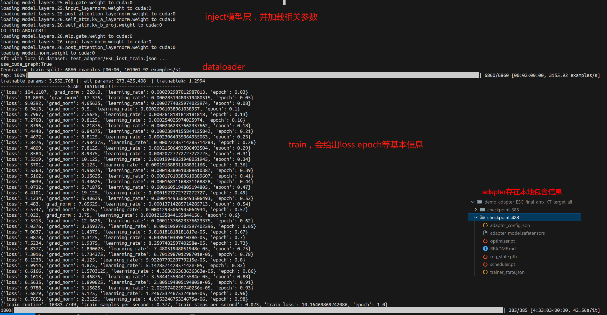

- [KTransformers 微调 × LLaMA-Factory 集成 – 用户指南](#ktransformers-微调-x-llama-factory-集成-–-用户指南)
- [Introduction](#introduction)

- [Quick to Start](#quick-to-start)
  - [快速上手](#快速上手)
  - [环境安装](#环境安装)
  - [核心功能1：使用KTransformers作为backend，微调超大规模MoE模型](#核心功能1使用ktransformers作为backend微调超大规模moe模型)
  - [核心功能2：与微调后模型（即原模型+LoRA Adapter）聊天，用于交互](#核心功能2与微调后模型即原模型lora-adapter聊天用于交互)
  - [核心功能3：生成微调后模型（即原模型+LoRA Adapter）的API，用于批量生成并评测指标](#核心功能3生成微调后模型即原模型lora-adapter的api用于批量生成并评测指标)

- [KT微调速度性能测试：用户侧](#kt微调速度性能测试用户侧)
  - [端到端性能](#端到端性能)
  - [显存/内存性能](#显存内存性能)

- [结论](#结论)

# KTransformers 微调 × LLaMA-Factory 集成 – 用户指南

**MadSys实验室, KVCache-AI团队, 趋境科技, LLaMA-Factory团队**

## Introduction

从 **DeepSeek-V3/R1** 到 **Qwen3-MoE、Kimi-K2**，每一次超大模型的开源都带来性能与规模上的巨大跃升。然而，多数研究者与开发者受限于昂贵的显卡与动辄数千亿参数的模型，**难以在资源受限条件下微调超大模型**。面对这种差距，我们提出了一种更具可行性的方案：通过 **KTransformers 与 LLaMA-Factory 的结合**，仅需2~4张RTX 4090与较高内存CPU，便可微调DeepSeek-671B等超大规模的MoE模型。

该架构的核心目标是为资源受限下的研究者提供 **在本地探索超大规模模型微调的可能性**。同时，也在较小规模（如 14B/30B）提供快速定制特定场景的路径。我们以**风格化对话、西式腔调翻译、医学问答**作为代表任务，验证架构的可行性，并展示在**数小时内达成个性化适配**的可操作性。


如下图所示，LLaMA-Factory 是整个微调流程的统一调度与配置框架，负责数据处理、训练调度、LoRA 插入与推理接口管理； KTransformers 则作为其可插拔的高性能后端，在相同的训练配置下接管 Attention / MoE 等核心算子，实现异构设备（GPU+CPU）的高效协同。


我们在 LLaMA-Factory 框架下，对比评测了 **HuggingFace**、**Unsloth**、**KTransformers** 三种后端的 LoRA 微调方案。结果显示，KTransformers为超大规模的MoE模型（671B等）提供了**4090 级别**的唯一可行方案，并在较小规模的MoE模型（DeepSeek-14B）上面也展现了更高的吞吐和更低的显存占用。

| Under LoRA (BF16)+[NekoQA-10K-风格化对话数据集](https://github.com/mindsRiverPonder/LLM-practice) | HuggingFace Backend                      | Unsloth Backend                      | KTransformers Backend |
| ------------------------------------------------------------ | ---------------------------------------- | ------------------------------------ | --------------------- |
| [14B-DeepSeekV2-Lite] LoRA Fine-tuning throughput            | 303.58 token/s                           | 455.37 token/s                       | 530.38 token/s        |
| [14B-DeepSeekV2-Lite] GPU Memory                             | 32.12 GB                                 | 9.64 GB                              | 6.08 GB               |
| [671B-DeepSeekV3] LoRA Fine-tuning throughput                | <font color='red'>Too Huge to run</font> | <font color='red'>NOT SUPPORT</font> | 40.35 token/s         |
| [671B-DeepSeekV3] GPU Memory（多卡总和）                     | 理论值1400 GB †                          | <font color='red'>NOT SUPPORT</font> | 70 GB †               |

† **1400 GB** 为**理论显存**（FP16 全参数常驻，非可运行配置）；**70 GB** 为 KT 策略（Attention 驻 GPU + MoE分层 offload）下的**实测峰值**。


### 微调效果示例

#### 风格化对话测试（CatGirl风格语气）

数据集：[NekoQA-10K: 面向猫娘语言建模的对话数据集](https://zhuanlan.zhihu.com/p/1934983798233231689)，目标是提升风格一致性与可辨识度。

下图对比了原始模型和微调模型的回答，可以看到微调后模型在语气和称谓上更加稳定地保持了猫娘风格（红框部分），验证了**风格迁移微调**的有效性。


#### Benchmark测试

数据集选取：

（1）采用了[西式翻译腔数据集](https://github.com/Benson114/Translational-Style-ChatLLM)，该数据集要求模型按西式表达习惯进行夸张的翻译，有明确的定制化风格需求。

（2）采用了[AfriMed-QA](https://aclanthology.org/2025.acl-long.96/)数据集（ACL-2025），作为非洲地区医疗领域的专用数据集，具有很强的场景定制特征，包含选择题和简答题两种形式，非常适合作为垂直领域微调的评估。针对单选和简答形式，我们分别进行测试，结果如下。

下表显示了微调前后模型在这些数据集上的指标变化。可以看到经过 LoRA 微调后，各项指标**大幅提升**，验证了微调的有效性：

| 西式翻译腔数据集                | BLEU-1    | BLEU-2    | BLEU-3    | BLEU-4    | ROUGE-1   | ROUGE-2   | ROUGE-L   |
| ------------------------------- | --------- | --------- | --------- | --------- | --------- | --------- | --------- |
| V2-Lite原模型（不LoRA微调）     | 20.66     | 8.33      | 4.54      | 2.89      | 22.71     | 4.52      | 19.19     |
| **KT-LoRA微调DeepSeek-V2-Lite** | **35.41** | **22.44** | **15.42** | **11.18** | **42.03** | **18.38** | **33.10** |
| V3原模型（不LoRA微调）          | 8.49      | 3.34      | 1.62      | 0.96      | 15.91     | 2.55      | 10.07     |
| **KT-LoRA微调DeepSeek-V3**      | **37.02** | **23.70** | **16.21** | **11.49** | **43.43** | **18.96** | **34.54** |

| AfriMed-QA数据集（简答任务）    | BLEU-1    | BLEU-2    | BLEU-3    | BLEU-4    | ROUGE-1   | ROUGE-2   | ROUGE-L   |
| ------------------------------- | --------- | --------- | --------- | --------- | --------- | --------- | --------- |
| V2-Lite原模型（不LoRA微调）     | 13.58     | 11.12     | 9.10      | 7.23      | 22.48     | 7.81      | 11.73     |
| **KT-LoRA微调DeepSeek-V2-Lite** | **35.90** | **27.63** | **22.99** | **19.15** | **35.25** | **17.50** | **28.44** |
| V3原模型（不LoRA微调）          | 12.75     | 10.27     | 8.05      | 5.99      | 20.33     | 5.65      | 10.11     |
| **KT-LoRA微调DeepSeek-V3**      | **42.42** | **34.12** | **28.95** | **24.54** | **41.97** | **22.37** | **33.28** |

| AfriMed-QA数据集（单选任务）    | Accuracy   |
| ------------------------------- | ---------- |
| V2-Lite原模型（不LoRA微调）     | 0.0645     |
| **KT-LoRA微调DeepSeek-V2-Lite** | **0.4812** |
| V3原模型（不LoRA微调）          | 0.5833     |
| **KT-LoRA微调DeepSeek-V3**      | **0.7930** |

从以上测试可以看出，即使是参数量巨大的 MoE 模型，通过 KTransformers 后端的高效微调，**也能在特定任务上快速达到理想效果**。


## Quick to Start

### 快速上手

本节将指导您如何安装环境并使用 **LLaMA-Factory + KTransformers** 完成微调和推理。我们将涵盖以下内容：

- 环境依赖的安装配置
- 使用 KTransformers 作为后端微调超大规模 MoE 模型
- 加载微调后的模型（原模型 + LoRA 适配器）进行对话/推理
- 批量推理微调模型并评测指标

### 环境安装

根据下面示例，同时安装KTransformers和LLaMA-Factory环境，这次为了简化KTransformers的安装流程，我们特意封装了wheel包避免本地编译，具体安装步骤如下：（注意对应好本地的python版本、torch版本、cuda版本和不同文件名的KTransformers包）

```shell
# 1. 安装conda环境
conda create -n Kllama python=3.10 # choose from : [3.10, 3.11, 3.12, 3.13]
conda install -y -c conda-forge libstdcxx-ng gcc_impl_linux-64
conda install -y -c nvidia/label/cuda-11.8.0 cuda-runtime

# 2. 安装llamafactory环境
git clone --depth 1 https://github.com/hiyouga/LLaMA-Factory.git
cd LLaMA-Factory
pip install -e ".[torch,metrics]" --no-build-isolation

# 3. 安装对应torch和python版本的KTransformers（CUDA版本可以跟whl命名的不一致）
pip install ktransformers-0.4.1+cu128torch28fancy-cp310-cp310-linux_x86_64.whl

# 4. 安装flash-attention，参照python版本和torch版本，从https://github.com/Dao-AILab/flash-attention/releases下载
https://github.com/Dao-AILab/flash-attention/releases/download/v2.8.3/flash_attn-2.8.3+cu12torch2.8cxx11abiTRUE-cp310-cp310-linux_x86_64.whl
# abi=True/False可以用下面代码查看
# import torch
# print(torch._C._GLIBCXX_USE_CXX11_ABI)

# 5. （可选）如果你想使用flash_infer的话（不然默认triton）
git clone https://github.com/kvcache-ai/custom_flashinfer.git
pip install custom_flashinfer/
```


**使用要点**：在 LLaMA-Factory 的配置 YAML 文件中启用 KTransformers 后端，只需设置 `use_kt: true`，并指定相应的 `kt_optimize_rule` YAML 文件，即可切换到底层由 KTransformers 接管计算。下面我们将通过具体功能来说明如何设置这些配置。

### 核心功能1：使用KTransformers作为backend，微调超大规模MoE模型

运行命令：`USE_KT=1 llamafactory-cli train examples/train_lora/deepseek3_lora_sft_kt.yaml`。

需要注意的是，必须提供BF16格式模型文件，DeepSeek-V3-671B默认下载是FP8格式，需要通过 [DeepSeek-V3/inference/fp8_cast_bf16.py](https://github.com/deepseek-ai/DeepSeek-V3/blob/main/inference/fp8_cast_bf16.py) 转换。

```yaml
### model
model_name_or_path: opensourcerelease/DeepSeek-V3-bf16
trust_remote_code: true

### method
stage: sft
do_train: true
finetuning_type: lora
lora_rank: 8
lora_target: all

### dataset
dataset: identity
template: deepseek
cutoff_len: 2048
max_samples: 100000
overwrite_cache: true
preprocessing_num_workers: 16
dataloader_num_workers: 4

### output
output_dir: saves/Kllama_deepseekV3
logging_steps: 10
save_steps: 500
plot_loss: true
overwrite_output_dir: true
save_only_model: false
report_to: none  # choices: [none, wandb, tensorboard, swanlab, mlflow]

### train
per_device_train_batch_size: 1
gradient_accumulation_steps: 8
learning_rate: 1.0e-4
num_train_epochs: 3.0
lr_scheduler_type: cosine
warmup_ratio: 0.1
bf16: true
ddp_timeout: 180000000
resume_from_checkpoint: null

### ktransformers
use_kt: true # use KTransformers as LoRA sft backend
kt_optimize_rule: examples/kt_optimize_rules/DeepSeek-V3-Chat-sft-amx-multi-gpu.yaml
cpu_infer: 32
chunk_size: 8192
```

其中，`kt_optimize_rule`提供了大量默认的YAML文件来控制**KTransformers的放置策略**，下面针对YAML文件名和功能对照特别说明，也可以参考[ktransformers/optimize_rules](https://github.com/kvcache-ai/ktransformers/tree/main/ktransformers/optimize/optimize_rules)：（\*指通配符）

| 文件名字段                                    | 功能特征                                           |
| --------------------------------------------- | -------------------------------------------------- |
| DeepSeek-V2-Lite-Chat-\*或DeepSeek-V3-Chat-\* | 对应的不同模型                                     |
| \*-sft-\*                                     | 微调所用的放置策略，其他为推理所用                 |
| \*-amx-\*                                     | 使用AMX指令集进行CPU运算，其他为llamafile          |
| \*-multi-gpu-X\*                              | 使用X张GPU进行模型并行（显存共担），X为空默认是2张 |

例如：`examples/kt_optimize_rules/DeepSeek-V3-Chat-sft-amx-multi-gpu.yaml`为DeepSeek-V3-Chat模型用AMX指令集进行微调，并调用两卡模型并行。

对于微调任务，我们推荐使用**AMX指令集加速**，可以使用`lscpu | grep amx`查看CPU是否支持AMX指令集，AMX精度支持BF16/Int8，修改方式如下：

```yaml
- match:
    name: "^model\\.layers\\..*\\.mlp\\.experts$"
  replace:
    class: ktransformers.operators.experts.KTransformersExperts     # custom MoE Kernel with expert parallelism
    kwargs:
      prefill_device: "cpu"
      prefill_op: "KExpertsTorch"
      generate_device: "cpu"
      generate_op: "KSFTExpertsCPU"
      out_device: "cuda"
      backend: "AMXInt8" # or "AMXBF16" or "llamafile" (default)
```

输出会保存在`output_dir`里面，默认为safetensor格式，并且保留adapter.json等配套内容以便后续加载。




### 核心功能2：与微调后模型（即原模型+LoRA Adapter）聊天，用于交互

运行命令：`llamafactory-cli chat examples/inference/deepseek3_lora_sft_kt.yaml`。

调用KT微调的adapter (safetensor格式) 推理对话。

```yaml
model_name_or_path: opensourcerelease/DeepSeek-V3-bf16
adapter_name_or_path: saves/Kllama_deepseekV3
template: deepseek
infer_backend: ktransformers  # choices: [huggingface, vllm, sglang, ktransformers]
trust_remote_code: true

use_kt: true # 调用KTransformers backend
kt_optimize_rule: examples/kt_optimize_rules/DeepSeek-V3-Chat-sft-amx.yaml # 请选择和LoRA微调的时候保持一致的YAML文件
cpu_infer: 32
chunk_size: 8192
```

同时，我们也支持GGUF格式的adapter进行推理（如果您已经使用了上述LLaMA-Factory+KTransformers的微调方案，就不用管啦~）。

safetensors 场景填**文件所在目录**，GGUF 场景填**文件路径**，也就是说您需要把`adapter_name_or_path`选为具体的GGUF格式文件。

加载过程中适配了KT每层的命名，和torch.save保存下来的常规命名的不同，正常映射日志`Loaded adapter weight: XXX -> XXX`，展示如下。


### 核心功能3：生成微调后模型（即原模型+LoRA Adapter）的API，用于批量生成并评测指标

运行命令：`API_PORT=8000 llamafactory-cli api examples/inference/deepseek3_lora_sft_kt.yaml`。

调用KT微调的adapter给出API，其他API使用逻辑和llamafactory原生方式一致。

```yaml
model_name_or_path: opensourcerelease/DeepSeek-V3-bf16
adapter_name_or_path: saves/Kllama_deepseekV3
template: deepseek
infer_backend: ktransformers  # choices: [huggingface, vllm, sglang, ktransformers]
trust_remote_code: true

use_kt: true # use KTransformers as LoRA sft backend to inference
kt_optimize_rule: examples/kt_optimize_rules/DeepSeek-V3-Chat-sft-amx-multi-gpu.yaml
cpu_infer: 32
chunk_size: 8192
```


## KT微调速度性能测试：用户侧

### 端到端性能

**测试定义：**

`step_time`：一次优化步（包含 `gradient_accumulation_steps (GAS)` 次累积）的总时间，涵盖 **PyTorch 张量搬运 + Attention + MoE + 其他计算等**。

`tokens_per_step = GAS × qlen`；`token/s = tokens_per_step / step_time`。

**测试设置：**`GAS=16`，`qlen=512`（即每步 8192 tokens）；LoRA（`r=8, alpha=32, dropout=0.1`）；使用AMX指令集优化；GPU选取RTX 4090，CPU选取Intel Xeon Platinum 8488C。

**实测结果：**

**DeepSeek-V3-671B：**step_time = 203 s` → `token/s ≈ 8192 / 203 **≈ 40.35 token/s**

**DeepSeek-V2-Lite-14B：**step_time = 36 s` → `token/s ≈ 8192 / 36 **≈ 227.6 token/s**

### 显存/内存性能

DeepSeek-V3（671B，61层，其中58层有MoE）占用显存（多卡总量）大约**70GB**、内存占用约1.2-1.3TB。

DeepSeek-V2-lite（14B，27层，其中26层有MoE）占用显存大约**5.5GB**、内存占用约150GB。


## 结论

通过开发 KTransformers LoRA微调并将其集成到 LLaMA‑Factory，我们为希望高效训练与部署 MoE 大模型的用户提供了可行指南。KT 带来最尖端的优化（支持 DeepSeek、Qwen、Kimi 等，配合 AMX 加速 kernel），同时通过 LoRA 微调在极低 GPU 显存下实现定制化。LLaMA‑Factory 则提供友好的统一界面，更广的用户支持。

该集成（类似 Unsloth 补丁所带来的提速）意味着即便是数百亿乃至万亿总参数量的 MoE 模型，也可在普通硬件上完成微调并低延迟部署。**显存节省、速度提升、易用性** 三者兼得。我们鼓励用户在下一次 MoE 项目中尝试 LLaMA‑Factory 的 KT 集成，并参考本文档进行操作。也欢迎提出任何问题和建议！