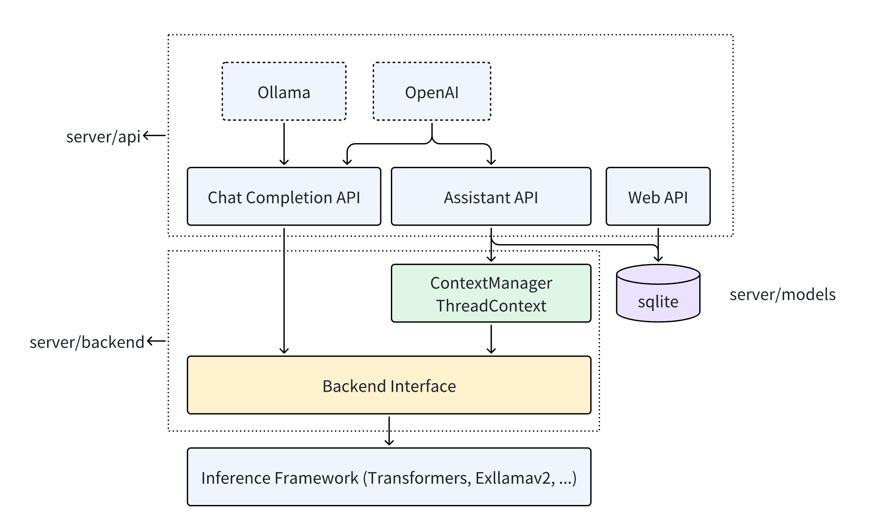

# 后端服务（Server）
Server 将 ktransformers 的快速异构推理能力通过 API 提供给外界调用。



## API

Server 通过 RESTful API 对外提供模型推理服务，提供  ChatCompletion 和 Assistant 两种调用方式。

- ChatCompletion 接口要求用户一次提供所有的历史对话，然后返回模型的回复。AI 服务提供商（例如[OpenAI](https://platform.openai.com/docs/api-reference/chat/create) ）和本地推理框架（例如[Ollama](https://github.com/ollama/ollama/blob/main/docs/api.md) ）都提供 ChatCompletion 接口。为了兼容 OpenAI 和 Ollama，Server 分别提供和它们一致的 API 接口。因此，当前使用 OpenAI 和 Ollama 的应用可以无缝切换到我们的 Server。例如： [如何使用 Tabby 和 ktransformers 在本地利用 236B 的大模型做代码补全？](tabby.md)。
- Assistant 适用于应用需要复用一系列资源并调用模型的场景。例如，在教育应用场景中，应用开发者可以创建一个名为二年级数学老师的 Assistant，并设置初始prompt（“你是一个有经验的的二年级数学老师...”），上传相关的资料（二年级数学教材）。创建 Assistant 后，应用需要创建一个 Thread 来存储用户和模型的对话消息（Message）。调用模型时，应用需要创建一个 Run 来获得 Assistant 的回复。相对于 ChatCompletion，实现了 Assistant 的 Server 代替应用实现了对话背景复用和多轮对话，使得复杂场景下的模型的调用更加方便。 [OpenAI Assistant API](https://platform.openai.com/docs/api-reference/assistants/createAssistant) 提出了这样的 Assistant 接口，而 Server 也提供和它一致的 API 。

这些 API 定义在`server/api`中，它们的具体使用请见[这里](api.md)。


## 对接模型推理框架

Server 通过 ktransformers 调用模型并进行推理。Server 也支持其他的推理框架，例如已经支持的 [transformers](https://huggingface.co/docs/transformers/index) ，并计划支持 [exllamav2](https://github.com/turboderp/exllamav2)。这些功能在`server/backend` 中实现。

Server 将模型推理框架的推理功能抽象成一个基类`BackendInterfaceBase`。这个基类包含一个函数：inference。它的输入是是历史的对话信息 messages，输出是模型返回的文字结果。inference 函数采用 async generator 的设计，这使得 Server 可以流式地返回模型的回复。

```python
class BackendInterfaceBase:
  async def inference(self, messages, **kwargs)->AsyncIterator[str]:
  	...
```

这个 inference 函数，因为它的输入和输出分别是历史对话和模型回复，所以它自然地实现了 ChatCompletion 的功能。因此 ChatCompletion API 可以直接调用inference 函数完成模型推理。

而 Assistant 则比 ChatCompletion 复杂许多，需要 Server 存储 Assistant 的相关状态，并以合适的方式调用 inference 函数。Server 在数据库中维护了一套 Assistant 逻辑，存储应用创建的 Assistant，Thread 和 Message。在内存中，Server 为每个 Thread 维护一个 `ThreadContext`，集合每个Thread 相关的 Assistant 等信息。当用户发出新的 Message 时，Server 调用 ThreadContext 的get_local_messages函数，获得 messages，并调用 inference 函数获得推理结果。

```python
class MyThreadContext(ThreadContext):
    def get_local_messages(self):
      ...
```

由于不同的模型推理框架有着不同的历史对话输入格式，所以 `ThreadContext` 和 `BackendInterface` 需要成对地使用。Server 除了自己的 ktransformers 之外，还支持 transformers。如果要对接其他的模型推理框架，可以参考在 [transformers.py](https://github.com/kvcache-ai/ktransformers-dev/blob/main/ktransformers/server/backend/interfaces/transformers.py) 中`TransformersInterface`和`TransformersThreadContext`的实现。 


