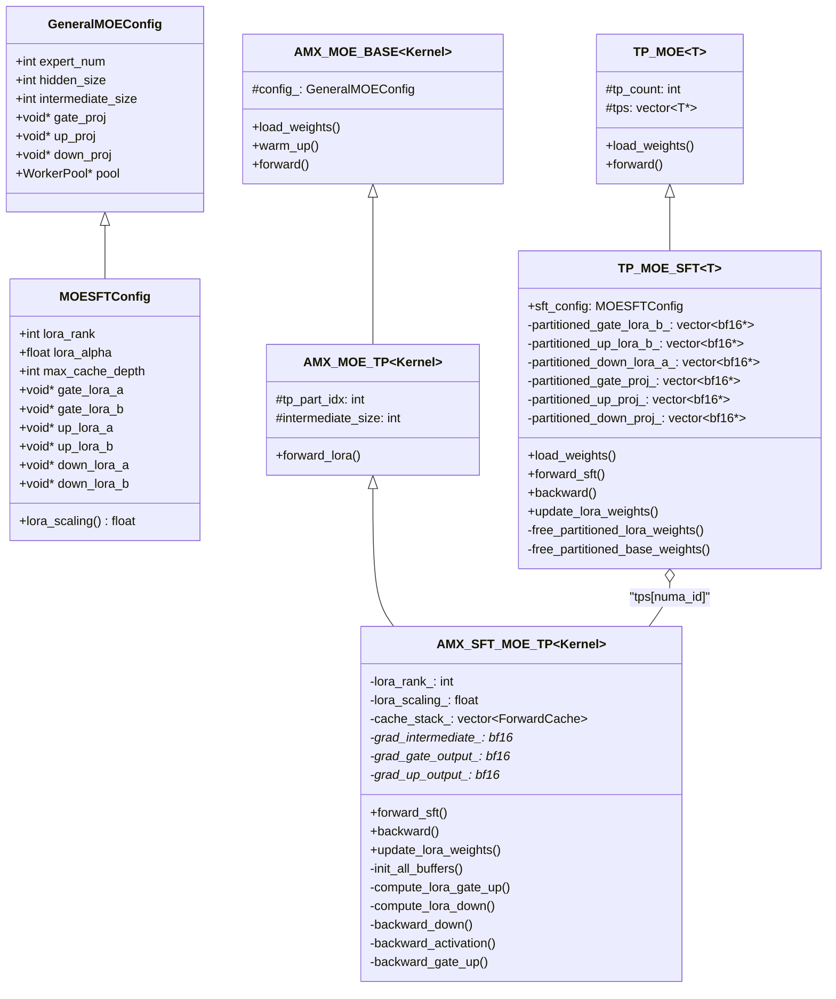
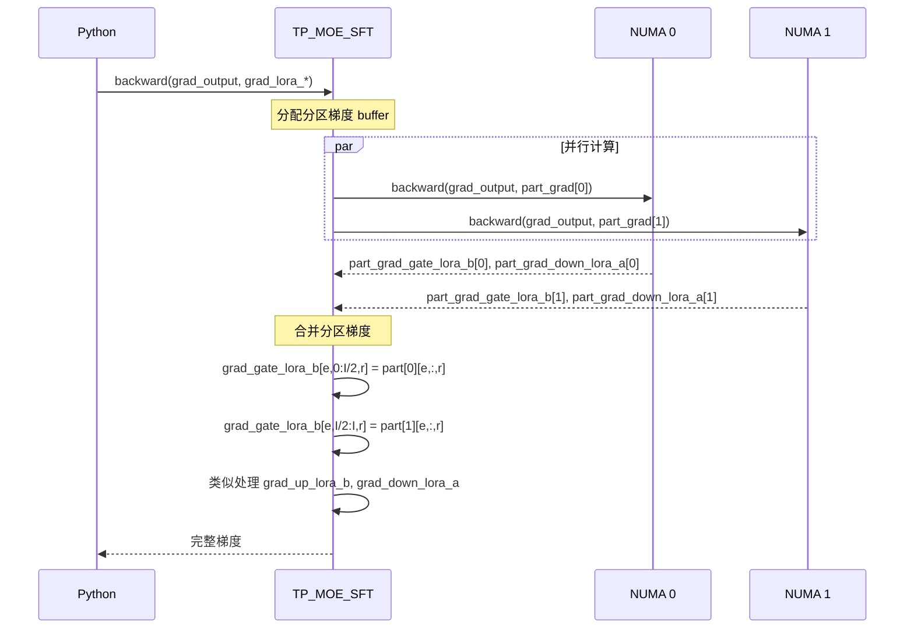
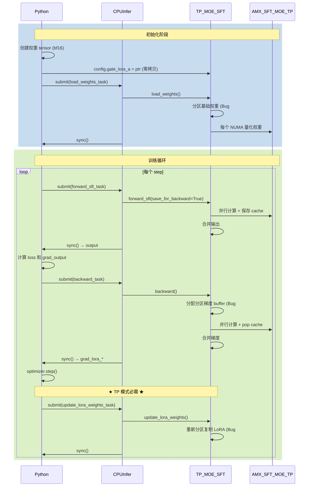
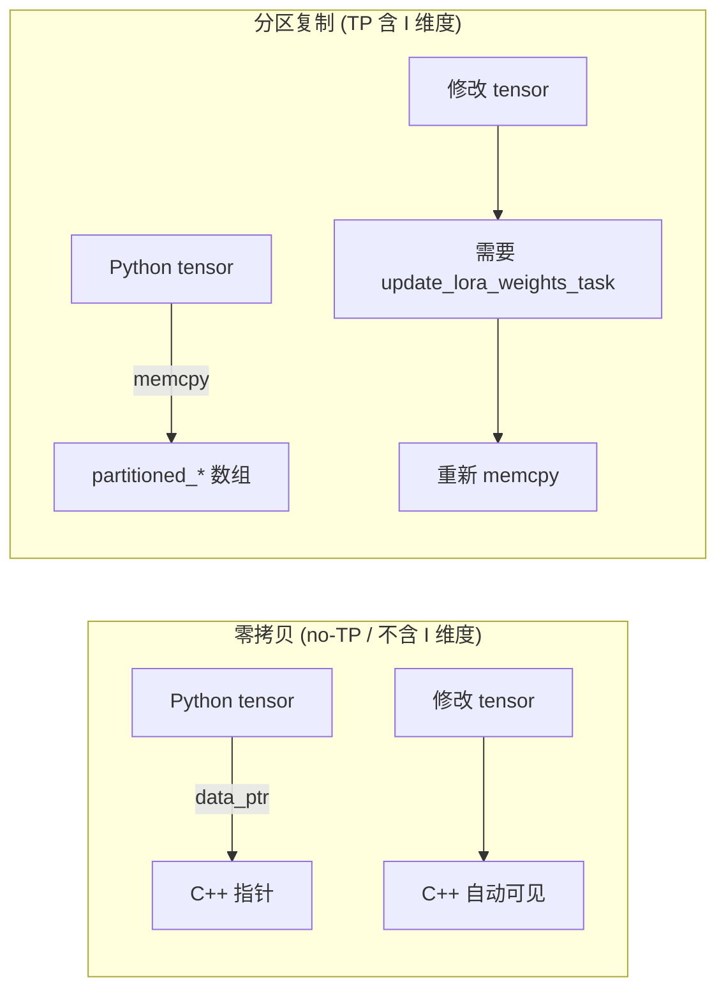
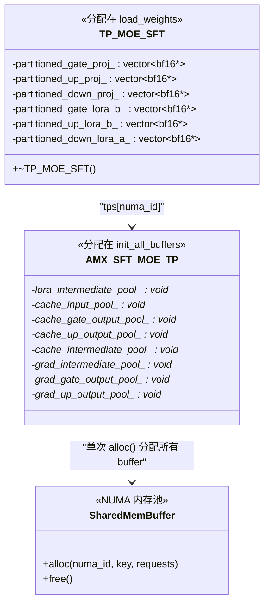
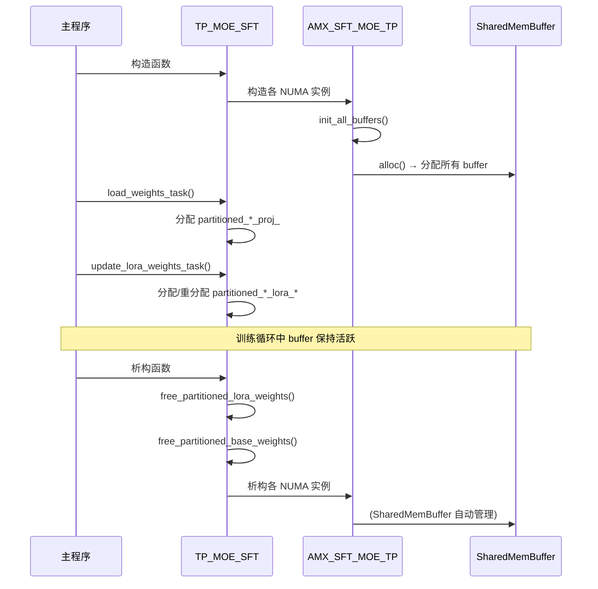
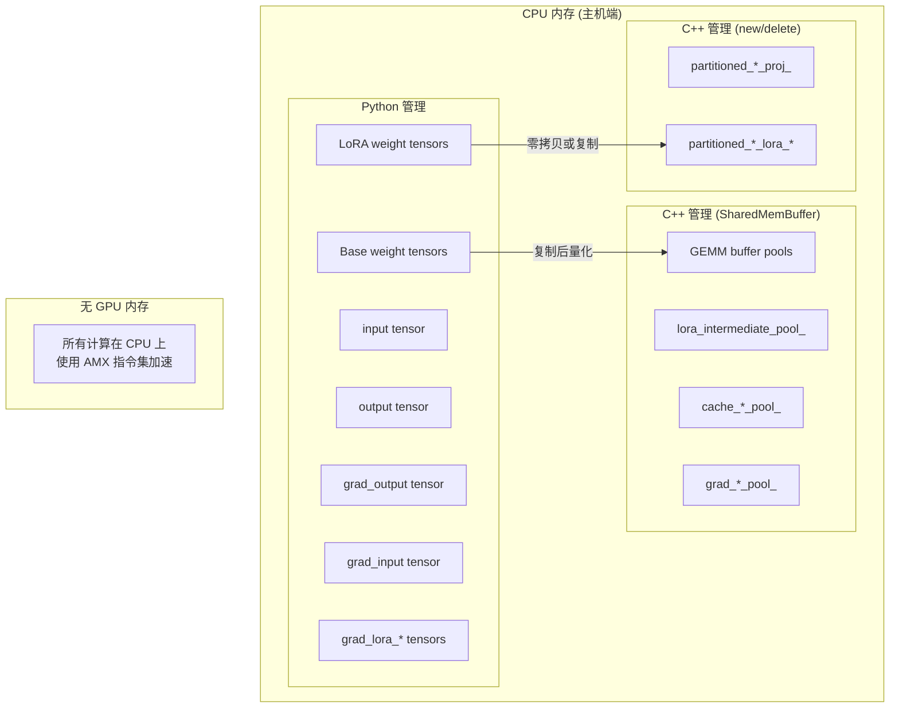

# MoE SFT AMX 最终流程 & 存储情况

本文档详细说明 SFT MoE AMX 算子的实现逻辑、存储布局、同步机制和内存管理。

---

## 1. SFT 算子实现逻辑

### 1.1 整体架构 (UML 类图)



### 1.2 TP vs no-TP 模式对比

| 特性 | no-TP 模式 | TP 模式 |
|------|-----------|---------|
| NUMA 节点数 | 1 | 2+ |
| intermediate_size | 完整 | 分区（每节点 intermediate_size / N） |
| 基础权重 | 直接使用 | 分区复制 |
| LoRA 权重 | 零拷贝 | 部分零拷贝，部分分区复制 |
| Forward | 单节点计算 | 多节点并行 + 输出合并 |
| Backward | 单节点计算 | 多节点并行 + 梯度合并 |
| 权重同步 | 不需要 | 每次 step 后需要 |

### 1.3 核心 Bug 修复说明

#### Bug #19: 基础权重分区

**问题**: TP 模式下 `TP_MOE_SFT::load_weights()` 没有对基础权重进行分区，导致每个 NUMA 节点使用完整权重，Forward 输出约为期望值的 2 倍。

**修复**: 在 `load_weights()` 中添加基础权重分区逻辑，参考 `TP_MOE<AMX_MOE_BASE>::load_weights()` 实现。

```cpp
// moe-sft-tp.hpp::load_weights (修复后)
void load_weights() override {
    // Step 1: 分配并复制分区后的权重
    for (int i = 0; i < tp_count; i++) {
        // gate_proj/up_proj: 连续块切片
        // down_proj: 逐行切片
    }
    // Step 2: 每个 NUMA 节点加载分区权重
    // Step 3: 保存指针供 backward 使用（Bug #20）
}
```

#### Bug #20: BF16 权重生命周期

**问题**: `load_weights()` 创建的临时分区权重在函数结束时被删除，但 `backward_down()` 需要使用原始 BF16 权重计算梯度，导致段错误。

**修复**: 将分区权重指针保存为类成员变量 `partitioned_*_proj_`，在析构函数中释放。

#### Bug #21: 梯度分区和合并

**问题**: `backward()` 直接传递完整大小的梯度 buffer 给每个 NUMA 节点，但含 `intermediate_size` 维度的梯度需要分区处理。

**修复**: 为每个 NUMA 分配分区梯度 buffer，backward 后合并到完整梯度。

```cpp
// moe-sft-tp.hpp::backward (修复后)
void backward(...) {
    // Step 1: 分配分区梯度 buffer
    // Step 2: 每个 NUMA 计算分区梯度
    // Step 3: 合并到完整梯度
    // Step 4: 清理临时 buffer
}
```

#### Bug #22: LoRA 分区非零拷贝

**问题**: 含 `intermediate_size` 维度的 LoRA 权重被复制到分区数组，修改原始 Python tensor 不会影响已复制的分区权重。

**修复**: 每次 `optimizer.step()` 后必须调用 `update_lora_weights_task()` 重新同步分区权重。

---

## 2. TP-MoE-SFT vs no-TP 在 LoRA 部分的区别

### 2.1 权重存储布局对比 (UML 对象图)

```mermaid
graph TB
    subgraph "no-TP 模式 (单 NUMA)"
        P1[Python Tensor<br/>gate_lora_a: E×R×H<br/>gate_lora_b: E×I×R<br/>up_lora_a: E×R×H<br/>up_lora_b: E×I×R<br/>down_lora_a: E×R×I<br/>down_lora_b: E×H×R]
        C1[C++ 指针<br/>零拷贝]
        P1 -->|data_ptr| C1
    end

    subgraph "TP 模式 (2 NUMA)"
        P2[Python Tensor<br/>gate_lora_a: E×R×H<br/>gate_lora_b: E×I×R<br/>...]

        subgraph "NUMA 0"
            N0_a[gate_lora_a → 零拷贝]
            N0_b[gate_lora_b → 复制<br/>E×(I/2)×R]
            N0_da[down_lora_a → 复制<br/>E×R×(I/2)]
            N0_db[down_lora_b → 零拷贝]
        end

        subgraph "NUMA 1"
            N1_a[gate_lora_a → 零拷贝]
            N1_b[gate_lora_b → 复制<br/>E×(I/2)×R]
            N1_da[down_lora_a → 复制<br/>E×R×(I/2)]
            N1_db[down_lora_b → 零拷贝]
        end

        P2 --> N0_a & N0_b & N0_da & N0_db
        P2 --> N1_a & N1_b & N1_da & N1_db
    end
```

### 2.2 LoRA 权重分区逻辑

| 权重 | 形状 | 分区维度 | 分区方式 | 存储方式 |
|------|------|---------|---------|---------|
| `gate_lora_a` | `[E, R, H]` | 无 | 不分区 | 零拷贝 |
| `gate_lora_b` | `[E, I, R]` | `I` | 连续块 | 分区复制 |
| `up_lora_a` | `[E, R, H]` | 无 | 不分区 | 零拷贝 |
| `up_lora_b` | `[E, I, R]` | `I` | 连续块 | 分区复制 |
| `down_lora_a` | `[E, R, I]` | `I` | 逐行 | 分区复制 |
| `down_lora_b` | `[E, H, R]` | 无 | 不分区 | 零拷贝 |

**分区公式**:
- 连续块切片: `dst[e, i, r] = src[e, numa_id * (I/N) + i, r]`，其中 `i ∈ [0, I/N)`
- 逐行切片: `dst[e, r, i] = src[e, r, numa_id * (I/N) + i]`，其中 `i ∈ [0, I/N)`

### 2.3 NUMA 并行逻辑 (UML 活动图)

```mermaid
flowchart TD
    subgraph "Forward (TP 模式)"
        F1[input: qlen × H] --> F2[分发到各 NUMA]
        F2 --> F3a[NUMA 0: 计算 intermediate[0:I/2]]
        F2 --> F3b[NUMA 1: 计算 intermediate[I/2:I]]
        F3a --> F4a[NUMA 0: down projection → partial output]
        F3b --> F4b[NUMA 1: down projection → partial output]
        F4a --> F5[合并输出: output = sum of partials]
        F4b --> F5
    end

    subgraph "Backward (TP 模式)"
        B1[grad_output: qlen × H] --> B2[分发到各 NUMA]
        B2 --> B3a[NUMA 0: backward_down → 分区梯度]
        B2 --> B3b[NUMA 1: backward_down → 分区梯度]
        B3a --> B4a[NUMA 0: backward_activation]
        B3b --> B4b[NUMA 1: backward_activation]
        B4a --> B5a[NUMA 0: backward_gate_up → 分区梯度]
        B4b --> B5b[NUMA 1: backward_gate_up → 分区梯度]
        B5a --> B6[合并梯度: grad = merge of partials]
        B5b --> B6
    end
```

### 2.4 梯度分区与合并 (UML 序列图)



---

## 3. GPU-CPU 和 Python-C++ 同步点

### 3.1 完整数据流 (UML 序列图)



### 3.2 同步点详解

| 同步点 | 位置 | 作用 | 数据流向 |
|--------|------|------|---------|
| `CPUInfer.submit()` | Python | 提交异步任务到线程池 | Py → CPUInfer |
| `CPUInfer.sync()` | Python | 等待任务完成 | CPUInfer → Py |
| `load_weights_task` | 初始化 | 量化基础权重，分区权重 | bf16 → int8 |
| `forward_sft_task` | Forward | 计算并保存 cache | input → output + cache |
| `backward_task` | Backward | 计算梯度，消费 cache | grad_output → grad_lora |
| `update_lora_weights_task` | Step 后 | 同步分区 LoRA 权重 | Python → C++ 分区数组 |

### 3.3 零拷贝 vs 分区复制



---

## 4. Buffer 生命周期与内存管理

### 4.1 所有 Buffer 汇总表

| Buffer 名称 | 大小公式 | 分配位置 | 释放位置 | 用途 |
|------------|---------|---------|---------|------|
| **LoRA 中间 Buffer** |
| `lora_intermediate_pool_` | `max_len × k × R × 2` | `init_all_buffers()` | SharedMemBuffer | LoRA 中间计算 |
| **Cache Buffer** |
| `cache_input_pool_` | `max_len × H × 2 × depth` | `init_all_buffers()` | SharedMemBuffer | 保存原始输入 |
| `cache_gate_output_pool_` | `max_len × k × I × 2 × depth` | `init_all_buffers()` | SharedMemBuffer | 保存 gate 输出(激活前) |
| `cache_up_output_pool_` | `max_len × k × I × 2 × depth` | `init_all_buffers()` | SharedMemBuffer | 保存 up 输出(激活前) |
| `cache_intermediate_pool_` | `max_len × k × I × 2 × depth` | `init_all_buffers()` | SharedMemBuffer | 保存中间值(激活后) |
| **梯度 Buffer** |
| `grad_intermediate_pool_` | `max_len × k × I × 2` | `init_all_buffers()` | SharedMemBuffer | grad_intermediate |
| `grad_gate_output_pool_` | `max_len × k × I × 2` | `init_all_buffers()` | SharedMemBuffer | grad_gate_output |
| `grad_up_output_pool_` | `max_len × k × I × 2` | `init_all_buffers()` | SharedMemBuffer | grad_up_output |
| **分区权重 (TP 模式)** |
| `partitioned_gate_proj_[i]` | `E × (I/N) × H × 2` | `load_weights()` | `~TP_MOE_SFT()` | 分区后基础权重 |
| `partitioned_up_proj_[i]` | `E × (I/N) × H × 2` | `load_weights()` | `~TP_MOE_SFT()` | 分区后基础权重 |
| `partitioned_down_proj_[i]` | `E × H × (I/N) × 2` | `load_weights()` | `~TP_MOE_SFT()` | 分区后基础权重 |
| `partitioned_gate_lora_b_[i]` | `E × (I/N) × R × 2` | `update_lora_weights()` | `~TP_MOE_SFT()` | 分区后 LoRA |
| `partitioned_up_lora_b_[i]` | `E × (I/N) × R × 2` | `update_lora_weights()` | `~TP_MOE_SFT()` | 分区后 LoRA |
| `partitioned_down_lora_a_[i]` | `E × R × (I/N) × 2` | `update_lora_weights()` | `~TP_MOE_SFT()` | 分区后 LoRA |

**符号说明**: E = expert_num, H = hidden_size, I = intermediate_size, R = lora_rank, k = num_experts_per_tok, N = tp_count, depth = max_cache_depth

### 4.2 分配位置 (UML 类图标注)



### 4.3 释放位置与生命周期 (UML 时序图)



### 4.4 GPU vs CPU 内存分布



### 4.5 内存估算示例

**配置参数** (DeepSeek-V3):
```
expert_num (E) = 256
hidden_size (H) = 7168
intermediate_size (I) = 2048
lora_rank (R) = 16
num_experts_per_tok (k) = 8
max_len = 25600
max_cache_depth = 1
tp_count (N) = 2
```

**Buffer 大小计算**:

| 类别 | Buffer | 大小计算 | 结果 |
|------|--------|---------|------|
| LoRA | lora_intermediate | 25600 × 8 × 16 × 2 | 6.25 MB |
| Cache | input_cache | 25600 × 7168 × 2 × 1 | 350 MB |
| Cache | gate_output_cache | 25600 × 8 × 2048 × 2 × 1 | 800 MB |
| Cache | up_output_cache | 25600 × 8 × 2048 × 2 × 1 | 800 MB |
| Cache | intermediate_cache | 25600 × 8 × 2048 × 2 × 1 | 800 MB |
| Grad | grad_intermediate | 25600 × 8 × 2048 × 2 | 800 MB |
| Grad | grad_gate_output | 25600 × 8 × 2048 × 2 | 800 MB |
| Grad | grad_up_output | 25600 × 8 × 2048 × 2 | 800 MB |
| **Cache + Grad 总计** | | | **~5.15 GB** |

**分区权重 (TP 模式)**:

| 类别 | Buffer | 大小计算 (每 NUMA) | 结果 (2 NUMA 总计) |
|------|--------|-------------------|-------------------|
| Base | partitioned_gate_proj | 256 × 1024 × 7168 × 2 | 3.5 GB |
| Base | partitioned_up_proj | 256 × 1024 × 7168 × 2 | 3.5 GB |
| Base | partitioned_down_proj | 256 × 7168 × 1024 × 2 | 3.5 GB |
| LoRA | partitioned_gate_lora_b | 256 × 1024 × 16 × 2 | 8 MB |
| LoRA | partitioned_up_lora_b | 256 × 1024 × 16 × 2 | 8 MB |
| LoRA | partitioned_down_lora_a | 256 × 16 × 1024 × 2 | 8 MB |

**总内存需求**:
- Cache + Grad: ~5.15 GB
- Base weight 分区: ~10.5 GB (TP 模式)
- LoRA 分区: ~24 MB (TP 模式)
- Python tensors (原始权重): 取决于模型大小

---

## 附录：关键代码位置

| 功能 | 文件 | 行号 |
|------|------|------|
| init_all_buffers() | operators/amx/sft_moe.hpp | 488-523 |
| forward_sft() | operators/amx/sft_moe.hpp | 164-356 |
| backward() | operators/amx/sft_moe.hpp | 372-428 |
| TP_MOE_SFT::load_weights() | operators/moe-sft-tp.hpp | 73-148 |
| TP_MOE_SFT::backward() | operators/moe-sft-tp.hpp | 254-319 |
| TP_MOE_SFT::update_lora_weights() | operators/moe-sft-tp.hpp | 347-408 |
