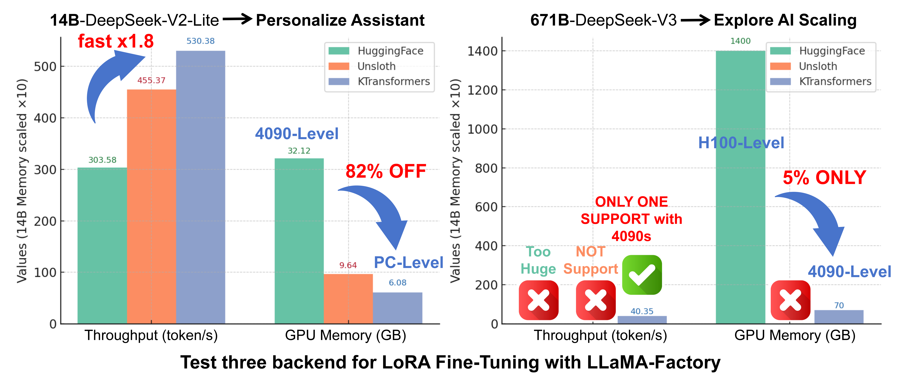
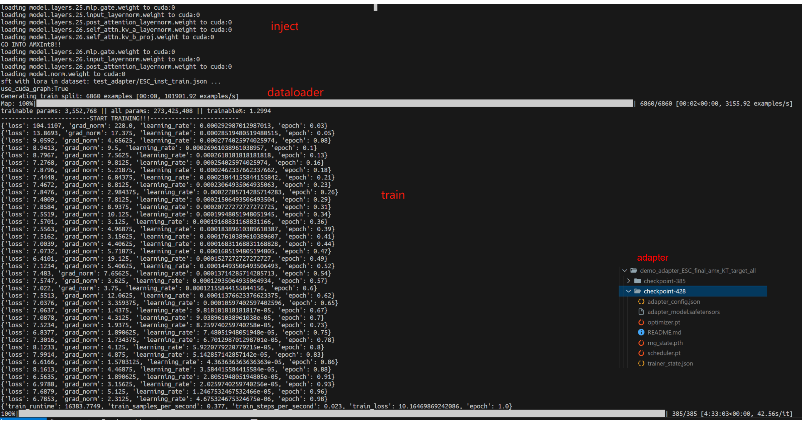
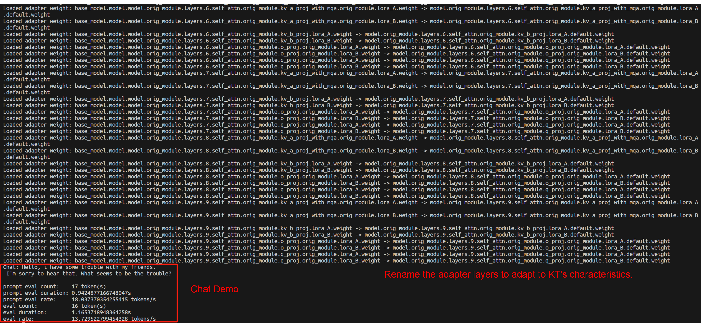

- [KTransformers Fine-Tuning × LLaMA-Factory Integration – User Guide](#ktransformers-fine-tuning-x-llama-factory-integration-–-user-guide)
- [Introduction](#introduction)

- [Fine-Tuning Results (Examples)](#fine-tuning-results-examples)
  - [Stylized Dialogue (CatGirl tone)](#stylized-dialogue-catgirl-tone)
  - [Benchmarks](#benchmarks)
    - [Translational-Style dataset](#translational-style-dataset)
    - [AfriMed-QA (short answer)](#afrimed-qa-short-answer)
    - [AfriMed-QA (multiple choice)](#afrimed-qa-multiple-choice)

- [Quick to Start](#quick-to-start)
  - [Environment Setup](#environment-setup)
  - [Core Feature 1: Use KTransformers backend to fine-tune ultra-large MoE models](#core-feature-1-use-ktransformers-backend-to-fine-tune-ultra-large-moe-models)
  - [Core Feature 2: Chat with the fine-tuned model (base + LoRA adapter)](#core-feature-2-chat-with-the-fine-tuned-model-base--lora-adapter)
  - [Core Feature 3: Batch inference + metrics (base + LoRA adapter)](#core-feature-3-batch-inference--metrics-base--lora-adapter)

- [KT Fine-Tuning Speed (User-Side View)](#kt-fine-tuning-speed-user-side-view)
  - [End-to-End Performance](#end-to-end-performance)
  - [GPU/CPU Memory Footprint](#gpucpu-memory-footprint)

- [Conclusion](#conclusion)


# KTransformers Fine-Tuning × LLaMA-Factory Integration – User Guide

**MadSys Lab, KVCache-AI Team, Approaching AI, LLaMA-Factory Team**

## Introduction

From **DeepSeek-V3/R1** to **Qwen3-MoE** and **Kimi-K2**, each wave of open-sourced large models brings leaps in performance and scale. However, many researchers and developers are constrained by expensive GPUs and models with tens or even hundreds of billions of parameters, making it **hard to fine-tune very large models under limited resources**. To bridge this gap, we propose a practical approach: combining **KTransformers** with **LLaMA-Factory**. With just **2–4 RTX 4090s** and a high-memory CPU, you can fine-tune ultra-large MoE models like DeepSeek-671B.

Our goal is to give resource-constrained researchers a **local path to explore fine-tuning ultra-large models**, and also a fast way to customize smaller models (e.g., 14B/30B) for specific scenarios. We validate the setup using **stylized dialogue**, **Westernized translation tone**, and **medical Q&A** as representative tasks, showing that **personalized adaptation can be achieved within hours**.

As shown below, LLaMA-Factory is the unified orchestration/configuration layer for the whole fine-tuning workflow—handling data, training scheduling, LoRA injection, and inference interfaces. **KTransformers** acts as a pluggable high-performance backend that takes over core operators like Attention/MoE under the same training configs, enabling efficient **GPU+CPU heterogeneous cooperation**.


Within LLaMA-Factory, we compared LoRA fine-tuning with **HuggingFace**, **Unsloth**, and **KTransformers** backends. KTransformers is the **only workable 4090-class solution** for ultra-large MoE models (e.g., 671B) and also delivers higher throughput and lower GPU memory on smaller MoE models (e.g., DeepSeek-14B).

| Under LoRA (BF16) + [NekoQA-10K stylized dialogue](https://github.com/mindsRiverPonder/LLM-practice) | HuggingFace Backend                      | Unsloth Backend                      | KTransformers Backend |
| ------------------------------------------------------------ | ---------------------------------------- | ------------------------------------ | --------------------- |
| [14B-DeepSeekV2-Lite] LoRA fine-tuning throughput            | 303.58 token/s                           | 455.37 token/s                       | 530.38 token/s        |
| [14B-DeepSeekV2-Lite] GPU memory                             | 32.12 GB                                 | 9.64 GB                              | 6.08 GB               |
| [671B-DeepSeekV3] LoRA fine-tuning throughput                | <font color='red'>Too Huge to run</font> | <font color='red'>NOT SUPPORT</font> | 40.35 token/s         |
| [671B-DeepSeekV3] GPU memory (sum across GPUs)               | theoretical 1400 GB †                    | <font color='red'>NOT SUPPORT</font> | 70 GB †               |

† **1400 GB** is a **theoretical** FP16 full-parameter resident footprint (not runnable). **70 GB** is the **measured peak** with KT strategy (Attention on GPU + layered MoE offload).



### Fine-Tuning Results (Examples)

#### Stylized Dialogue (CatGirl tone)

Dataset: [NekoQA-10K](https://zhuanlan.zhihu.com/p/1934983798233231689). Goal: improve style consistency and recognizability.

The figure compares responses from the base vs. fine-tuned models. The fine-tuned model maintains the target tone and address terms more consistently (red boxes), validating the effectiveness of **style-transfer fine-tuning**.


#### Benchmarks

We use:

(1) [Translational-Style-ChatLLM](https://github.com/Benson114/Translational-Style-ChatLLM), which asks for an exaggerated, Westernized translation tone—clear, stylized customization.

(2) [AfriMed-QA](https://aclanthology.org/2025.acl-long.96/) (ACL 2025), a medical dataset for African contexts with strong domain specificity, including multiple-choice and short-answer sub-tasks—well-suited for vertical fine-tuning evaluation.

The tables show metrics before vs. after LoRA fine-tuning. We observe **large improvements** across metrics, verifying fine-tuning effectiveness:

| Translational-Style dataset    | BLEU-1    | BLEU-2    | BLEU-3    | BLEU-4    | ROUGE-1   | ROUGE-2   | ROUGE-L   |
| ------------------------------ | --------- | --------- | --------- | --------- | --------- | --------- | --------- |
| V2-Lite (no LoRA)              | 20.66     | 8.33      | 4.54      | 2.89      | 22.71     | 4.52      | 19.19     |
| **KT-LoRA fine-tuned V2-Lite** | **35.41** | **22.44** | **15.42** | **11.18** | **42.03** | **18.38** | **33.10** |
| V3 base (no LoRA)              | 8.49      | 3.34      | 1.62      | 0.96      | 15.91     | 2.55      | 10.07     |
| **KT-LoRA fine-tuned V3**      | **37.02** | **23.70** | **16.21** | **11.49** | **43.43** | **18.96** | **34.54** |

| AfriMed-QA (short answer)      | BLEU-1    | BLEU-2    | BLEU-3    | BLEU-4    | ROUGE-1   | ROUGE-2   | ROUGE-L   |
| ------------------------------ | --------- | --------- | --------- | --------- | --------- | --------- | --------- |
| V2-Lite (no LoRA)              | 13.58     | 11.12     | 9.10      | 7.23      | 22.48     | 7.81      | 11.73     |
| **KT-LoRA fine-tuned V2-Lite** | **35.90** | **27.63** | **22.99** | **19.15** | **35.25** | **17.50** | **28.44** |
| V3 base (no LoRA)              | 12.75     | 10.27     | 8.05      | 5.99      | 20.33     | 5.65      | 10.11     |
| **KT-LoRA fine-tuned V3**      | **42.42** | **34.12** | **28.95** | **24.54** | **41.97** | **22.37** | **33.28** |

| AfriMed-QA (multiple choice)   | Accuracy   |
| ------------------------------ | ---------- |
| V2-Lite (no LoRA)              | 0.0645     |
| **KT-LoRA fine-tuned V2-Lite** | **0.4812** |
| V3 base (no LoRA)              | 0.5833     |
| **KT-LoRA fine-tuned V3**      | **0.7930** |

Even for ultra-large MoE models, **KTransformers-backed fine-tuning** achieves strong task performance quickly.


## Quick to Start

This section shows how to install and use **LLaMA-Factory + KTransformers** for fine-tuning and inference:

- Environment setup
- Fine-tune ultra-large MoE models with KTransformers backend
- Load the fine-tuned model (base + LoRA adapter) for chat/inference
- Batch inference and metric evaluation

### Environment Setup

According to the following example, install both the **KTransformers** and **LLaMA-Factory** environments simultaneously.
 This time, to simplify the installation process of KTransformers, we have specially packaged a wheel file to avoid local compilation.
 The detailed installation steps are as follows:
 (Note: Make sure your local **Python version**, **Torch version**, **CUDA version**, and the **KTransformers wheel filename** correspond correctly.)

```shell
# 1. Create a conda environment
conda create -n Kllama python=3.10 # choose from : [3.10, 3.11, 3.12, 3.13]
conda install -y -c conda-forge libstdcxx-ng gcc_impl_linux-64
# ATTENTION: DO NOT skip this step, even if your cuda version is not 11.8! Otherwise, you will get this error: ImportError: libcudart.so.11.0: cannot open shared object file: No such file or directory.
conda install -y -c nvidia/label/cuda-11.8.0 cuda-runtime

# 2. Install the LLaMA-Factory environment
git clone --depth 1 https://github.com/hiyouga/LLaMA-Factory.git
cd LLaMA-Factory
pip install -e ".[torch,metrics]" --no-build-isolation

# 3. Install the KTransformers wheel that matches your Torch and Python versions (Note: The CUDA version can differ from that in the wheel filename.)
pip install ktransformers-0.4.1+cu128torch28fancy-cp310-cp310-linux_x86_64.whl

# 4. Install flash-attention, download the corresponding file based on your Python and Torch versions from: https://github.com/Dao-AILab/flash-attention/releases
pip install https://github.com/Dao-AILab/flash-attention/releases/download/v2.8.3/flash_attn-2.8.3+cu12torch2.8cxx11abiTRUE-cp310-cp310-linux_x86_64.whl
# abi=True/False can find from below
# import torch
# print(torch._C._GLIBCXX_USE_CXX11_ABI)

# 5. (Optional) If you want to use flash_infer (otherwise it defaults to triton)
git clone https://github.com/kvcache-ai/custom_flashinfer.git
pip install custom_flashinfer/
```

**Usage tip:** In LLaMA-Factory YAML, set `use_kt: true` and pick a `kt_optimize_rule` file to have KTransformers handle the core compute. The features below show typical configs.

### Core Feature 1: Use KTransformers backend to fine-tune ultra-large MoE models

Run the command: `USE_KT=1 llamafactory-cli train examples/train_lora/deepseek3_lora_sft_kt.yaml`.

Note: You **must** provide a **BF16** model. DeepSeek-V3-671B is released in FP8 by default; convert with [DeepSeek-V3/inference/fp8_cast_bf16.py](https://github.com/deepseek-ai/DeepSeek-V3/blob/main/inference/fp8_cast_bf16.py).

```yaml
### model
model_name_or_path: opensourcerelease/DeepSeek-V3-bf16
trust_remote_code: true

### method
stage: sft
do_train: true
finetuning_type: lora
lora_rank: 8
lora_target: all

### dataset
dataset: identity
template: deepseek
cutoff_len: 2048
max_samples: 100000
overwrite_cache: true
preprocessing_num_workers: 16
dataloader_num_workers: 4

### output
output_dir: saves/Kllama_deepseekV3
logging_steps: 10
save_steps: 500
plot_loss: true
overwrite_output_dir: true
save_only_model: false
report_to: none  # choices: [none, wandb, tensorboard, swanlab, mlflow]

### train
per_device_train_batch_size: 1
gradient_accumulation_steps: 8
learning_rate: 1.0e-4
num_train_epochs: 3.0
lr_scheduler_type: cosine
warmup_ratio: 0.1
bf16: true
ddp_timeout: 180000000
resume_from_checkpoint: null

### ktransformers
use_kt: true # use KTransformers as LoRA sft backend
kt_optimize_rule: examples/kt_optimize_rules/DeepSeek-V3-Chat-sft-amx-multi-gpu.yaml
cpu_infer: 32
chunk_size: 8192
```

`kt_optimize_rule` controls **placement strategy**. See also [ktransformers/optimize_rules](https://github.com/kvcache-ai/ktransformers/tree/main/ktransformers/optimize/optimize_rules). Naming hints (`*` = wildcard):

| Pattern                                      | Meaning                                               |
| -------------------------------------------- | ----------------------------------------------------- |
| DeepSeek-V2-Lite-Chat-* / DeepSeek-V3-Chat-* | Target model variants                                 |
| *-sft-*                                      | Strategy for fine-tuning; others are for inference    |
| *-amx-*                                      | Use AMX on CPU; otherwise use **llamafile**           |
| *-multi-gpu-X*                               | Model parallel on X GPUs (X omitted → default 2 GPUs) |

Example: `DeepSeek-V3-Chat-sft-amx-multi-gpu.yaml` = V3-Chat fine-tuning with AMX and 2-GPU model parallel.

We recommend **AMX acceleration** where available (`lscpu | grep amx`). AMX supports BF16/INT8. Example:

```yaml
- match:
    name: "^model\\.layers\\..*\\.mlp\\.experts$"
  replace:
    class: ktransformers.operators.experts.KTransformersExperts     # custom MoE Kernel with expert parallelism
    kwargs:
      prefill_device: "cpu"
      prefill_op: "KExpertsTorch"
      generate_device: "cpu"
      generate_op: "KSFTExpertsCPU"
      out_device: "cuda"
      backend: "AMXInt8" # or "AMXBF16" or "llamafile" (default)
```

Outputs go to `output_dir` in safetensors format plus adapter metadata for later loading.



### Core Feature 2: Chat with the fine-tuned model (base + LoRA adapter)

Run the command: `llamafactory-cli chat examples/inference/deepseek3_lora_sft_kt.yaml`.

Use the safetensors adapter trained with KT for inference.

```yaml
model_name_or_path: opensourcerelease/DeepSeek-V3-bf16
adapter_name_or_path: saves/Kllama_deepseekV3
template: deepseek
infer_backend: ktransformers  # choices: [huggingface, vllm, sglang, ktransformers]
trust_remote_code: true

use_kt: true # use KTransformers as LoRA sft backend to inference
kt_optimize_rule: examples/kt_optimize_rules/DeepSeek-V3-Chat-sft-amx-multi-gpu.yaml
cpu_infer: 32
chunk_size: 8192
```

We also support **GGUF** adapters: for safetensors, set the **directory**; for GGUF, set the **file path** in `adapter_name_or_path`.

During loading, LLaMA-Factory maps layer names to KT’s naming. You’ll see logs like `Loaded adapter weight: XXX -> XXX`:



### Core Feature 3: Batch inference + metrics (base + LoRA adapter)

Run the command: `API_PORT=8000 llamafactory-cli api examples/inference/deepseek3_lora_sft_kt.yaml`.
 Invoke the KT fine-tuned adapter to provide the API; the usage logic of other APIs is consistent with the native LLaMA-Factory approach.

```yaml
model_name_or_path: opensourcerelease/DeepSeek-V3-bf16
adapter_name_or_path: saves/Kllama_deepseekV3
template: deepseek
infer_backend: ktransformers  # choices: [huggingface, vllm, sglang, ktransformers]
trust_remote_code: true

use_kt: true # use KTransformers as LoRA sft backend to inference
kt_optimize_rule: examples/kt_optimize_rules/DeepSeek-V3-Chat-sft-amx-multi-gpu.yaml
cpu_infer: 32
chunk_size: 8192
```


## KT Fine-Tuning Speed (User-Side View)

### End-to-End Performance

**Definitions**

- `step_time`: wall-clock time for a full optimization step (tensor movement + Attention + MoE + other compute).
- `tokens_per_step = GAS × qlen`; `token/s = tokens_per_step / step_time`.

**Settings:** `GAS=16`, `qlen=512` (→ `tokens_per_step = 8192`); LoRA (`r=8, alpha=32, dropout=0.1`); **AMX** enabled; GPU: RTX 4090, CPU: Intel Xeon Platinum 8488C.

**Measured**

- **DeepSeek-V3-671B:** `step_time = 203 s` → `token/s ≈ 8192 / 203 ≈ 40.35`
- **DeepSeek-V2-Lite-14B:** `step_time = 36 s` → `token/s ≈ 8192 / 36 ≈ 227.6`

### GPU/CPU Memory Footprint

- DeepSeek-V3 (671B; 61 layers with 58 MoE): ~**70 GB** total GPU VRAM (multi-GPU), ~**1.2–1.3 TB** RAM.
- DeepSeek-V2-Lite (14B; 27 layers with 26 MoE): ~**5.5 GB** GPU VRAM, ~**30 GB** RAM.

## Conclusion

By integrating **KTransformers LoRA fine-tuning** into **LLaMA-Factory**, we provide a practical guide for efficient training and deployment of MoE LLMs. KT brings cutting-edge optimizations (DeepSeek/Qwen/Kimi support with AMX-accelerated kernels), and LoRA enables customization under very low GPU memory. LLaMA-Factory offers a friendly, unified interface.

This integration (akin to Unsloth-style speedups) means even models with tens to hundreds of billions of parameters can be fine-tuned and deployed with low latency on commodity hardware. You get **memory savings, speed-ups, and usability** together. We encourage you to try LLaMA-Factory + KT for your next MoE project and follow this guide. Feedback is welcome!
