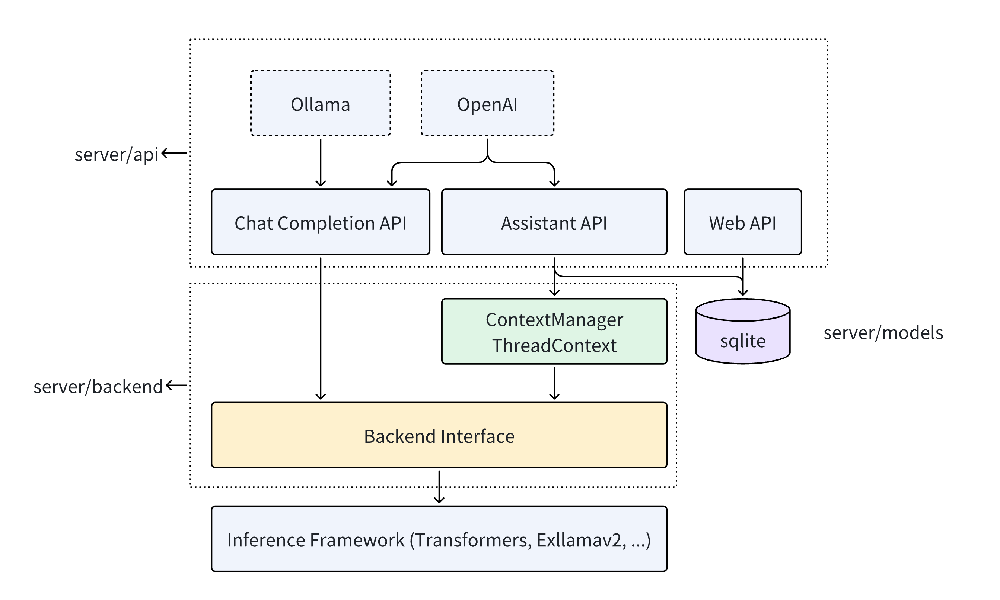

# Backend Services (Server)
The Server offers fast heterogeneous inference capabilities of ktransformers through an API for external usage.



## API

The Server provides model inference services externally through a RESTful API, with two methods of interaction: ChatCompletion and Assistant.

- The ChatCompletion interface requires users to provide all historical dialogues at once, after which the model responds. AI service providers (such as [OpenAI](https://platform.openai.com/docs/api-reference/chat/create)) and local inference frameworks (such as [Ollama](https://github.com/ollama/ollama/blob/main/docs/api.md)) both offer the ChatCompletion interface. To ensure compatibility with OpenAI and Ollama, the Server offers APIs that are consistent with theirs. Therefore, applications currently using OpenAI and Ollama can seamlessly switch to our Server. For example: [How to use Tabby and ktransformers locally with a 236B model for code completion?](tabby.md).
- The Assistant is suitable for applications that need to reuse a series of resources and call the model. For instance, in educational applications, developers can create an Assistant named "Second Grade Math Teacher" and set an initial prompt ("You are an experienced second-grade math teacher..."), and upload relevant materials (second grade math textbooks). After creating the Assistant, the application needs to create a Thread to store the dialogues between the user and the model (Message). When calling the model, the application creates a Run to obtain the Assistant's response. Compared to ChatCompletion, the Assistant-enabled Server handles the reuse of conversational contexts and multi-turn dialogues, making model calls in complex scenarios more convenient. The [OpenAI Assistant API](https://platform.openai.com/docs/api-reference/assistants/createAssistant) introduces such an Assistant interface, and the Server provides a consistent API.

These API definitions are located in `server/api`, and their specific usage can be seen [here](api.md).

## Integrating Model Inference Frameworks

The Server uses ktransformers for model calling and inference. It also supports other inference frameworks, such as the already supported [transformers](https://huggingface.co/docs/transformers/index), and plans to support [exllamav2](https://github.com/turboderp/exllamav2). These functionalities are implemented in `server/backend`.

The model inference functionalities of the frameworks are abstracted into a base class `BackendInterfaceBase`. This class includes a function: inference. It takes historical dialogue information messages as input and returns the text result from the model. The inference function adopts an async generator design, allowing the Server to return model responses in a streaming manner.

```python
class BackendInterfaceBase:
  async def inference(self, messages, **kwargs)->AsyncIterator[str]:
    ...
```

This inference function naturally implements the functionality of ChatCompletion because its inputs and outputs are historical dialogues and model responses, respectively. Thus, the ChatCompletion API can directly call the inference function to complete model inference.

Assistant is more complex than ChatCompletion, requiring the Server to store the related state of the Assistant and call the inference function appropriately. The Server maintains a set of Assistant logic in the database, storing the Assistants, Threads, and Messages created by applications. In memory, the Server maintains a `ThreadContext` for each Thread, gathering information related to each Thread's Assistant, etc. When a user sends a new Message, the Server calls the get_local_messages function of ThreadContext to obtain messages and then calls the inference function to get the inference results.

```python
class MyThreadContext(ThreadContext):
    def get_local_messages(self):
      ...
```

Since different model inference frameworks have different historical dialogue input formats, `ThreadContext` and `BackendInterface` need to be used in pairs. Besides its own ktransformers, the Server also supports transformers. For integrating other model inference frameworks, refer to the implementations of `TransformersInterface` and `TransformersThreadContext` in [transformers.py](https://github.com/kvcache-ai/ktransformers-dev/blob/main/ktransformers/server/backend/interfaces/transformers.py). 