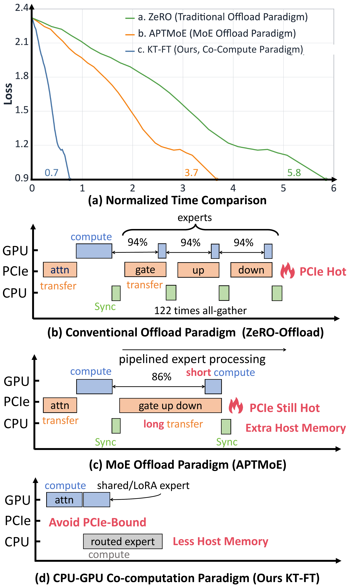
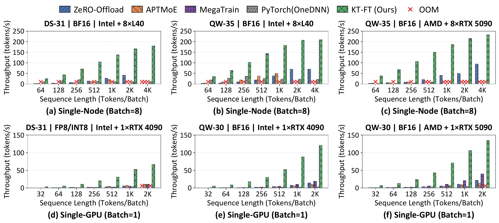

# KTransformers-FineTune: Beyond Offload with Layout-Aware and Schedule-Optimized Heterogeneous MoE Fine-Tuning

[中文](README_ZH.md) · [Read PDF](ktransformers-finetune.pdf) · [Download PDF](https://raw.githubusercontent.com/kvcache-ai/ktransformers/paper-ktft-v1/papers/kt-ft/ktransformers-finetune.pdf) · [Fine-tuning cookbook](https://github.com/kvcache-ai/ktransformers/blob/main/doc/en/SFT/KTransformers-Fine-Tuning_Cookbook.md) · [Citation](#citation)

Peilin Li, Xingxing Hao, Hongtao Chen, Weiyu Xie, Yaowei Zheng, Bowen Wu, Yujie Yang, Huanming Shen, Qingliang Ou, Boxin Zhang, Jingqi Tang, Ziwei Yuan, Jianwei Dong, Dongdong Kuang, Zhangchi Feng, Jiaheng Dai, Qianrui Yang, Shaoyuan Chen, Jiahao Wang, Yaochen Han, Yuening Zhu, Jiaqi Liao, Xianglin Chen, Zhiyuan Ai, Yongwei Wu, and Mingxing Zhang.

Author preprint · Published on GitHub: October 8, 2026 · Version: `paper-ktft-v1`.

The arXiv link will be added when available. Corresponding author: Mingxing Zhang.

KTransformers-FineTune (KT-FT) lowers GPU memory requirements and improves training efficiency for local fine-tuning of large MoE models. Sparse expert activation reduces computation, but offloading still transfers large expert weights over PCIe. KT-FT brings computation to the data: the CPU executes routed experts while the GPU executes attention. A conventional PyTorch+OneDNN implementation of this co-computation paradigm has insufficient CPU efficiency at longer contexts. KT-FT addresses this bottleneck through layouts optimized across devices and execution stages, together with dynamic scheduling that handles uneven expert workloads.

In the paper's evaluation, KT-FT achieves **2.5–21.2× the throughput** of the compared offloading systems and supports contexts up to **128K tokens**. With the host CPU and sufficient system memory, it enables **BF16 LoRA fine-tuning of a 671B DeepSeek model at a 2K context length using 16GB of GPU memory**.

LoRA Experts use residual GPU memory for a shared adaptation path, accelerating convergence and improving final model quality through system-algorithm co-design. Through collaboration with LlamaFactory, these capabilities fit established workflows: LlamaFactory handles data processing and training orchestration, while KT-FT provides heterogeneous execution, enabling local customization on private data.

## Paper figures



*Figure 1. Offloading and CPU-GPU co-computation for MoE fine-tuning.*



*Figure 8. End-to-end fine-tuning throughput from the paper.*

## Citation

See [CITATION.bib](CITATION.bib) for the full 26-author BibTeX entry.

```bibtex
@misc{li2026ktft,
  title = {{KTransformers-FineTune: Beyond Offload with Layout-Aware and Schedule-Optimized Heterogeneous MoE Fine-Tuning}},
  author = {Li, Peilin and Hao, Xingxing and Chen, Hongtao and Xie, Weiyu and Zheng, Yaowei and Wu, Bowen and Yang, Yujie and Shen, Huanming and Ou, Qingliang and Zhang, Boxin and Tang, Jingqi and Yuan, Ziwei and Dong, Jianwei and Kuang, Dongdong and Feng, Zhangchi and Dai, Jiaheng and Yang, Qianrui and Chen, Shaoyuan and Wang, Jiahao and Han, Yaochen and Zhu, Yuening and Liao, Jiaqi and Chen, Xianglin and Ai, Zhiyuan and Wu, Yongwei and Zhang, Mingxing},
  year = {2026},
  note = {Author preprint, version paper-ktft-v1},
  howpublished = {Author preprint, GitHub},
  url = {https://github.com/kvcache-ai/ktransformers/tree/paper-ktft-v1/papers/kt-ft}
}
```

The PDF SHA-256 is recorded in [SHA256SUMS](SHA256SUMS). See [CHANGELOG.md](CHANGELOG.md) for paper versions.
